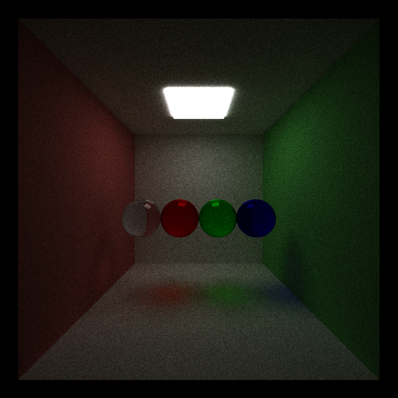

add tiny obj and tiny gltf!!!!


CUDA Path Tracer
================

**University of Pennsylvania, CIS 565: GPU Programming and Architecture, Project 3**

* Xinran Tao
  - [LinkedIn](https://www.linkedin.com/in/xinran-tao/), [Personal Website](https://www.xinrantao.com/), [GitHub](https://github.com/theBoilingPoint).
* Tested on: 
  - Ubuntu 22.04, i7-11700K @ 3.60GHz × 16, RAM 32GB, GeForce RTX 3080 Ti 12GB (Personal)

# Introduction
This project implements a path tracer that's running on CUDA. Althought there are many different things to be done, here we focus on extending the material features for a path tracer rather than accelerated structures. Below is the final render after the project is completed.


> ## Important Notes
> Given that the report is due 2 days after the programming deadline, there are some minor adjustments in the repository to run the experienments and generate the final render for the report. These adjustments **do not** change the main implementation for all my features. They include:
> - Reordering scene file structures.
> - Commented out BVH related codes, given that this feature is buggy.
> - Adding directives to switch on/off different features.
> - Adding print statements to remind users to set a certain feature when customising json files. 
> - Fixed a really silly and tiny bug.
>   - Forgot to add an if statement for the checkerboard material in `pathtrace.cu`, although I added it for texture which is one line below that code.

# Basic Features
## Simple BRDFs
Both images are generated after 1000 iterations.

### Diffuse
A diffse material should be define in json like this:
```json
"diffuse_white": 
{
  "TYPE":"Diffuse",
  "RGB":[0.98, 0.98, 0.98]
}
```

Below is the image of the default Cornell box scene with a diffuse material. 


The average time for each frame is 500 ms and the FPS is 2.0.

### Mirror
A mirror material should be define in json like this:
```json
"mirror": 
{
  "TYPE": "Mirror",
  "SPEC_RGB": [1.0,1.0,1.0]
}
```

Below is the image of the default Cornell box scene with a mirror material.


The average time for each frame is 533.5 ms and the FPS is 1.9.

### *Blooper*: Dark Ring for the Mirror Material
This took me so long to debug. At the beginning my mirror material looked like this:
.
I had absolutely no idea why because the feature was so simple. At the end I found out that GLM's reflect uses an inverse version of the original physics equation. The lesson to learn is never take APIs for granted. Always read what they actually do.

## Performance/Visual Improvements
> - The scene file to test **stream compaction** and **matwrial sort** features is in `../scenes/jsons/test_performance/cornell_mesh.json`. Remember to replace the path to the meshes and textures with the absolute path on your machine.
> - The scene file to test **antialiasing** is the default cornell box scene.

For each of the experiments conducted in this section, the number of iterations is set to 500. When testing each feature, the other two features are turned on for faster result generation.

### Stream Compaction

### Sorting Paths by Material

### Antialiasing


# Advanced Features
## Visual Improvements
### (2) Dielectric (Refraction)


### (?) Microfacet Material

### (2) Depth of Field

### (6) Texture Loading with Arbitrary Mesh

## Mesh Loading
### (2) .obj

### (4) .gltf/.glb

## Performance
### (1) Raussian Roulette

### (?) Buggy BVH


