CUDA Path Tracer
================

**University of Pennsylvania, CIS 565: GPU Programming and Architecture, Project 2**

* Zixiao Wang
  * [LinkedIn](https://www.linkedin.com/in/zixiao-wang-826a5a255/)
* Tested and rendered on: Windows 11, i7-12800H @ 2.40 GHz 32GB, GTX 3070TI (Laptop)

### Final Image

Rendering

### Feature

#### BRDFs

ideal Diffuse shading

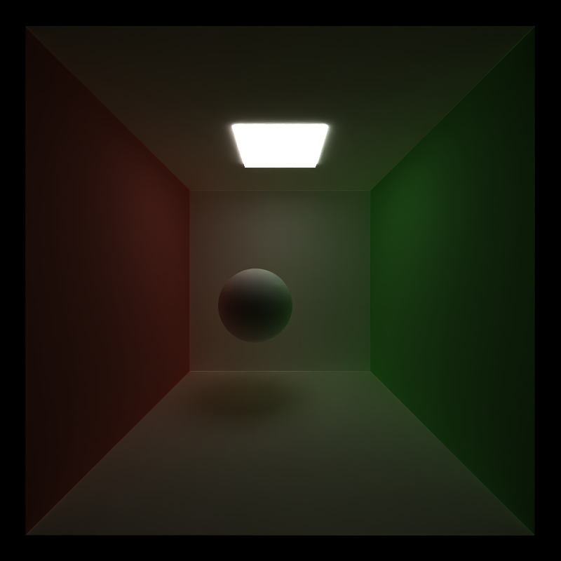

ideal Specular Shading

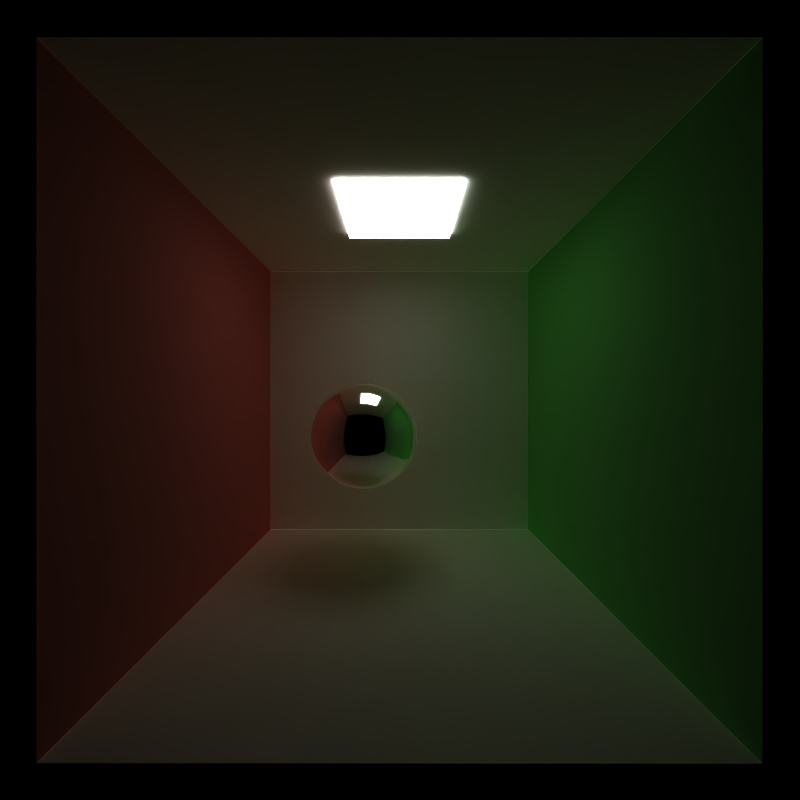

imperfect reflection

 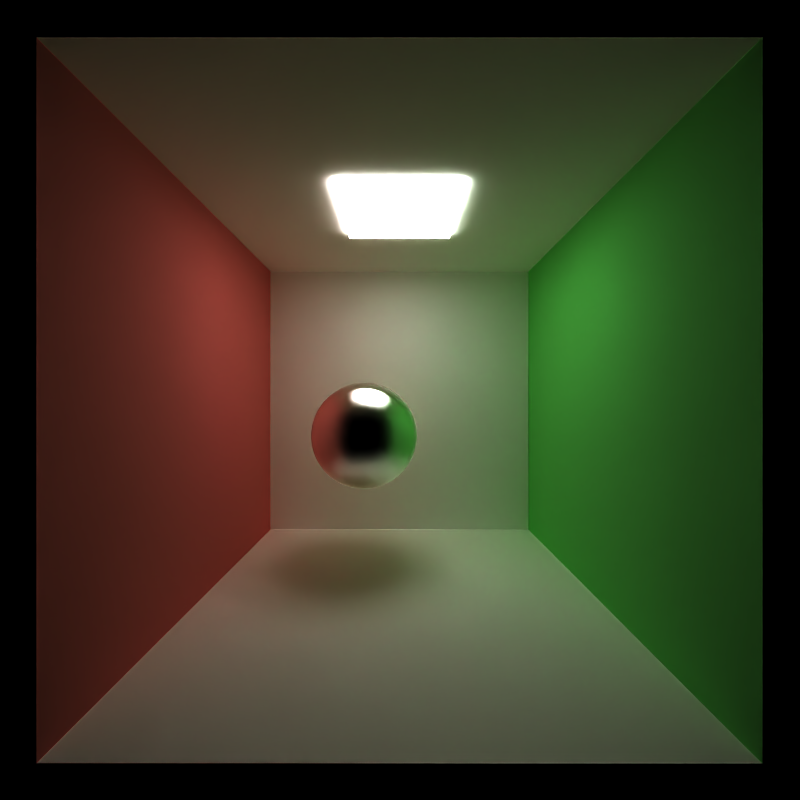  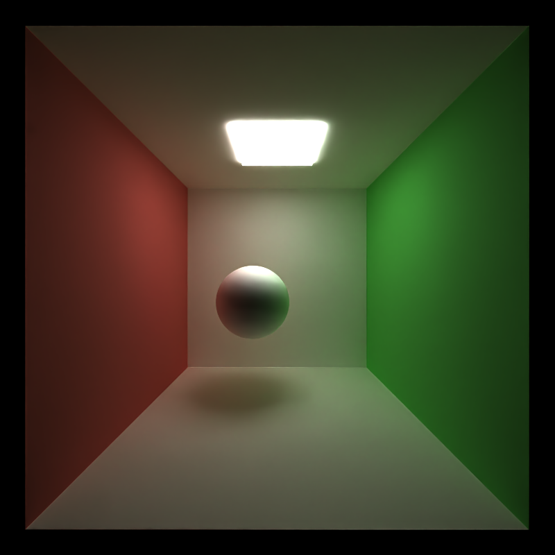

refraction and reflection

#### Visual Tools and Scene Features

##### OBJ Mesh Loading

##### Texture Mapping

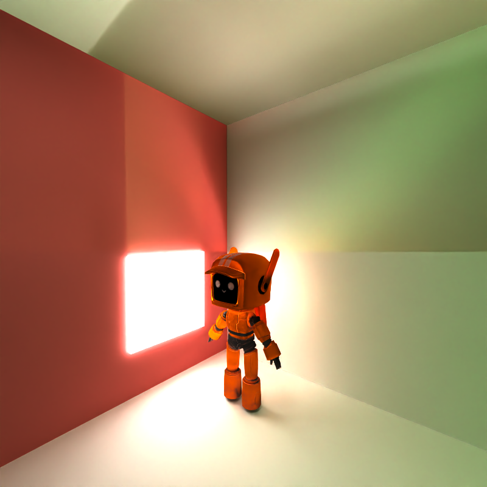  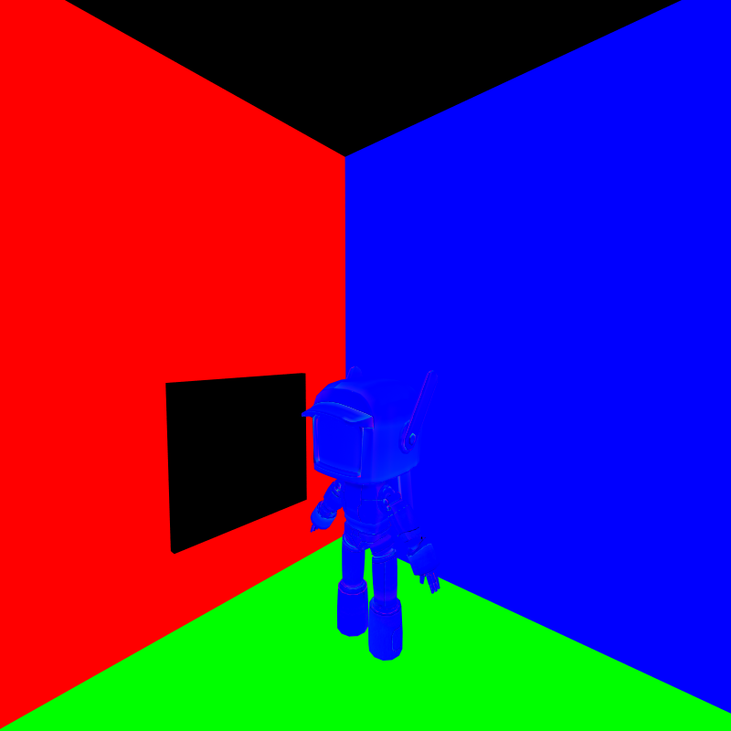 

##### Environment Map Lighting

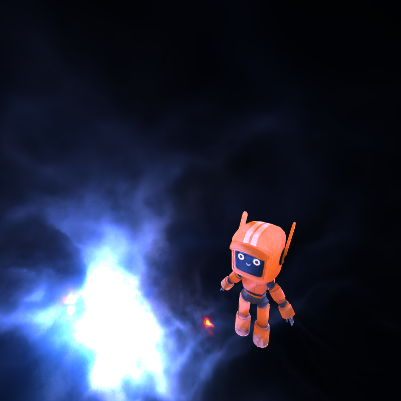

##### BVH accelerated spatial structure

 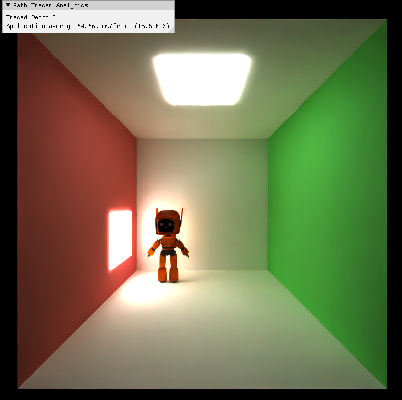

##### DOP (Depth of Field)

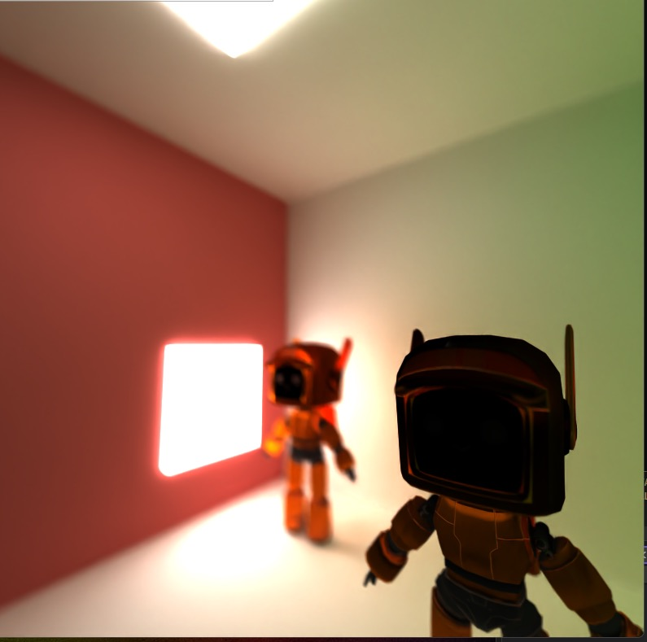 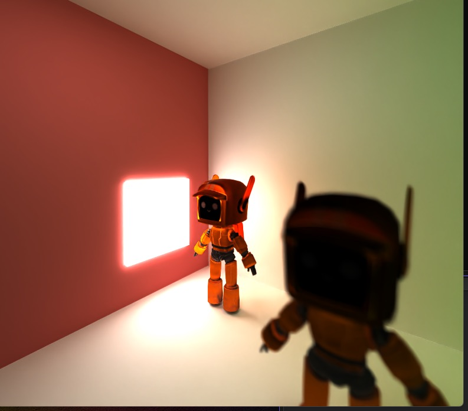

##### Denoise with intel Open Image Denoise

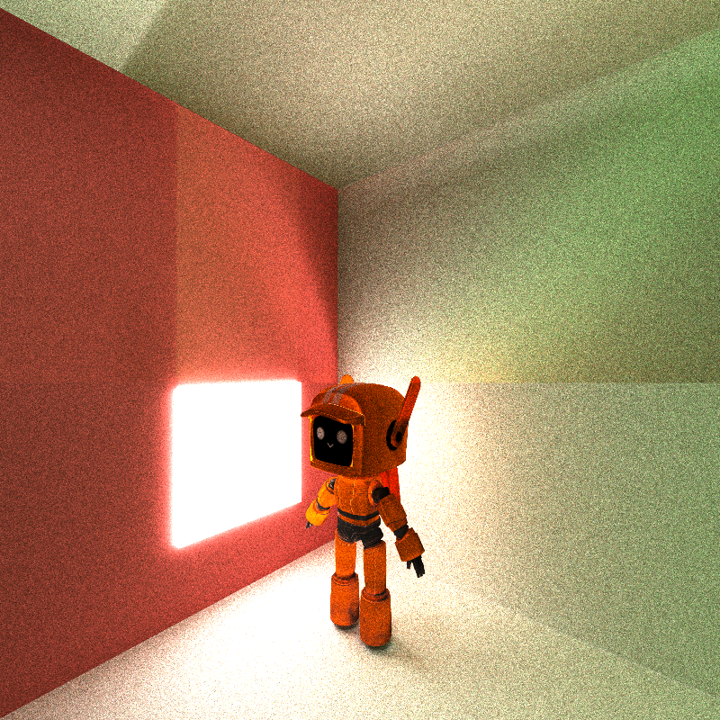 

