# CUDA Path Tracer

**University of Pennsylvania, CIS 565: GPU Programming and Architecture, Project 3**

- Jinxiang Wang
- Tested on: Windows 11, AMD Ryzen 9 8945HS w/ Radeon 780M Graphics 4.00 GHz 32GB, RTX 4070 Laptop 8 GB

## Results Preview:

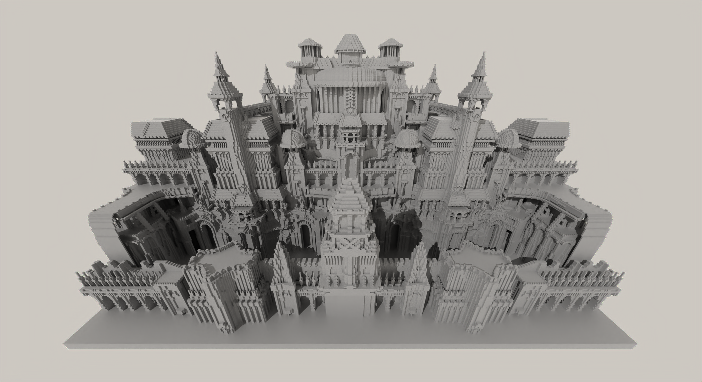

A large mineway castle shaded with one Disney BRDF material (6,490,766 triangles, 300 spp, 6.1 fps)

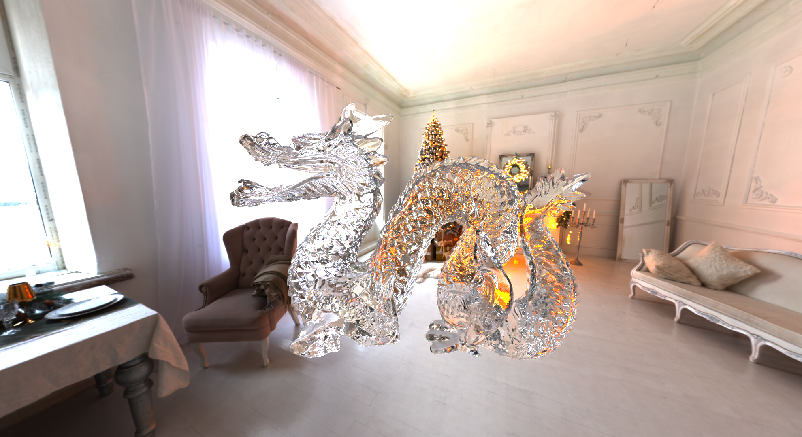

A stanford dragon shaded with refract material

## Features Implemented:

1. Bounding Volume Hierarchy (HLBVH)
2. Disney DRDF model (not fully correct in some cases)
3. GUI for dynamic material modification
4. Muiti-Importance Sampling
5. ACES Tone Mapping
6. TinyObj mesh loading
7. Environment Map
8. Stocastic Sampled Anti-Aliasing

# Bounding Volume Hierarchy

The base code shoots rays out from the camera and compute intersections with all objects in the scene.

This works fine when we can implicitly define intersecting method for each geometry (just like SDF). But after mesh loading feature is implemented, the way of light-scene intersection is changed from calculating
intersection with implicit geometries to calculating it with all triangles!

This gives an extremely low performance when model with many faces is loaded:

| < 200 faces (~60 fps)            | ~6000 faces (< 10 fps)          |
| -------------------------------- | ------------------------------- |
| 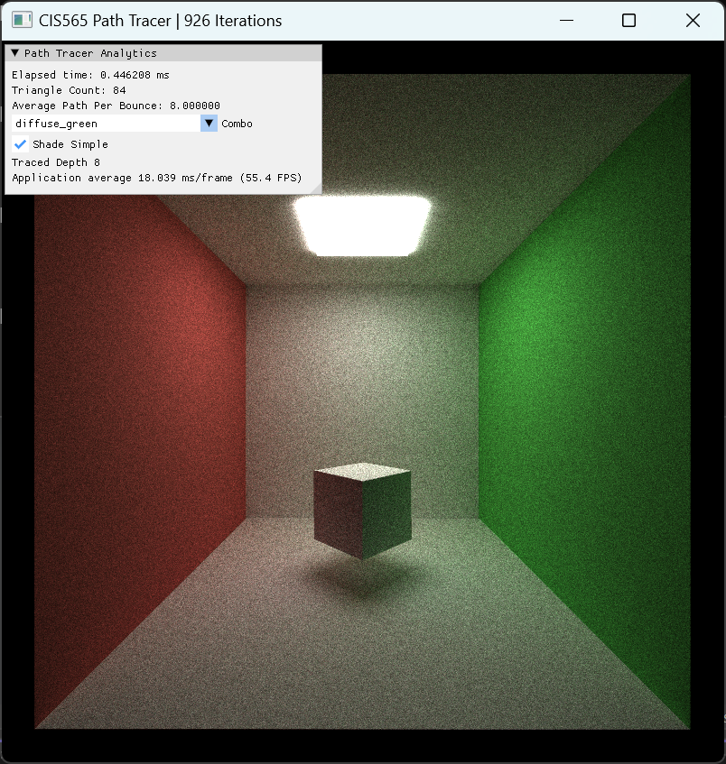 | 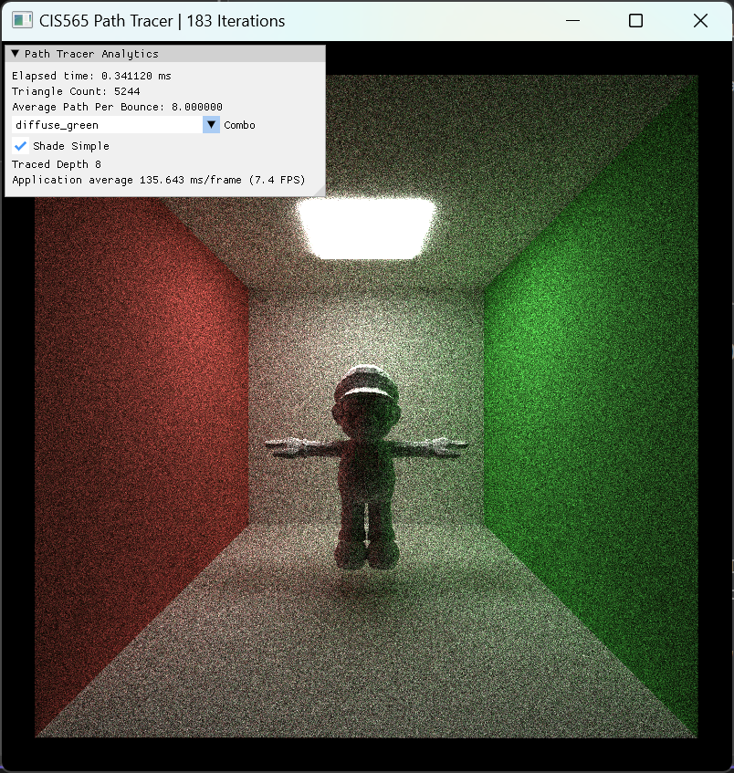 |

To effectively reduce the amout of intersection computation, we could use BVH, Bounding Volume Hierarchy, which construct
a tree-like structure to store scene primitives.

The efficiency of BVH depends on how we build the tree. There are many ways to segment triangls, for this project, I used HLBVH, which is a combination of Surface Area Heuristic (SAH) and morton code based Linear BVH. For more reference, check [PBRT 4.3 Bounding Volume Hierarchy](https://pbr-book.org/3ed-2018/Primitives_and_Intersection_Acceleration/Bounding_Volume_Hierarchies).

And this gives a very good speed up

| Before BVH (< 10 fps)           | After BVH (~30 fps)           |
| ------------------------------- | ----------------------------- |
|  | 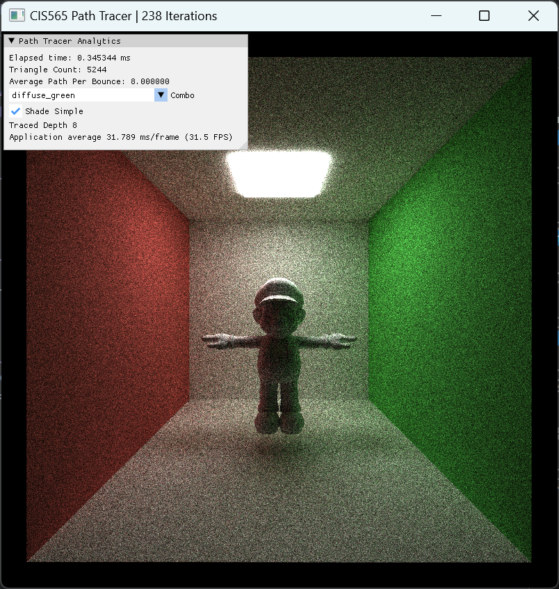 |

We can go even further with a stanford dragon (2,349,078 triangles)

| Dragon ( 15 fps)            |
| --------------------------- |
| 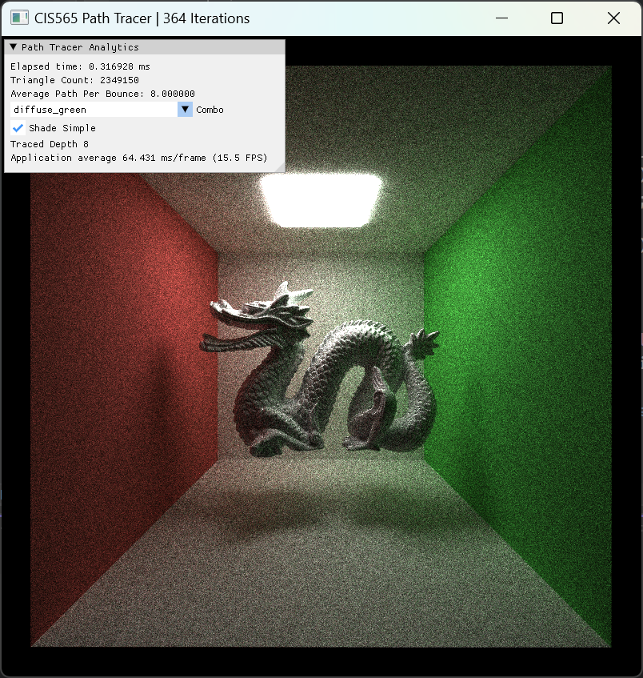 |

Visualizer:

| Wahoo                    | Dragon                         | Mineway Castle                |
| ------------------------ | ------------------------------ | ----------------------------- |
| 5117 triangles           | 2,349,078 triangles            | 6,490,766 triangles           |
|  |  | 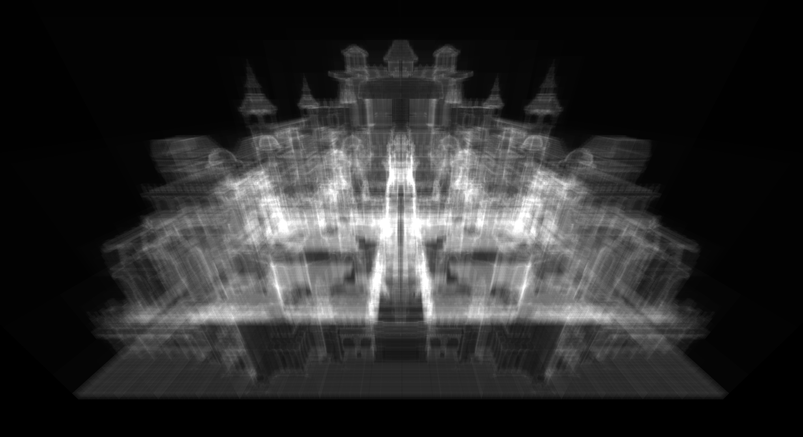 |

# Disney BRDF Model

This is a robust and art-oriented material model that allows for interpolation between different types of material based on pbr parameters. The model implemented in this project referenced SIGGRAPH 2012 [Physically Based Shading at Disney](https://media.disneyanimation.com/uploads/production/publication_asset/48/asset/s2012_pbs_disney_brdf_notes_v3.pdf) by Disney and their public repo [brdf](https://github.com/wdas/brdf/tree/main)
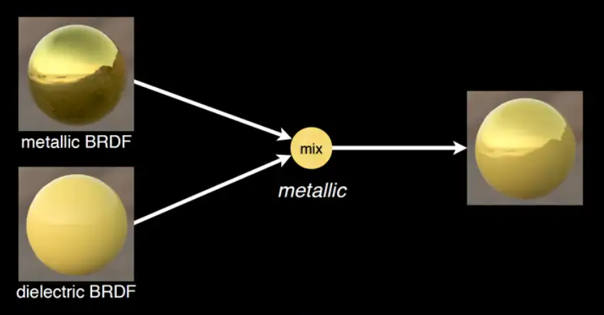

The input parameters are given by:

color baseColor .82 .67 .16  
float metallic 0 1 0  
float subsurface 0 1 0  
float specular 0 1 .5  
float roughness 0 1 .5  
float specularTint 0 1 0  
float anisotropic 0 1 0  
float sheen 0 1 0  
float sheenTint 0 1 .5  
float clearcoat 0 1 0  
float clearcoatGloss 0 1 1

| Input Format
| ------------------------------------- |
| 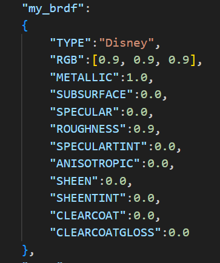 |

GUI allowing for dynamically changing parameters:

| GUI                             |
| ------------------------------- |
| 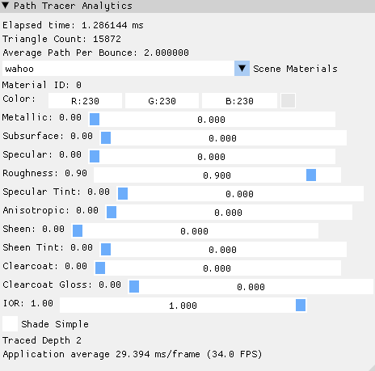 |

A brief demo illustrates the usage:

https://github.com/user-attachments/assets/62e0fcce-20bc-49f6-b9c6-eea6904767dc

# Direct Lighting & Multi-Importance Sampling

Consider the following 2 scenarios:

1. When light is very small in size
2. When we want to implement point light/directional light/spot light

When light is small in size, it is less likely for a diffused BRDF to gather meaningful light contribution.
Therefore, each time when a ray hits a surface, we can consider sampling radiance directly from a light in the scene.
This way of calculating radiance contribution is called direct lighting.

The direct radiance from different sample point:

| Direct Lighting Radiance        | Accumulative Color (depth = 1)  |
| ------------------------------- | ------------------------------- |
|  | 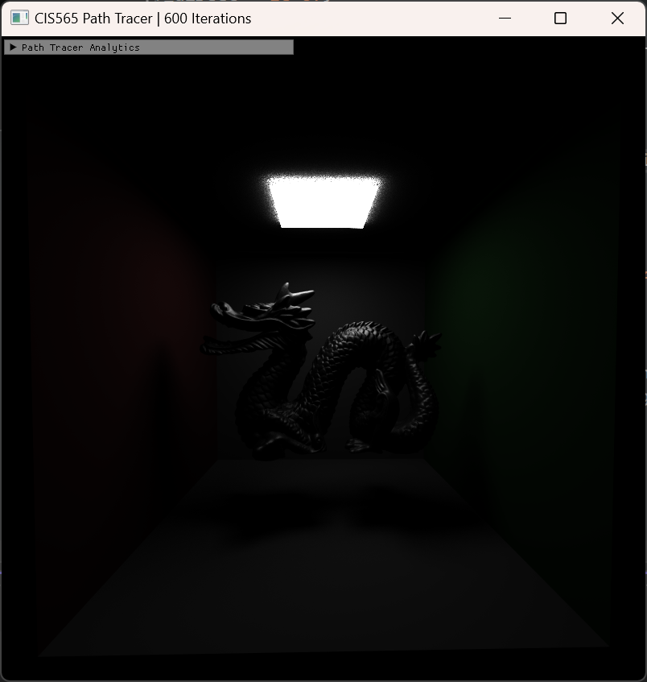 |

But direct lighting behaves poorly when sampling from a large area light.

Veach Scene:

| BSDF Lighting                | Direct Lighting            | MIS Lighting                  |
| ---------------------------- | -------------------------- | ----------------------------- |
| 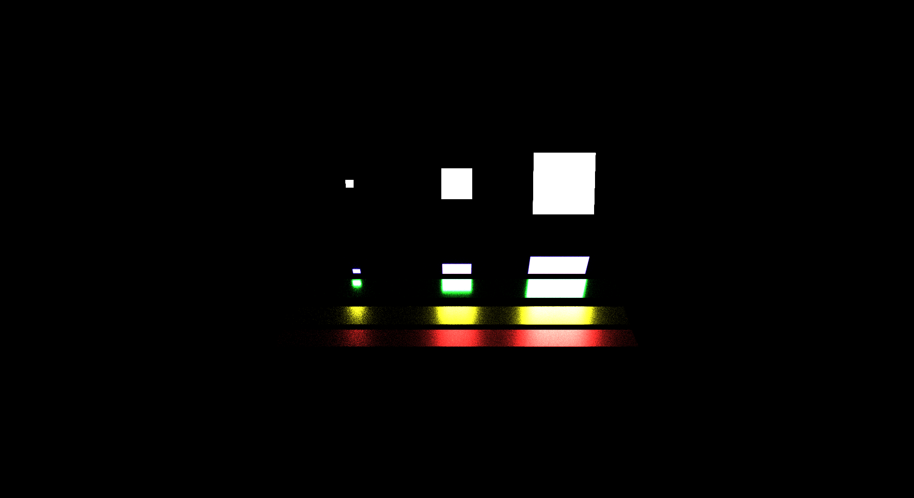 | 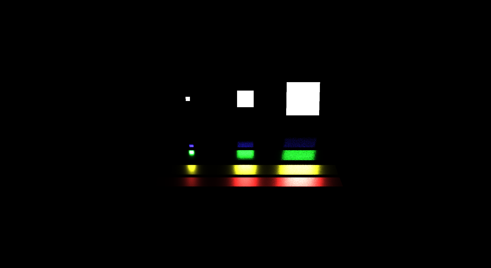 | 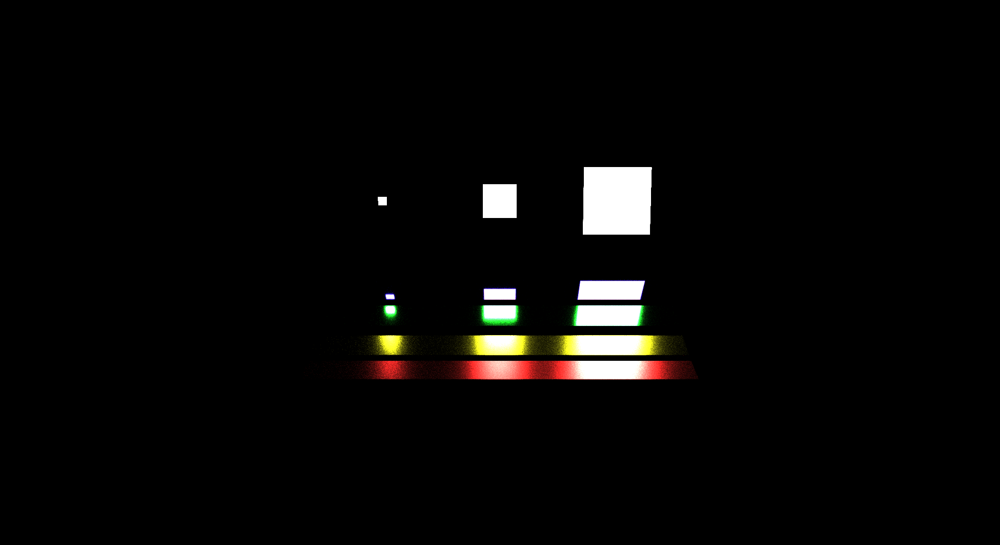 |

So a good practice might be to combine the two method, which is the main idea of Multi-Importance Sampling. To ensure energy-conserving contribution, we use Power Heuristic to calculate the appropriate weight for the directional light radiance.

Also by having an additional directional light contribution, we can acchieve a faster convergence. In order to make a correct contribution to our final color. At each bounce, multiply the sampled radiance with corresponding throughput (radiance `*` accumThroughput `*` BSDF(wo, wdirect)).

Some results:

| MIS On                     | MIS Off                     |
| -------------------------- | --------------------------- |
| 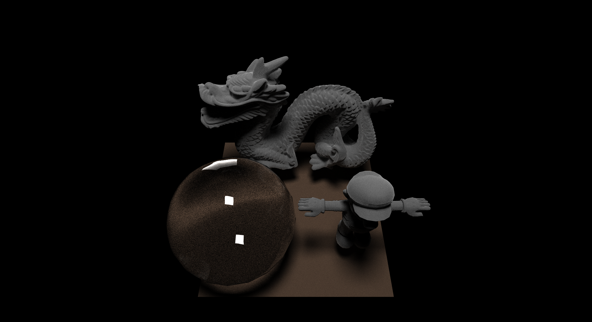 | 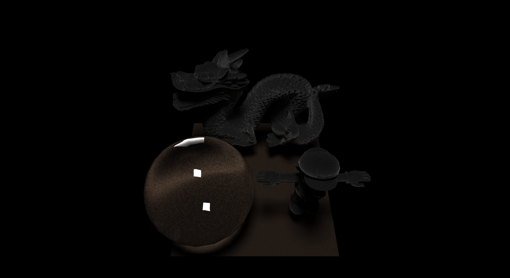 |

### Tone Mapping

---

Applying ACES Tone Mapping

| ACES Off                      | ACES On                      |
| ----------------------------- | ---------------------------- |
| 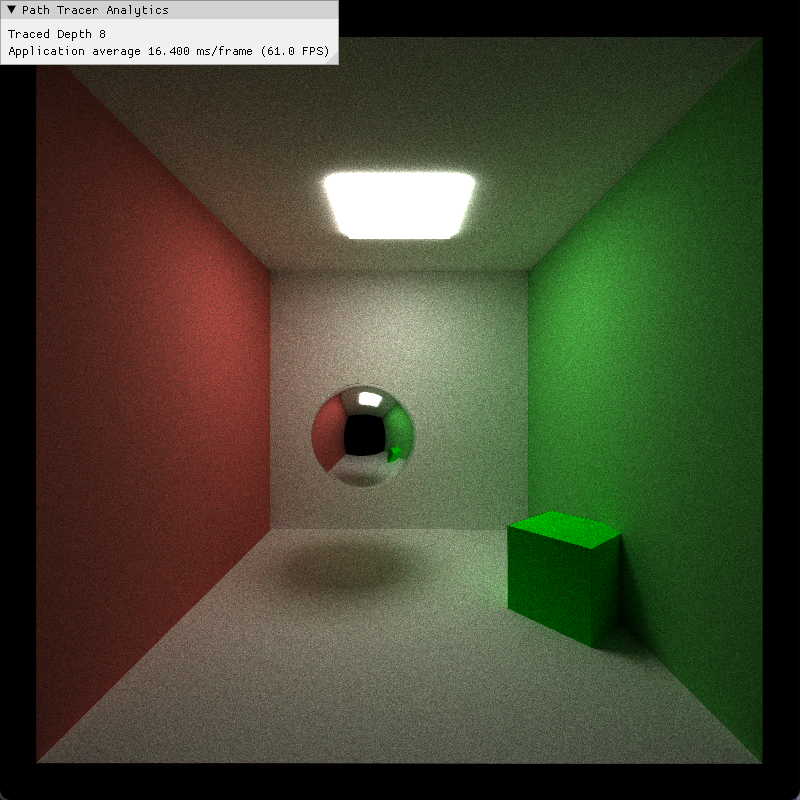 |  |

### Stocastic AA

---

| AA Off                     | AA On                    |
| -------------------------- | ------------------------ |
| 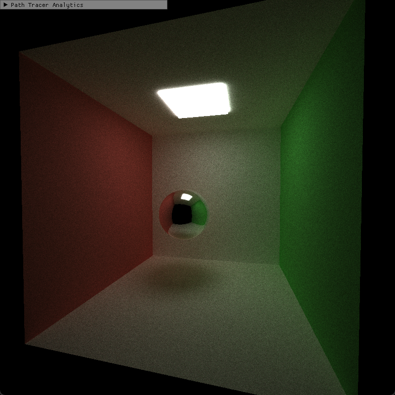 | 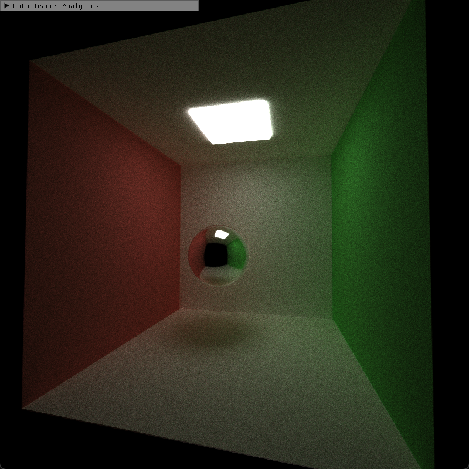 |

### Denoiser (Intel® Open Image Denoise)

---

| Denoiser Off                          | Denoiser On                             |
| ------------------------------------- | --------------------------------------- |
| 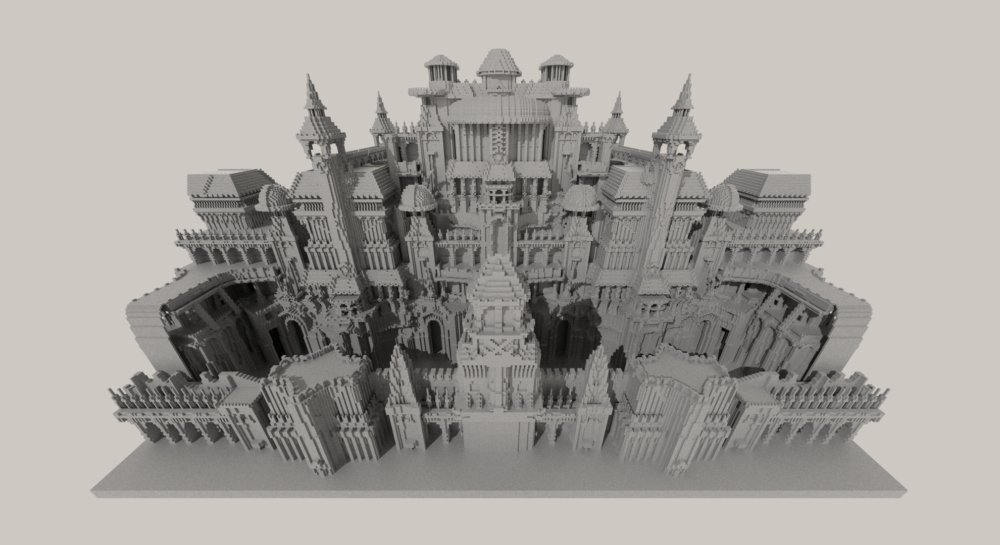 |  |
