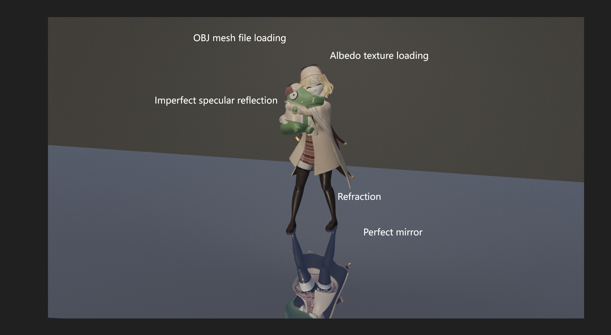
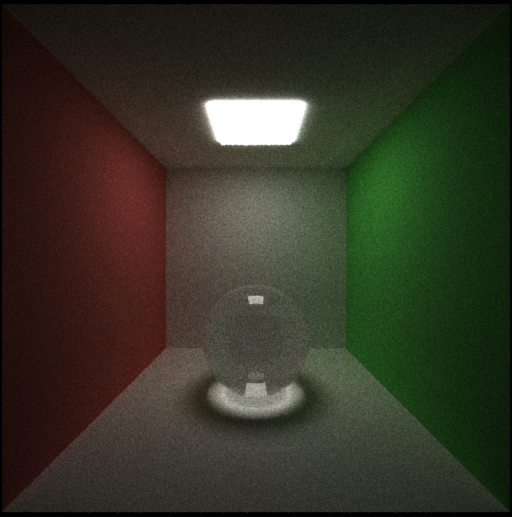
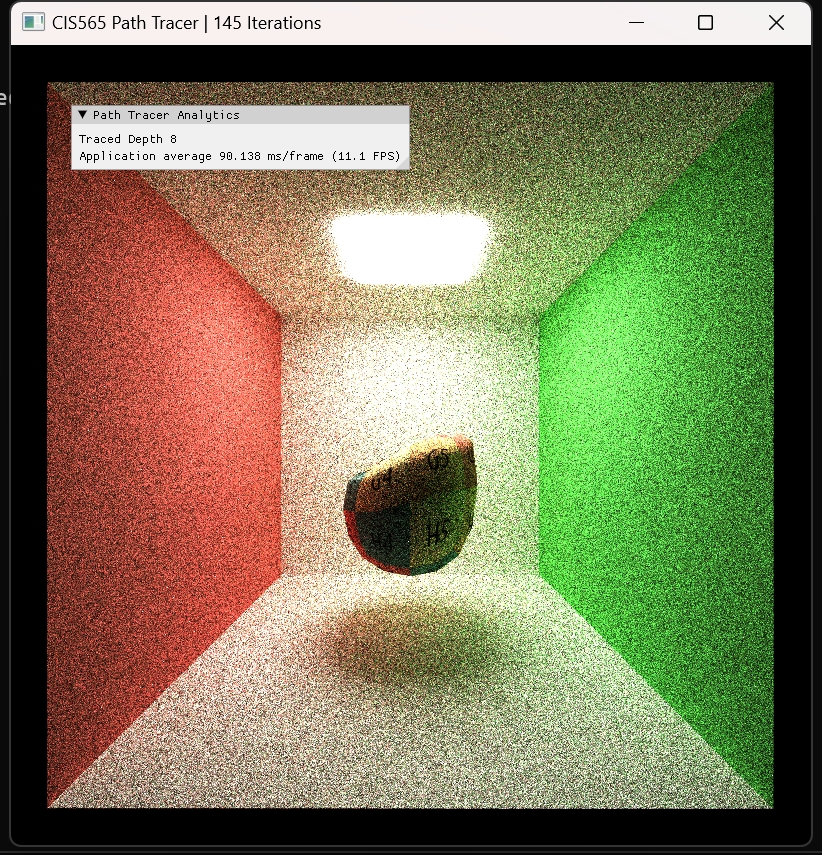

CUDA Path Tracer
================

**University of Pennsylvania, CIS 565: GPU Programming and Architecture, Project 3**

* Akiko Zhu
  * [LinkedIn](https://www.linkedin.com/in/geming-akiko-zhu-b6705a255/)
* Tested on: Windows 11, i9-12900H @ 2.50GHz 16GB, RTX 3070Ti 8GB (Personal)

### Result

*models from the free FBX download website
### Features
This project is a GPU-based CUDA Path Tracer
- Implemented a basic diffuse shading function
- Implemented a perfectly mirror and imperfect specular reflection function
- Implemented stream compaction to remove the terminated ray paths
- Implemented stochastic sampled antialiasing
- (Extra Feature) Arbitary OBJ mesh file loading
- (Extra Feature) Albedo and Normal Texture mapping function
- (Extra Feature) BVH hierarchical spatial data structure
- (Extra Feature) Refraction shading
### Analysis
#### Basic BSDF
In the first part, I implemented Bidirectional Scattering Distribution Function. The following images show the path tracer can render diffuse, perfect mirror, and refraction shader.
||||
|:--:|:--:|:--:|
|Diffuse|Reflection|Refraction|

#### OBJ file loading with Hierarchical Spatial Data Structure Accelaration
In this part, I implemented an efficient ray intersection testing function that can speed up the process of finding ray-object intersections. I grouped objects in a hierarchy of bounding volumes so that the intersection checks can be speeded up from O(n) to O(log n).
The left image shows that BVH data structure fast the render speed per frame (60.828 ms at about 146 iterations), while the right image shows that without BVH data structure, it takes 90.138 ms/frame at 145 render iterations.
|||
|:--:|:--:|
|w. BVH|wt. BVH|

#### Texture Mapping
In this part, I implemented albedo texture loading and normal texture loading.
|||
|:--:|:--:|
|Albedo and Normal|Albedo|
