CUDA Path Tracer
================

**University of Pennsylvania, CIS 565: GPU Programming and Architecture, Project 3**

* Annie Qiu
   * [LinkedIn](https://github.com/AnnieQiuuu/Project0-Getting-Started/blob/main/www.linkedin.com/in/annie-qiu-30531921a)
* Tested on: Windows 11, i9-12900H @2500 Mhz, 16GB, RTX 3070 Ti 8GB (Personal)

## Overview
This project is a CUDA-based path tracer designed to efficiently simulate realistic lighting in 3D scenes by tracing rays and evaluating their interactions with different materials. It focuses on optimizing performance through techniques like path segment sorting and stream compaction. The path tracer also includes features such as anti-aliasing, refraction with Fresnel effects, and efficient path termination, ensuring both high visual fidelity and fast rendering times.

### Customized Scene
#### Scene: Fly me to the Saturn
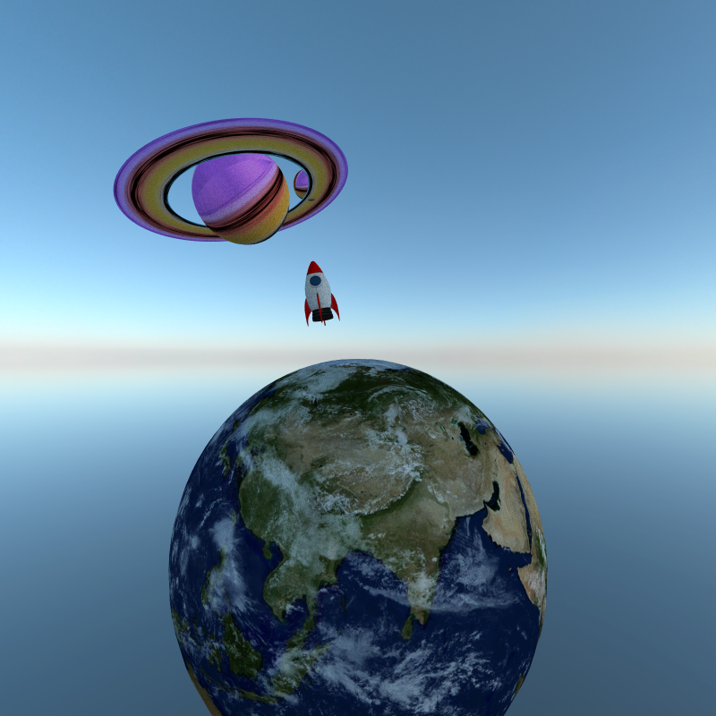

### Features
- Part 1: Core Features
    - A shading kernel with BSDF evaluation for
        - Ideal Diffuse
        - Perfectly specular-reflective
    - Path continuation/termination using Stream Compaction
    - Sorting by material type to get contiguous in memory
    - Antialiasing with stochastic sampled
- Part 2: More unique featrues
    -  Refraction (e.g. glass/water) with Frensel effects
    -  Physically-based depth-of-field (by jittering rays within an aperture)
    -  Arbitrary obj mesh loading and rendering 
    -  Texture mapping and bump mapping
    -  Implement Russian roulette path termination, which terminates unimportant paths early without introducing bias
- Part 3: Extra features
    - Environment Mapping

## Description Output

### Feature 1: Shading Kernel with BSDF Evaluations
The shading kernel computes light interactions at each ray-surface intersection using Bidirectional Scattering Distribution Functions (BSDF). 
- Ideal Diffuse: Simulates surfaces that scatter light uniformly in all directions with cosine-weighted scattering.
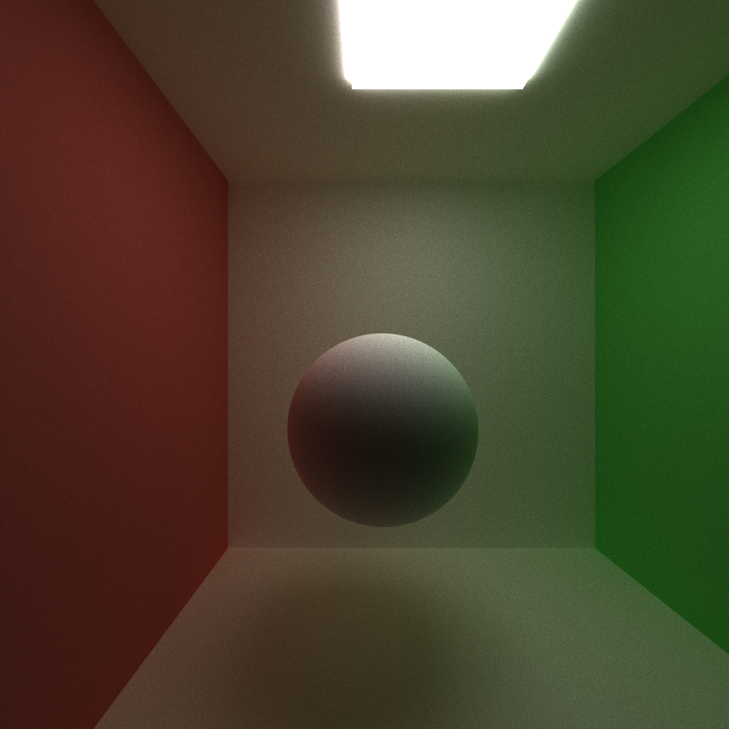

- Perfectly Specular: Mirror like surface, relects light perfectly based on the incident angle.


### Feature 2: Antialiasing with stochastic sampled
By jittering ray directions slightly at each pixel and averaging the results to make the image looks smoother and more natural.
- Anti-Aliased
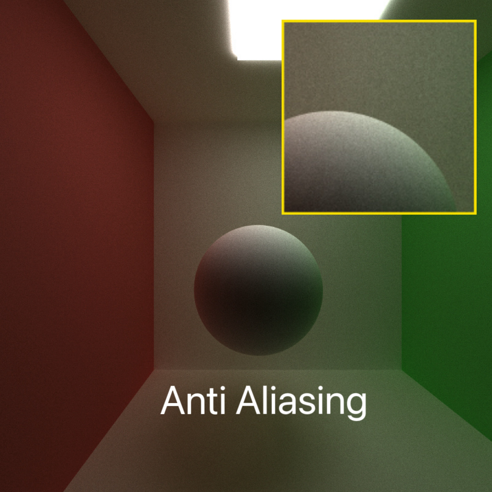

- Non-Anti-Aliased
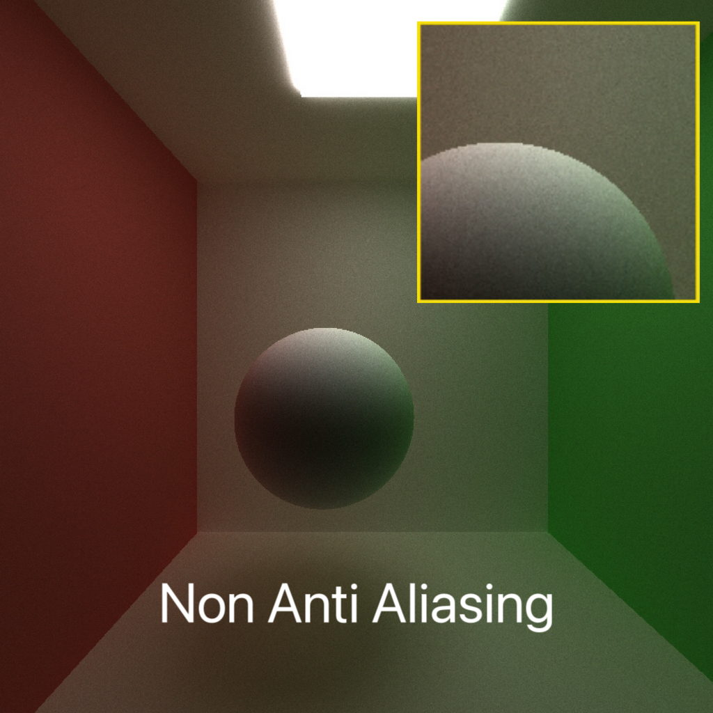

### Feature 3: Refraction
Implements refraction using Snell's Law with Fresnel effects for realistic materials like glass and water. Different Index of Refraction (IOR) values can be applied to simulate various transparent materials:
- Glass: IOR = 1.55
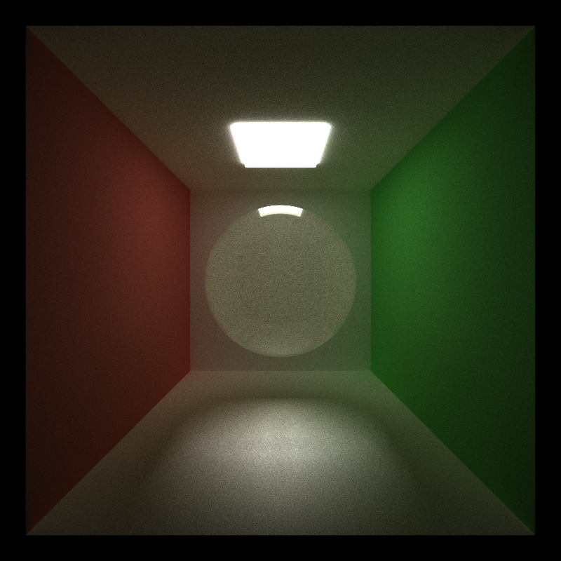

- Different iors results: IOR = 1.55, 1.33, 1.31, 2.42
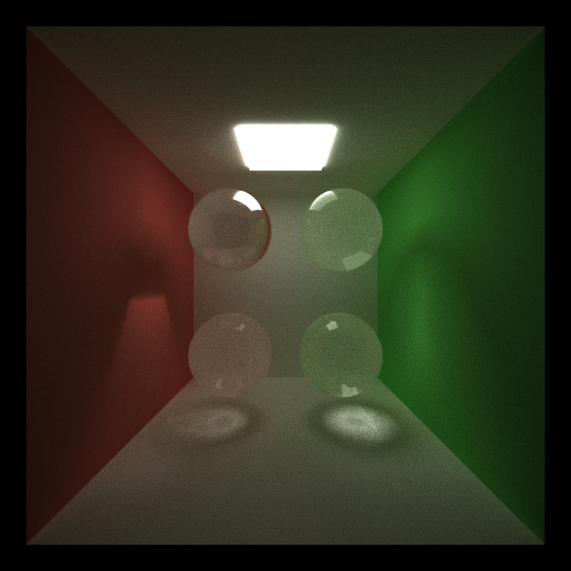

### Feature 4: Physically-based depth of field
This feature is to simulate the real life camera lens. It produces a depth-of-field (DOF) effect, making objects outside the focus range appear blurred.
- Without dop: All objects appear in focus.
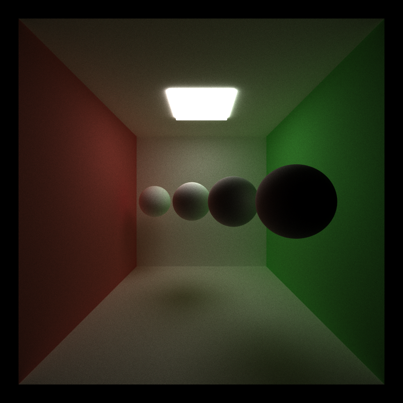

- With dop: Objects closer or farther than the focus point appear blurred, enhancing realism.


- User friendly toggable UI
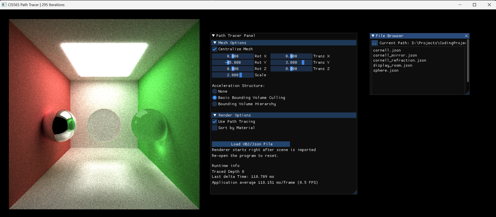
- Focal Length
- Aperture

### Feature 5: Arbitrary obj mesh loading and rendering 
This feature enables the loading of complex 3D models from OBJ files to your scene. By simply adding "OBJ" in the JSON file, you can load models and assign materials to them.
- Marrio mesh with build in diffuse white material.
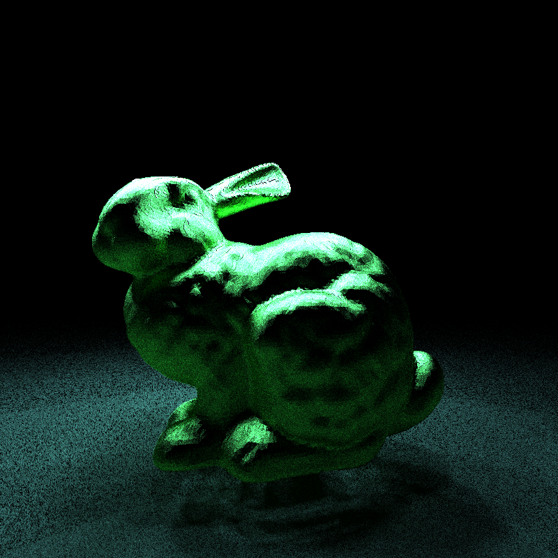

### Feature 6: Texture mapping and bump mapping
Supports both file-loaded textures and procedural textures.
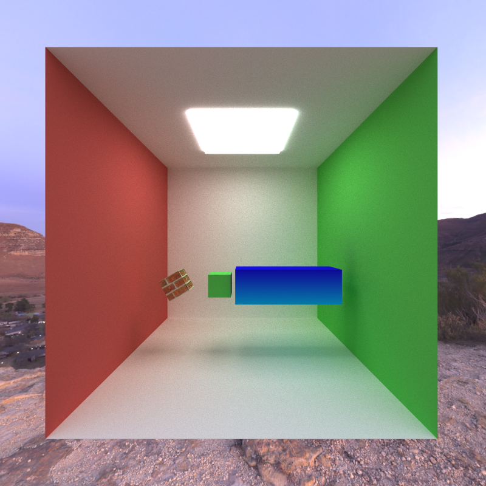

Comparision Between with normal mapping and without normal mapping.
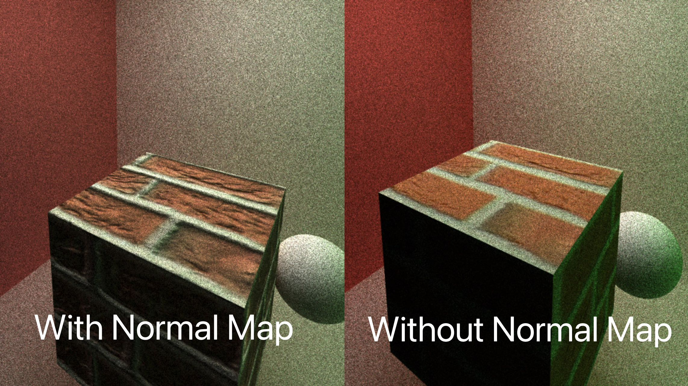

### Feature 7: Environment Mapping
Supports environment mapping. However, it is not compatible with stream compaction, as stream compaction terminates rays prematurely, preventing environment sampling.
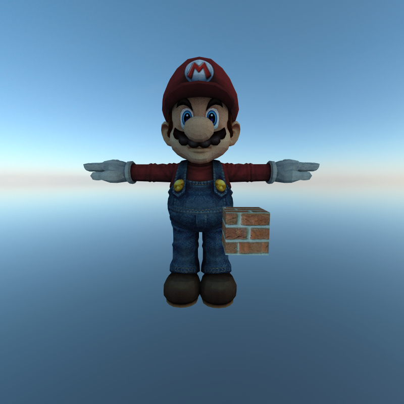


## Description Performance

### Feature 8: Path continuation/termination using Stream Compaction
Stream Compaction is used to terminate completed rays efficiently, preventing wasted computation on rays that have no further contribution to the scene. This method ensures that active paths are processed while inactive paths are discarded. 
- Stream Compaction Chart

### Feature 9: Sorting by material type to get contiguous in memory
Sorting rays/path segments by material type ensures that all rays interacting with the same material are processed together, reducing memory divergence and improving efficiency in the shading kernel.
- Sort material Chart

### Feature 10: Russian Roulette
This feature terminates less important rays early in the path tracing process.
- Performance evaluation

## Bloopers
- Texture Mapping

## Instruction
- Scenes Selection: All the scenes are stored in the scene directory. You can call the scene by setting JSON file path "../scenes/sceneName.json" in the Debugging > Command Arguments section in the Project Properties.
- Change the following define to test the features
```
#define OBJ 1
#define STREAM_COMPACTION 1
#define SORTMATERIAL 0
#define RUSSIAN_ROULETTE 0
```

## Reference
- BVH: https://jacco.ompf2.com/2022/04/13/how-to-build-a-bvh-part-1-basics/
- Earth: https://www.turbosquid.com/3d-models/free-max-mode-realistic-planet-earth/916040
- Rocket: https://www.turbosquid.com/3d-models/3d-toy-rocket-4k-free-1973134
- Planet: https://www.turbosquid.com/3d-models/3d-stylized-planet-system-4k-free-1973128


