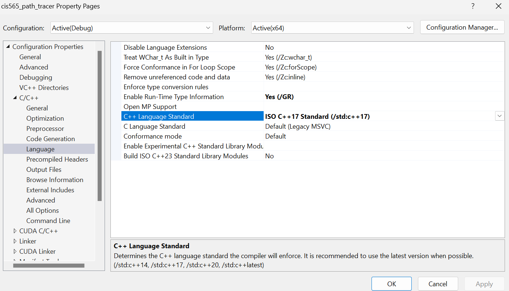
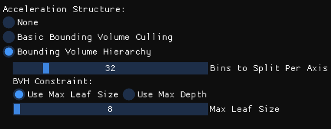
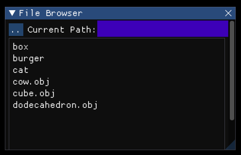

CUDA Path Tracer
================

**University of Pennsylvania, CIS 565: GPU Programming and Architecture, Project 3**

* Jiahang Mao
  * [LinkedIn](https://www.linkedin.com/in/jay-jiahang-m-b05608192/)
* Tested on: Windows 11, i5-13600kf @ 5.0GHz 64GB, RTX 4090 24GB, Personal Computer

## 1. Key feature implemented

Part 1
1. Cuda path tracing with lambertian and specular shading kernel
2. Unhit path termination using Stream Compaction
3. Sort ray-scene intersection by material type
4. Stochastic sampled antialiasing

Part 2
1. Obj mesh import.
2. BVH. Tree construction done on CPU, traversal with GPU. Configurable with either max depth or max leaf size.
3. Refraction. Support transmissive-only and glass-like material.

## 2. Build 

Use C++ 17 or later instead of default C++ 14 with VS2022. Reason is because I added `<filesystem.h>` to support importing files using windows file system.

Change under property -> C/C++ -> Language -> C++ Language Standard




## 3. Navigating UI

I made some updates to the UI, building on top of the imgui.


#### Mesh Options
* `Centralize mesh` When loading loading arbitrary obj mesh, this option automatically compute the center and scale, then apply a transformation to the center of camera's front pov.
* `Mesh transformation` Post-import transformation also customizable.
#### Acceleration Structure
A single choice between three options
* `None` No accleration structure will be applied. For each render pass the intersection checks each ray against all geometry in the scene.
* `Basic Bounding Volume Culling` Conceptually equivalent to a depth-equals-to-one BVH. Construct a single bounding box surrounding the mesh. 
* `Bounding Volume Hierarchy` Construct a tree-like structure to organize the geometry. The tree is built on CPU and traversed on GPU.
  
  * `Bins to Split Per Axis` Controls the number of bins used when determining the best split plane during BVH construction.
  * `BVH Constraint` Choose between using a maximum leaf size or maximum depth as the stopping criterion for BVH construction.
    * `Max Leaf Size` The maximum number of primitives allowed in a leaf node.
    * `Max Depth` The maximum depth allowed for the BVH tree.
#### Render Options
* `Use Path Tracing` Toggle between path tracing and basic shading. Latter suited for quick view of geometry.
* `Sort by Material` Enable/disable sorting of ray-scene intersections by material type.
#### Loading file
* Support either .json or .obj file. When importing an obj file, automatically load a display room scene under ./scenes/display_room.json

    
#### Program output
* Command prompt will have useful info about the mesh and bvh for debugging.
    ```console
    --- Mesh Info ---
    Loaded 5664 vertices, 11272 faces, and 1 face materials.
    Auto-centering object...
    Geometric Center: vec3(0.108734, 0.431662, 0.382079)
    Average Distance to center : 1.03667
    --- BVH Info ---
    Building BVH...
    Validating BVH...
    BVH is valid. Max depth: 50, largest leaf size: 69
    ```
## 4. Performance benchmark


### 3rd-party code used

* https://github.com/tinyobjloader/tinyobjloader/

