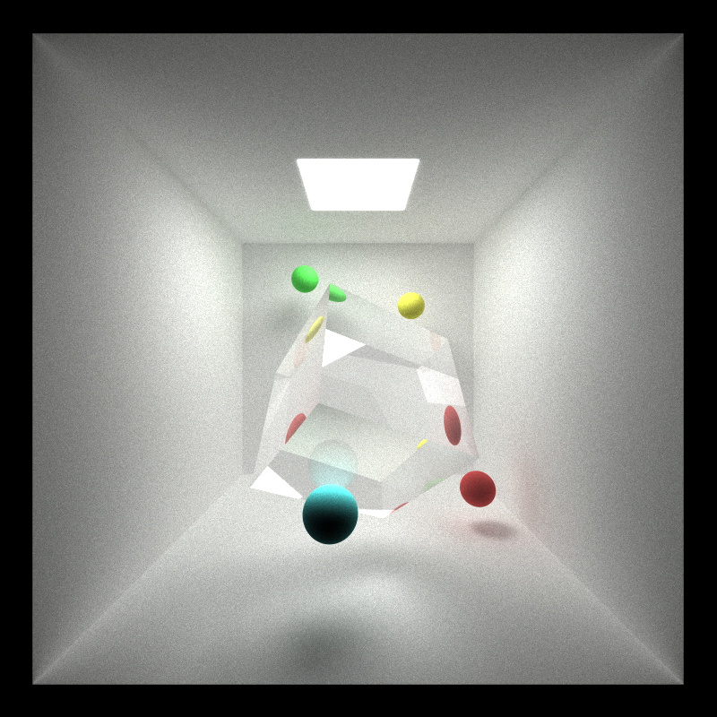

CUDA Path Tracer
================

**University of Pennsylvania, CIS 565: GPU Programming and Architecture, Project 3**

* Mufeng Xu
  * [LinkedIn](https://www.linkedin.com/in/mufeng-xu/)
* Tested on: Windows 11, i9-13900H @ 2.6GHz 32GB, RTX 4080 Laptop 12282MB (Personal Computer)

## Features

- Core
  - Diffuse
  - Perfectly Specular-Reflective Surfaces
  - Imperfect Specular
  - Stream Compaction
  - Sort Path Segments by Materials
  - Stochastic Sampled Anti-aliasing
- Extra
  - Refraction 2️⃣
  - Dispersion 3️⃣
  - Physics-based DoF 2️⃣
  - Motion blur 3️⃣
  - Re-startable path tracing 5️⃣

### Refraction

The implementation of refraction uses [Schlick's Approximation](https://en.wikipedia.org/wiki/Schlick'**s_approximation**)
to produce Fresnel Effect.

|              IoR = 1.2               |               IoR = 1.52             |
|:------------------------------------:|:------------------------------------:|
|   |  |

And imperfect refraction is also implemented with BRDF and BTDF:

The following demos are rendered with ***Roughness = 0.03***.
|                      IoR = 1.2                      |                       IoR = 1.52                    |
|:---------------------------------------------------:|:---------------------------------------------------:|
|   |  |

**Performance**: Refraction adds new branches to the `scatterRay` kernel,
and more branching causes more waste of GPU clock cycles. 
The measured performance impact is about 5%.

**Compare w/. CPU**: N/A

**Possible Improvement**: Sorting by materials might improve the performance if the geometry/scene is more complicated,
however this is not the case with my simple scenes.

### Dispersion

Dispersion happens because for the some material, 
the index of refraction (IoR) is varies for light with different wavelengths (colors).
In my implementation, the program samples different colors (RGB) in different iterations,
and each component has a different IoR, creating a realistic dispersion effect.

|            Without Dispersion           |             With Dispersion          |
|:---------------------------------------:|:------------------------------------:|
|  |  |

**Performance**: While the dispersion simply separately samples different colors
at each iteration, it is almost "free". There is no observable negative impact on
the performance.

**Compare w/. CPU**: N/A

**Possible Improvement**: My implementation assumes the white color is composed of red, green and blue colors, 
however the natural light is composed of the whole spectrum, including red, orange, yellow, green, cyan, blue and 
purple etc. To create the dispersion effect like a rainbow, it probably requires to decompose the white light into
many different colors and ray trace them separately.

### Depth of Field

For an ideal pinhole camera, the aperture size is infinitesimally small, and the Depth of Field (DoF) is infinite.
To create the effect of Depth of Field, we just modify the ideal pinhole camera model, 
to make the aperture size greater than 0.

In the implementation, what we did is to modify the ray origin in `generateRayFromCamera` kernel,
the new origin is selected randomly within the size of the aperture.
And to update the ray direction, the `view` vector is computed by `glm::normalize(cam.lookAt - segment.ray.origin)`
instead of `normalize(cam.lookAt - cam.position)`.
  
| Aperture |          Focus $z=-3.0$         |           Focus $z=0.0$        |          Focus $z=+3.0$         |
|:--------:|:-------------------------------:|:------------------------------:|:-------------------------------:|
|  **20**  |   |   |   |
| **200**  |  |  |  |

From the demo we can conclude that larger the aperture, the more blurry will the objects not in focus would be.
This is exactly what the real-world physics tells us. Notice that when Aperture is 20, the DoF is large and the 
whole scene seem to be in focus, as they look exactly like that without DoF effect.

**Performance**: Physics-based DoF is achieved almost "free", 
since it just randomly chooses an origin for rays.
There is no observable impact introduced by the feature.

**Compare w/. CPU**: N/A

### Motion Blur

To implement motion blur, a `motion` array and a `exposure` float is added to the scene file.
The former indicates the velocity (magnitude and direction) of an object, 
while the latter is the exposure time.
The renderer (uniformly) randomly samples the moving objects in the exposure interval, 
and update the transform matrices at the beginning of every iteration.
And then the renderer uses the new transform matrices perform ray-tracing,
after statistically large number of iterations, you can observe the object "moving".

**Performance**: Motion Blur is achieved almost "free", 
because it computes the new transform matrices for each moving object only once per iteration.
There is no observable impact introduced by the feature.

**Compare w/. CPU**: A kernel is invoked for each moving object,
the kernel generate a random number to sample within the time interval,
and then update the transform matrices for the object.
If the number of moving objects is small, the overhead of the GPU implementation might cause it 
to be slower than a CPU implementation. However, if the number is large enough, GPU will beat CPU.

**Possible Improvement**: If the whole scene is moving the same way, it is actually equal to the 
camera moving. Similarly we can randomly place the camera at its moving path, 
to create a motion blurred photo. 

### Re-startable Path Tracing

All the path tracing state (except the scene) has been save in `renderState`.
To enable re-startable rendering, `serialize()` method is implemented for `class RenderState`,
which write the object into a binary file when dumping the rendering state.
To resume the rendering process, 
the program loads the binary file, and use `deserialize()` to recover `renderState`.

***Press `D` to save the current state into a binary file, 
and pass `-r NAME.ITERATION.bin` parameter to the program to restart rendering.***

****

**Performance**: No impact on rendering performance.

**Compare w/. CPU**: N/A

### Stream Compaction

Stream Compaction terminates path segments early, 
it closes the threads occupied by the "dead" rays, and accelerate ray tracing.
There are 2 conditions that the rays are terminated before the depths run out:
first is when a ray hits a light source, another is when a ray has no intersection
with any of the objects in the scene.

The percentage of remaining path segments decreases with depth when stream compaction is applied. 
At depth 0, stream compaction does not reduce the path count, 
but as the depth increases, the reduction becomes more significant.
There is only about 25% of the rays remaining at the 8th depth.
And the FPS increase was significant.

As a comparison, in a closed box scene the number of remaining rays doesn't significantly reduce.
Thus the boost in FPS is minor. The reason is that without the opening, a ray will only terminate
because it hits a light source, while the amount of rays hitting some light source is very small,
there would be a lot of photons still traveling around after a few tracing depths.
One possible workaround is to terminate a ray if the color intensity it records is lower than some
threshold, say 0.02, which means the contribution of the ray to the pixel is negligible. 

***Blooper time***

### Sorting by Materials

Theoretically, sorting the path segments by materials would reduce branching 
and boost the performance. However, in my simple scenes, the overhead of sorting
the path segments overmatches the cost of branching. The FPS dropped with the 
implementation of sorting by materials.

### Anti-aliasing

***Notice the cyan sphere, with anti-aliasing, the edge appears to be much smoother.***

|       Without Anti-aliasing       |      With Anti-aliasing       |
|:---------------------------------:|:-----------------------------:|
|          |        |

**Performance**: Anti-aliasing with stochastic sampling is almost "free".
Just jitter the camera ray direction with a uniform random distribution within a pixel every iteration,
the anti-aliasing is automatically achieved. There is no observable impact on the performance.

**Compare w/. CPU**: N/A
