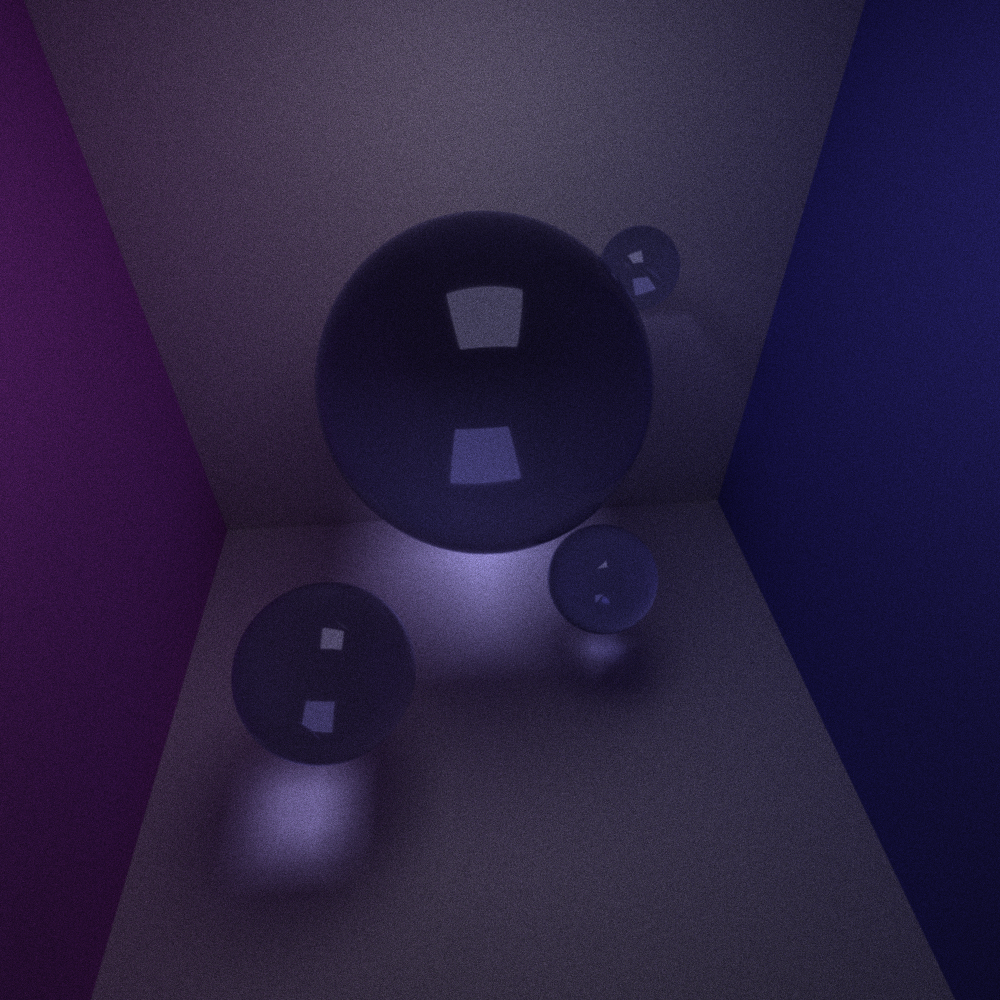

<h1 align="center"> CUDA Path Tracer </h1>

<small><h5 align="center">University of Pennsylvania, CIS 565: GPU Programming and Architecture, Project 3</h5></small>

<!-----
<h4 align="center">Meet the Dev</h4>

| 
  
 | 
 <i> Nadine Adnane </i> 
 [LinkedIn](https://www.linkedin.com/in/nadnane/) |
|------------------------------------------------------------------|---------------------------------------------------------------------------------------------------------------------------------|-->

 
---

## Summary

In this project, I implemented a CUDA-based path tracer capable of rendering globally-illuminated images at a fast pace.

## Part 1 - Core Features
- Shading Kernel with BSDF evaluation for:
## Ideal Diffuse Surfaces
- Overview
- Before/After images

### Perfectly Reflective Surfaces
- Overview
- Before/After images

### Partially Reflective Surfaces
- Overview
- Before/After images

### Stream Compaction
- Path continuation/termination using Stream Compaction
- Stream Compaction - Single iteration plot & analysis
- Stream Compaction - Open vs. Closed scene analysis
- Optimizations that target specific kernels (?)

### Memory-Sorted Materials
- Overview
- Before/After images

### Stochastic sampled Anti-Aliasing
- Overview
- Before/After images

## Part 2 - Customization
### Russian Roulette
- Overview
- Before/After images
- Performance impact
- GPU version vs Hypothetical CPU version
- Future Optimizations

### Refractive Materials
- Overview
- Before/After images
- Performance impact
- GPU version vs Hypothetical CPU version
- Future Optimizations

### Depth of Field
- Overview
- Before/After images
- Performance impact
- GPU version vs Hypothetical CPU version
- Future Optimizations

### Load OBJ
- Overview
- Before/After images
- Performance impact
- GPU version vs Hypothetical CPU version
- Future Optimizations

### Texture & Bump Mapping
- Overview
- Before/After images
- Performance impact
- GPU version vs Hypothetical CPU version
- Future Optimizations

### Dynamic JSON Loading
- Overview
- Before/After images
- Performance impact
- GPU version vs Hypothetical CPU version
- Future Optimizations

### Toggleable GUI Options
- Overview
- Before/After images
- Impact
- Future Ideas

## Bloopers! :D

Something bad is happening... I don't think this is denoising

## References & Helpful Resources
* [My pathtracer from CIS-5610 Advanced Rendering](https://github.com/CIS-4610-2023/homework-05-full-lighting-and-environment-maps-nadnane/tree/main) 
* [Thrust Library Documentation](https://nvidia.github.io/cccl/thrust/api/function_group__sorting_1ga667333ee2e067bb7da3fb1b8ab6d348c.html) 
* [OIDN Documentation](https://github.com/RenderKit/oidn)
* [DOF and Antialiasing](https://paulbourke.net/miscellaneous/raytracing/)