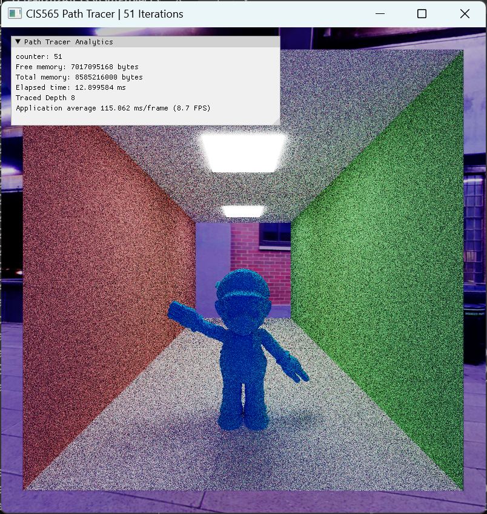

# CUDA Path Tracer

**University of Pennsylvania, CIS 565: GPU Programming and Architecture, Project 3**

- Jinxiang Wang
- Tested on: Windows 11, AMD Ryzen 9 8945HS w/ Radeon 780M Graphics 4.00 GHz 32GB, RTX 4070 Laptop 8 GB

## Results Preview:

A large mineway castle shade with one Disney BRDF material (6,490,766 triangles)

A stanford dragon shade with refract material

## Features Implemented:

1. Bounding Volume Hierarchy (HLBVH)
2. Disney DRDF model (not fully correct in some cases)
3. GUI for dynamic material modification
4. Muiti-Importance Sampling
5. ACES Tone Mapping
6. TinyObj mesh loading
7. Stocastic Sampled Anti-Aliasing

# Bounding Volume Hierarchy

The base code shoot rays out from the camera and intersect each object in the scene.

After mesh loading feature is implemented, the way of light-scene intersection is changed from calculating
intersection with implicit geometries to calculating it with all triangles! Which gives an extremely low frame rate
when model with many faces is loaded:
| < 200 faces (~60 fps) | ~6000 faces (< 10 fps) |
| -------------------------------------|-------------------------- |
| | |
