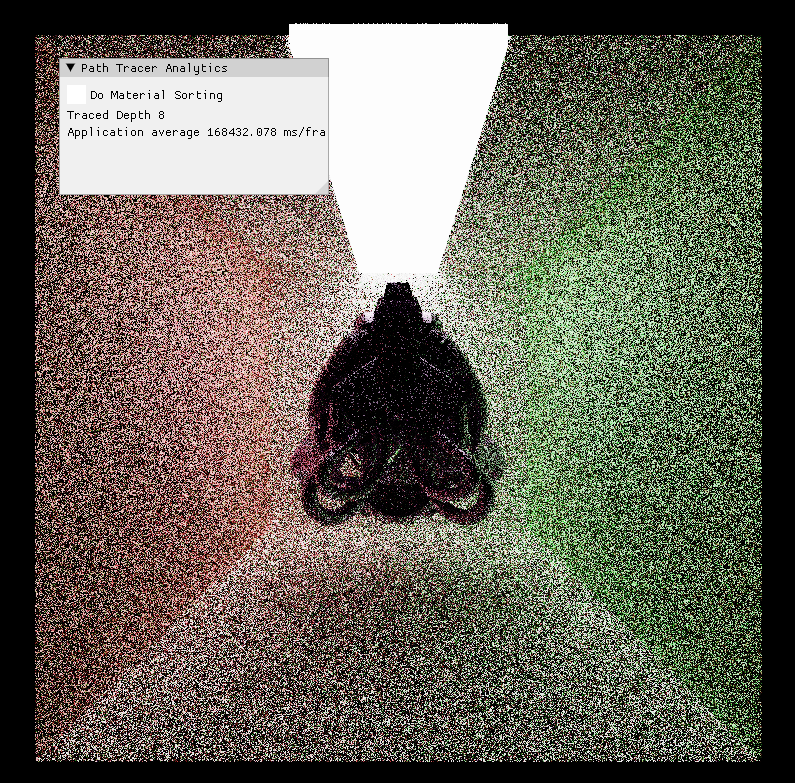

CUDA Path Tracer
================

**University of Pennsylvania, CIS 565: GPU Programming and Architecture, Project 2**

* CARLOS LOPEZ GARCES
  * [LinkedIn](https://www.linkedin.com/in/clopezgarces/)
  * [Personal website](https://carlos-lopez-garces.github.io/)
* Tested on: Windows 11, 13th Gen Intel(R) Core(TM) i9-13900HX @ 2.20 GHz, RAM 32GB, NVIDIA GeForce RTX 4060, personal laptop.

## Features

### Materials and Reflection Models

### Antialiasing

### Thins Lens Model and DoF

The camera configuration includes focus distance and aperture. These parameters are used to place the ray's origin at some point on the lens (as permitted by the aperture size) other than the center, chosen uniformly at random; the ray then passes through a jittered pixel position (see Antialiasing) and points at some point in the scene that is to be imaged in focused (as established by the focus distance). Obtaining a ray this way follows the thin lens model.

The thin lens model allows us to simulate Depth of Field (DoF), an imaging effect where objects at the focus distance are imaged in focus, while objects at other depths become gradually defocused.

The following images illustrate the effects of different aperture and focus distance values. Note how the reflection of the light source on the mirror ball is imaged to a larger set of pixels when the aperture size is larger. Note how objects become blurrier the farther from the focal plane they are.

| | Focus distance 3 | Focus distance 4 | Focus distance 5|
|----------------------------|----------------------------|----------------------------|----------------------------|
| Aperture 1 |  |  |  |
| Aperture 2 |  |  |  |

### Gamma Correction and ACES Tone Mapping

Gamma correction adjusts the brightness of an image by applying a nonlinear transformation to pixel values, compensating for the non-linear response of display devices. The resulting perceived brightness is consistent with human visual perception.

Tone mapping is applied to path-traced images to convert the high dynamic range (HDR) values into a range that can be displayed on standard screens. This process ensures that bright highlights and dark shadows are preserved in a visually appealing way, while preventing the image from looking too washed out or too dark.

These 2 postprocess conversions are performed for both the interactive preview and the stored image.

| No Postprocessing             | Gamma Correction                   | Gamma Corr. and ACES Tone Mapping   |
|-------------------------------|------------------------------------|-------------------------------------|
|  |  |  |

### glTF Mesh Loading and Triangle Mesh Intersections

`gltfLoader` is a thin layer I wrote on top of [Tiny glTF](https://github.com/syoyo/tinygltf) for loading glTF triangle meshes, along with their materials and textures.

For computing ray-triangle intersections, for each triangle in the mesh, `meshIntersectionTest` calculates whether the given ray intersects the triangle using the Möller-Trumbore intersection algorithm. It checks if the ray hits within the triangle boundaries, and if a valid intersection occurs, it calculates the intersection point, normal, and whether the hit is on the outside of the geometry. The closest valid intersection is returned, if any.

It takes very long to render one such triangle mesh. I spent a significant amount of time writing a BVH acceleration structure, but it didn't work well in the end.

The following image shows the [Damaged Helmet glTF model](https://github.com/KhronosGroup/glTF-Sample-Models/tree/main/2.0/DamagedHelmet) with a GGX material (roughness 0.5) after about 5 iterations or 25 minutes:

## Optimizations

### Stream Compaction of Active and Terminated Rays

### Path Sorting by Intersection Material Type

### (Incomplete) BVH-based Intersection Acceleration