CUDA Path Tracer
================

**University of Pennsylvania, CIS 565: GPU Programming and Architecture, Project 3**

* Mufeng Xu
  * [LinkedIn](https://www.linkedin.com/in/mufeng-xu/)
* Tested on: Windows 11, i9-13900H @ 2.6GHz 32GB, RTX 4080 Laptop 12282MB (Personal Computer)

## Features

- Core
  - Diffuse
  - Perfectly Specular-Reflective Surfaces
  - Imperfect Specular
  - Stream Compaction
  - Sort Path Segments by Materials
  - Stochastic Sampled Anti-aliasing
- Extra
  - Refraction 2️⃣
  - Dispersion 3️⃣
  - Physics-based DoF 2️⃣
  - Motion blur 3️⃣
  - Re-startable path tracing 5️⃣

### Refraction

The implementation of refraction uses [Schlick's Approximation](https://en.wikipedia.org/wiki/Schlick'**s_approximation**)
to produce Fresnel Effect.

|              IoR = 1.2               |               IoR = 1.52             |
|:------------------------------------:|:------------------------------------:|
| 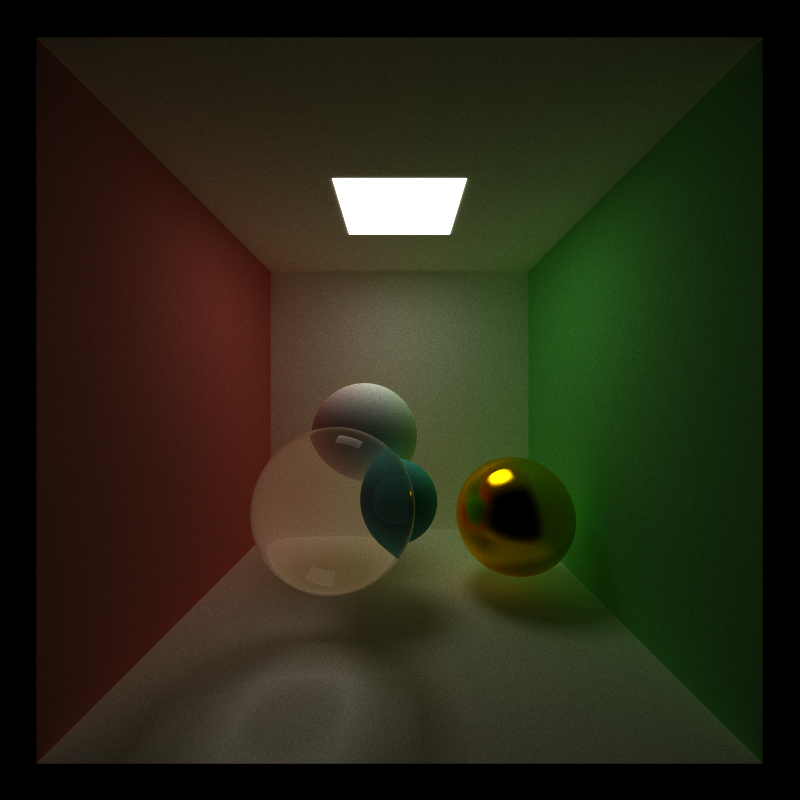  | 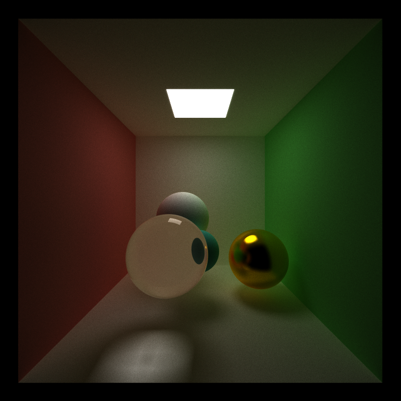 |

And imperfect refraction is also implemented with BRDF and BTDF:

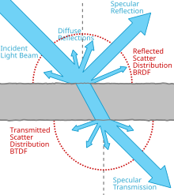

The following demos are rendered with ***Roughness = 0.03***.
|                      IoR = 1.2                      |                       IoR = 1.52                    |
|:---------------------------------------------------:|:---------------------------------------------------:|
| 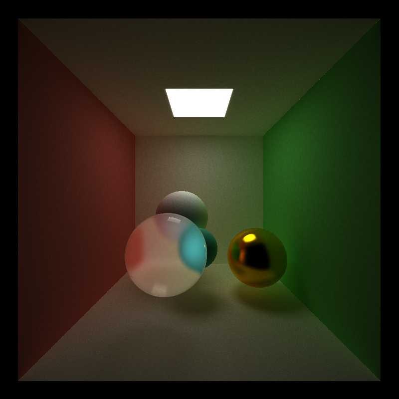  | 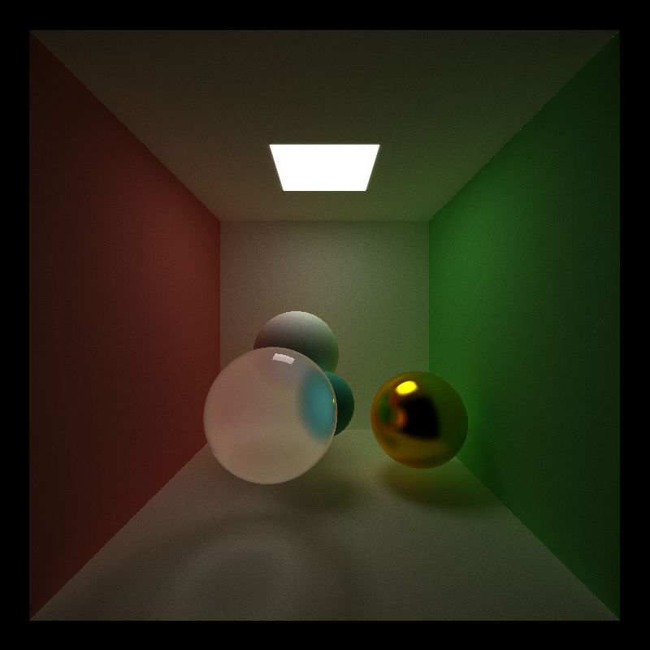 |

### Dispersion

Dispersion happens because for the some material, 
the index of refraction (IoR) is varies for light with different wavelengths (colors).
In my implementation, the program samples different colors (RGB) in different iterations,
and each component has a different IoR, creating a realistic dispersion effect.

|            Without Dispersion           |             With Dispersion          |
|:---------------------------------------:|:------------------------------------:|
| 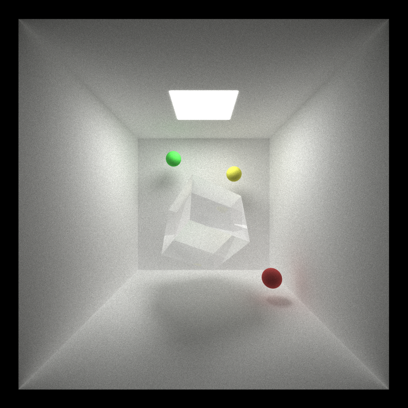 | 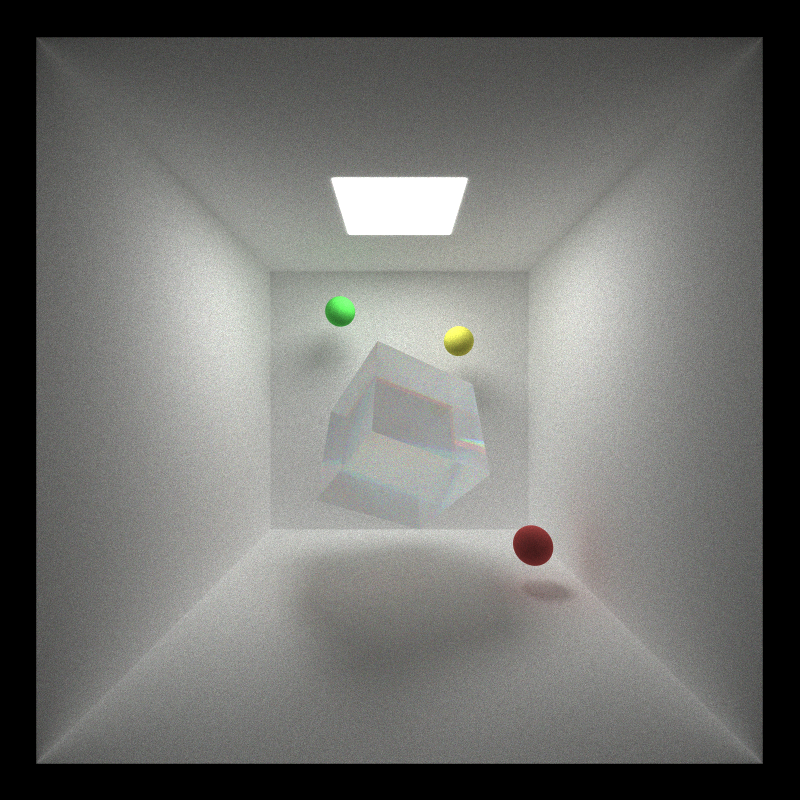 |

### Depth of Field

For an ideal pinhole camera, the aperture size is infinitesimally small, and the Depth of Field (DoF) is infinite.
To create the effect of Depth of Field, we just modify the ideal pinhole camera model, 
to make the aperture size greater than 0.

In the implementation, what we did is to modify the ray origin in `generateRayFromCamera` kernel,
the new origin is selected randomly within the size of the aperture.
And to update the ray direction, the `view` vector is computed by `glm::normalize(cam.lookAt - segment.ray.origin)`
instead of `normalize(cam.lookAt - cam.position)`.
  
| Aperture |          Focus $z=-3.0$         |           Focus $z=0.0$        |          Focus $z=+3.0$         |
|:--------:|:-------------------------------:|:------------------------------:|:-------------------------------:|
|  **20**  | 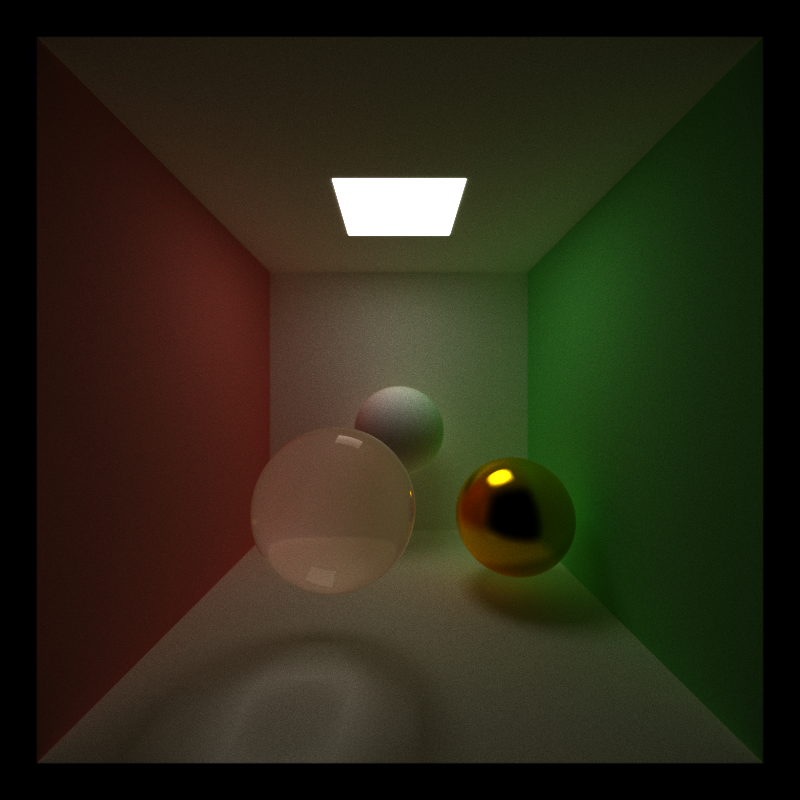  | 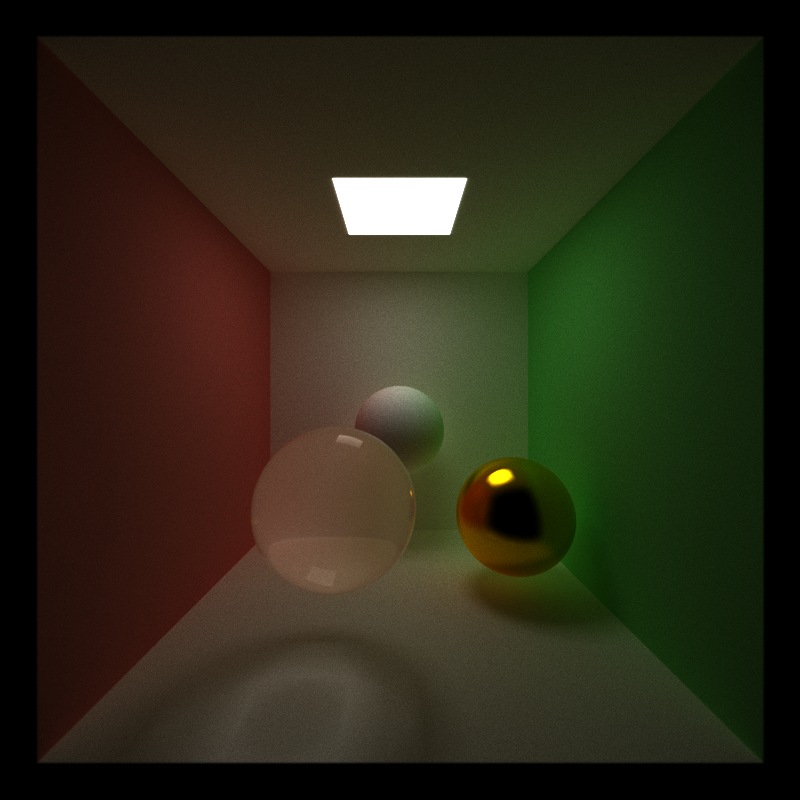  |   |
| **200**  |  | 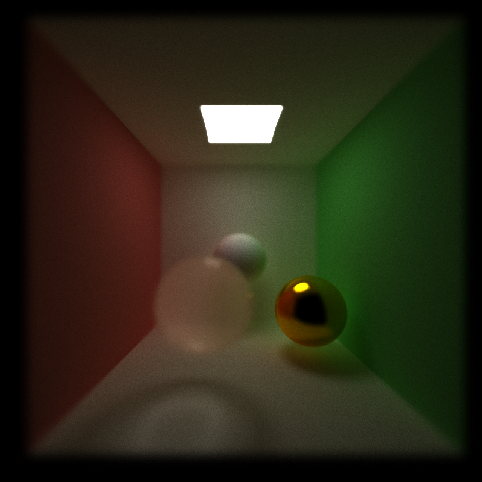 | 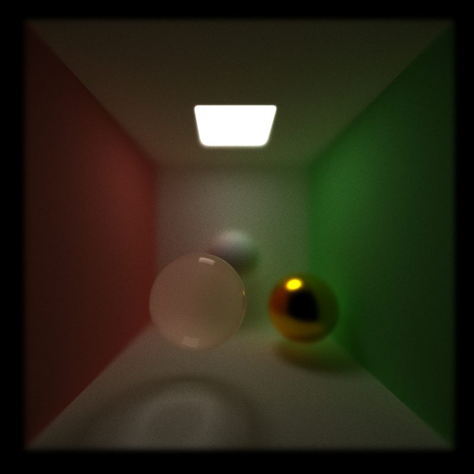 |

From the demo we can conclude that larger the aperture, the more blurry will the objects not in focus would be.
This is exactly what the real-world physics tells us.

### Motion Blur

To implement motion blur, a `motion` array and a `exposure` float is added to the scene file.
The former indicates the velocity (magnitude and direction) of an object, 
while the latter is the exposure time.
The renderer (uniformly) randomly samples in the exposure interval, 
creating the realistic motion blur effect.

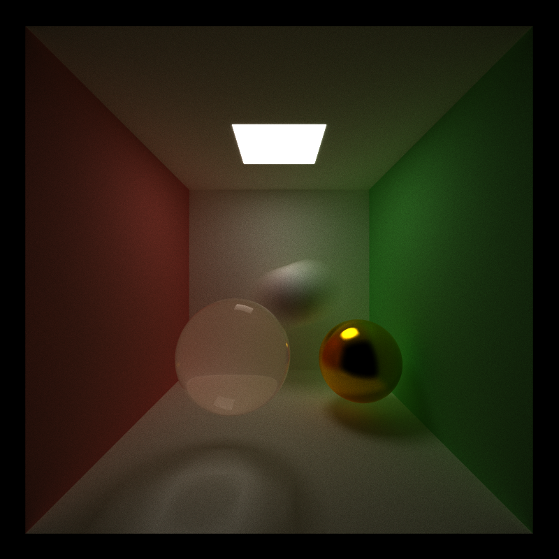

### Re-startable Path Tracing

All the path tracing state (except the scene) has been save in `renderState`.
To enable re-startable rendering, `serialize()` method is implemented for `class RenderState`,
which write the object into a binary file when dumping the rendering state.
To resume the rendering process, 
the program loads the binary file, and use `deserialize()` to recover `renderState`.

***Press `D` to save the current state into a binary file, 
and pass `-r NAME.ITERATION.bin` parameter to the program to restart rendering.***

****
