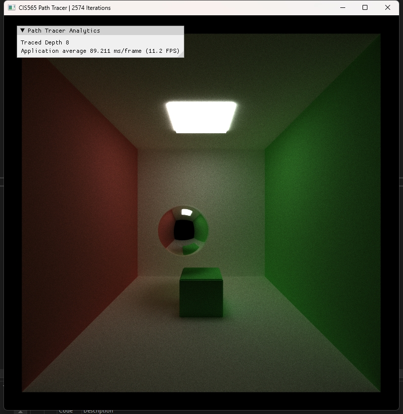
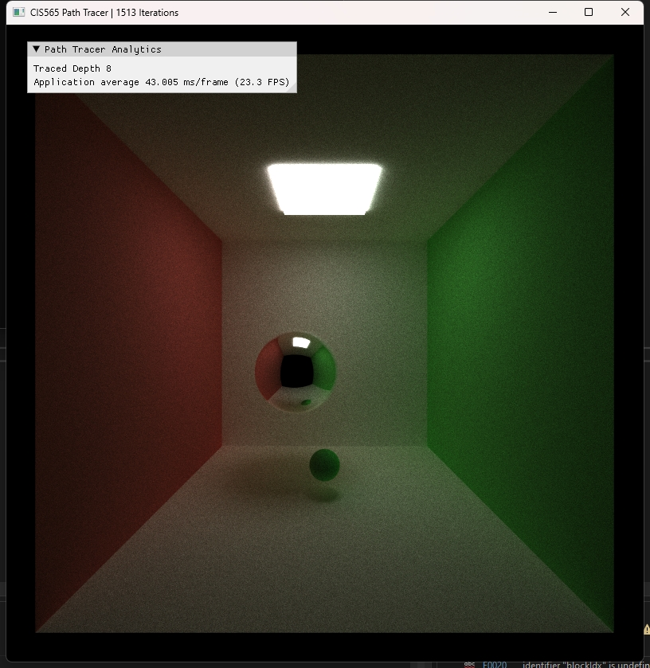

CUDA Path Tracer
================

**University of Pennsylvania, CIS 565: GPU Programming and Architecture, Project 3**

* Runjie Zhao
* [Linkedin]: https://www.linkedin.com/in/runjie-zhao-sde/ [Website]: https://runjiezhao1.github.io/portfolio.github.io/
* Tested on: Windows 11, i9 185H 2500 Mhz, GTX 4080 Laptop GPU

### Features

* :two: Support materials(diffuse, specular, refraction)
* :two: + :four: Support both obj mesh loading and gltf loading
* :two: Support DOF

### Display

* Basic Implmenetation where it supports basic diffuse and nothing else:

* Improved materials where it now can support refraction:

* Implemented obj loading

* Implemented gltf loading

* Implemnented depth of field to mimic the view from camera
