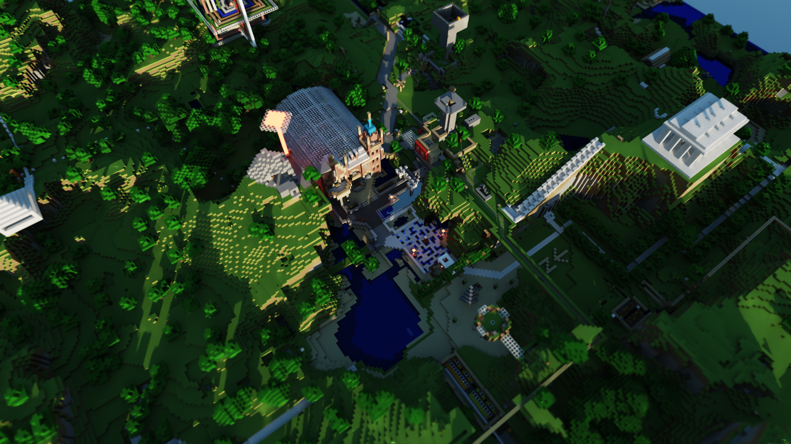

CUDA Path Tracer
================

**University of Pennsylvania, CIS 565: GPU Programming and Architecture, Project 3**

* Zhen Ren
  * https://www.linkedin.com/in/zhen-ren-837089208/
* Tested on: Windows 11, i9-13900H @ 2.60 GHz 16GB, RTX 4070 Laptop 8GB (Self laptop)

## User Instructions
### Hot Keys
| Keys| Usage               |
|-----|---------------------|
| ESC | Quit and save image |
| P   | Save image          |
| Z   | Zoom in             |
| X   | Zoom out            |
| W   | Moving up           |
| S   | Moving down         |
| F   | Auto focus          |

### Auto Focus
Auto focus is a very convenient helper to let you focus on any object you want. Hovering your mouse over the object you want to focus and then press **F**. This object will then be focused, i.e. the focal point is set to the object's surface. Also works for the tilt shift camera.

### Mouse control
The same as default setting. Left to rotate the camera, right to zoom the camera. Hold middle button to snap around the camera.

### ImGui Settings
ImGui is mainly used to control tilt shift camera. You can control the aperture size, lens shift and also the direction of focal plane.
You can also toggle ray compaction and material sort here.

## Gallery
| Mesa - shot using thin lens camera (1920*1080 100spp aperture0.5)|
| :------------------------------------: |
||

| Mesa - shot using tilt shift camera (1920*1080 100spp aperture0.5)|
| :------------------------------------: |
||

<b>Vokselia Spawn (1920*1080 100spp 0.5aperture size)</b>

|With tile shift camera|Normal thin lens camera|
| :-: | :-: |
| |  |

Using the same aperture size, tilt shift camera can generate more focused images. So, tilt shift camera can achieve a miniature faking effect.

| SpongeBob - shot using tilt shift camera (1920*1080 100spp)|
| :------------------------------------: |
||

We can also focus on arbitary plane, like a set of buildings on one side of the street.

| Dewmire Castle (1080*1080 100spp)|
| :------------------------------------: |
||

| Mando Helmet (1000*1000 76spp)|
| :------------------------------------: |
||

| White Girl Robot (1080*1080 500spp)|
| :------------------------------------: |
||

| Glass Dragon (1080*1080 1000spp)|
| :------------------------------------: |
||

| Glass Bunny (1080*1080 1000spp)|
| :------------------------------------: |
||

<b>Rungholt (1920*1080 10spp)</b>

|With MIS|Naive sampling|
| :-: | :-: |
| |  |