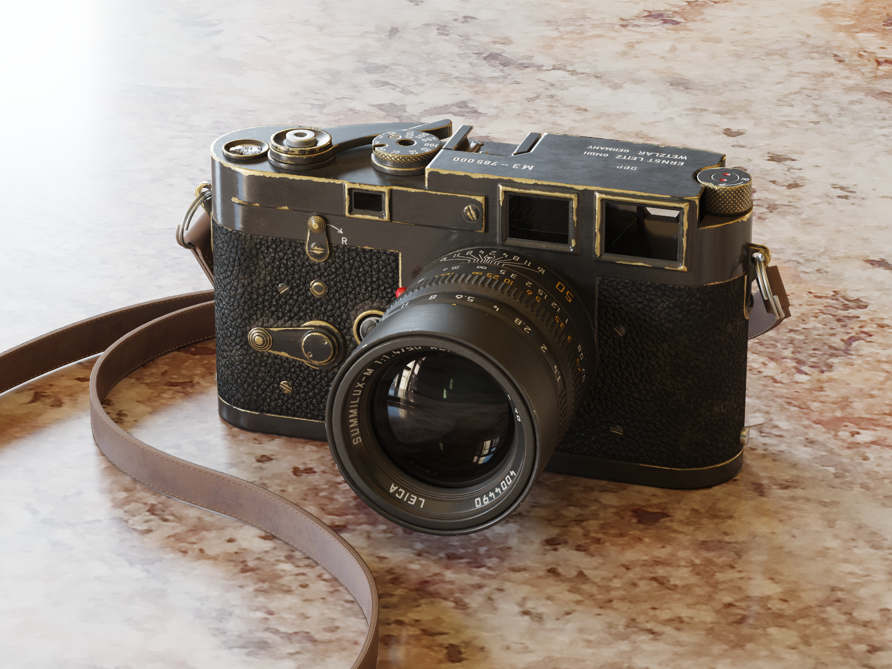
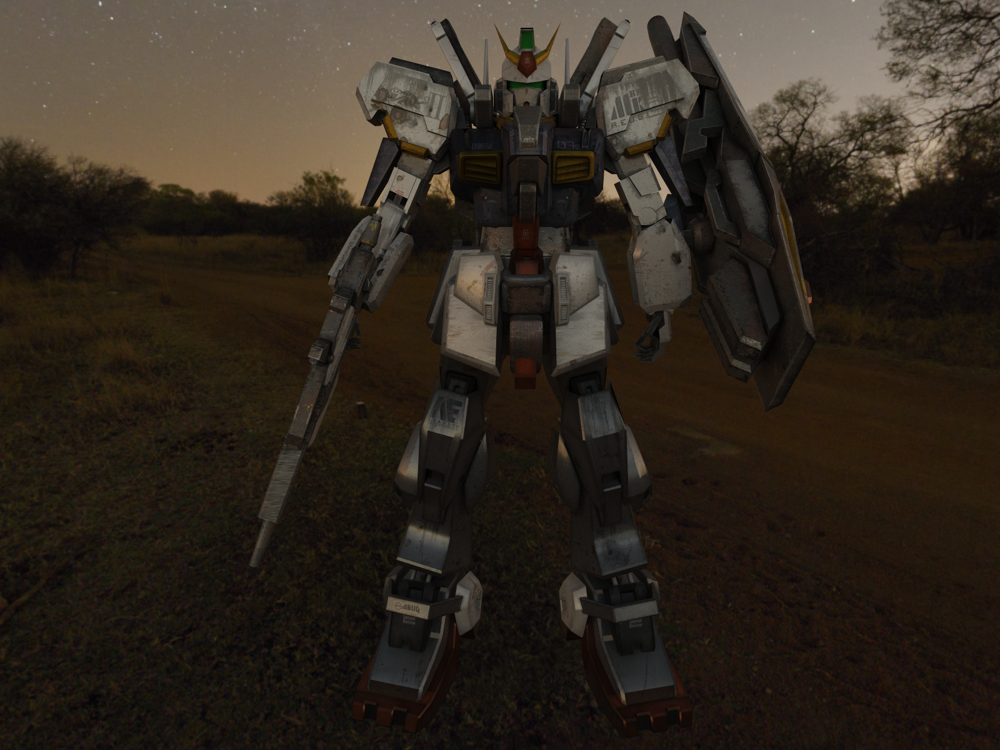
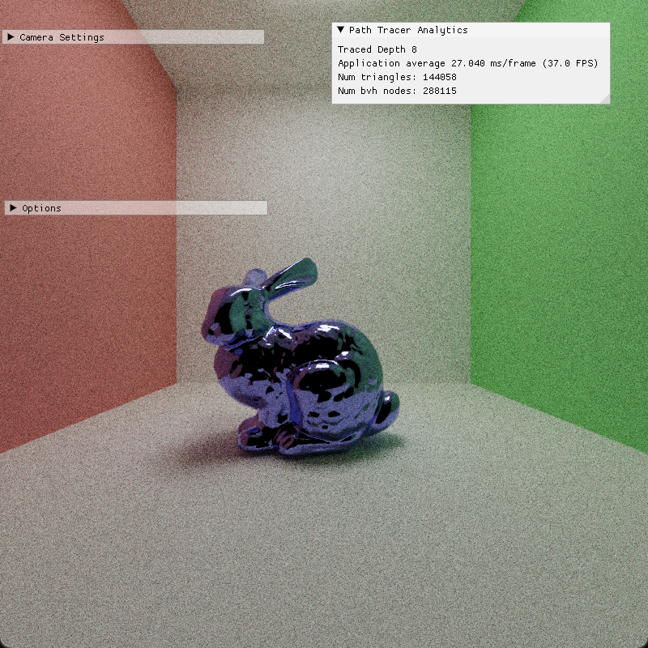
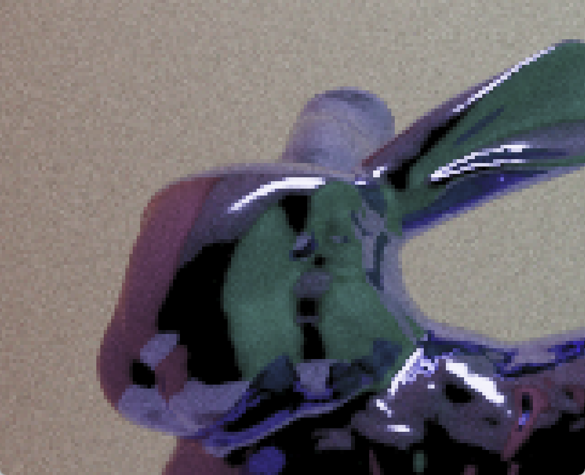
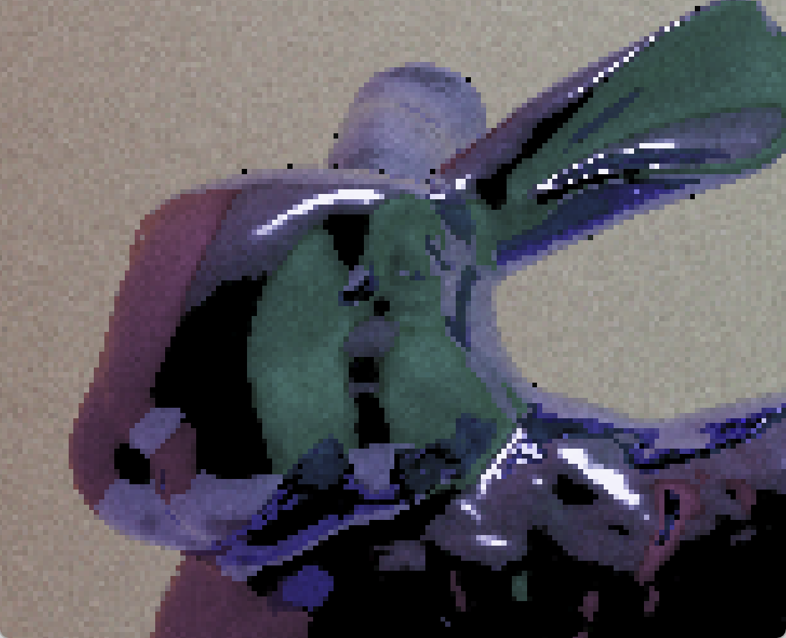
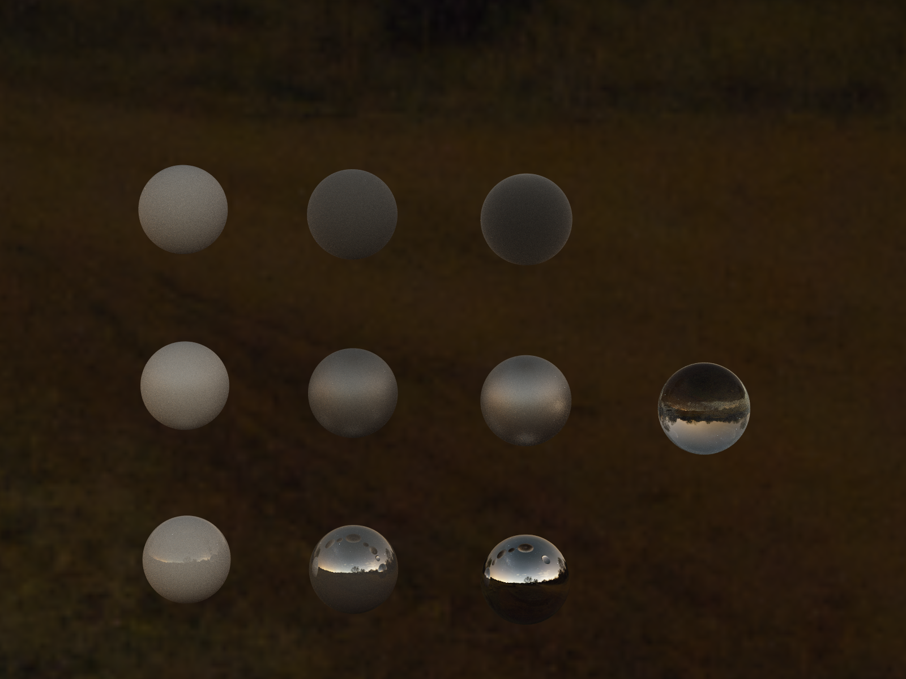

CUDA Path Tracer
================

**University of Pennsylvania, CIS 565: GPU Programming and Architecture, Project 3**

* Zhiyi Zhou
* Tested on: Windows 11, i9-13900H @ 2.6GHz 64GB, RTX4060 Laptop

## Features
- OBJ & glTF Loading
- BVH(MTBVH) Acceleration
- Stochastic Sampled Anti-Aliasing
- Physically-Based Materials
- Texture Mapping & Normal Mapping
- Environment Mapping
- Multiple Importance Sampling of different kind of light(sphere, cube, mesh and environment light)

### OBJ & glTF Loading
The glTF (GL Transmission Format) file is a streamlined, efficient format for transmitting 3D models and scenes, designed specifically for real-time rendering applications such as 3D games, web platforms, and virtual reality. Developed by the Khronos Group, the same organization behind OpenGL and Vulkan, it is lightweight and optimized for performance. A glTF file can encompass an entire scene, including meshes, materials, animations, cameras, and lights. However, I focus on utilizing only its meshes and materials in my projects.

Avocado

glTF file: [Avocado](https://github.com/KhronosGroup/glTF-Sample-Models/tree/main/2.0/Avocado/glTF)

### BVH(MTBVH) Acceleration
[BVH](https://www.pbr-book.org/3ed-2018/Primitives_and_Intersection_Acceleration/Bounding_Volume_Hierarchies)
[MTBVH](https://cs.uwaterloo.ca/~thachisu/tdf2015.pdf)

Computing intersections is the most time consuming part in our path tracer.
A BVH organizes a set of geometric objects, like triangles or meshes, into a hierarchy of nested bounding volumes, which allows for efficient spatial queries and reduces the computational cost of determining which objects are relevant in a given operation.

<table>
    <tr>
        <th>with BVH</th>
        <th>without BVH</th>
    </tr>
    <tr>
        <th></th>
        <th></th>
    </tr>
</table>

My computer struggles to traverse millions of triangles, but thanks to BVH, the speedup is significant.

### Stochastic Sampled Anti-Aliasing

<table>
    <tr>
        <th>with Anti-Aliasing</th>
        <th>without Anti-Aliasing</th>
    </tr>
    <tr>
        <th></th>
        <th></th>
    </tr>
</table>

### Physically-Based Materials
I implemented Microfacet material and metallic workflow in my path tracer. 
Here, the ball with high metallic and high roughness looks weird, this is because in microfacet model high roughness will cause energy loss.
 

### Texture Mapping & Normal Mapping
To improve the visual quality of the scene, texture mapping is crucial. Normal mapping can further enhance surface detail, adding greater realism.

### Multiple Importance Sampling 
| Direct Light sample(20spp)   | BSDF Sample (20spp)      | MIS(20spp)                  |
| :-----------------------:    | :----------------------: | --------------------------- |
|   | |     |

| Direct Light sample(2000spp)   | BSDF Sample (2000spp)      | MIS(2000spp)                  |
| :-----------------------:    | :----------------------: | --------------------------- |
|   | |     |

## Third-party code
1. [tinygltf](https://github.com/syoyo/tinygltf)
2. [Tinyobjloader](https://github.com/tinyobjloader/tinyobjloader)

## Reference

1. [glTF™ 2.0 Specification](https://registry.khronos.org/glTF/specs/2.0/glTF-2.0.html#appendix-b-brdf-implementation).
2. [Poly Haven](https://polyhaven.com/)
3. [Gundam Mk-II](https://sketchfab.com/3d-models/gundam-rx-178-mk-ii-8d4bf8343fd346e4a18bde44fb129fd1)