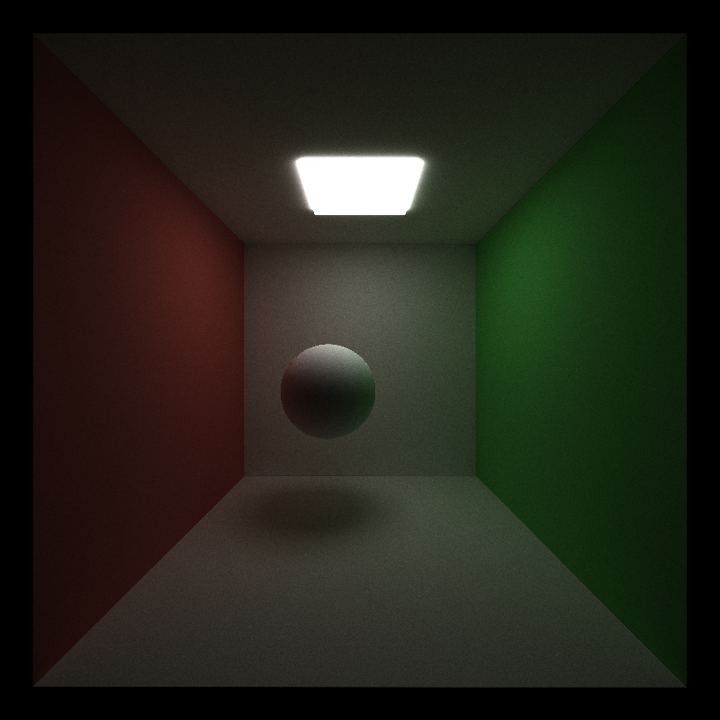
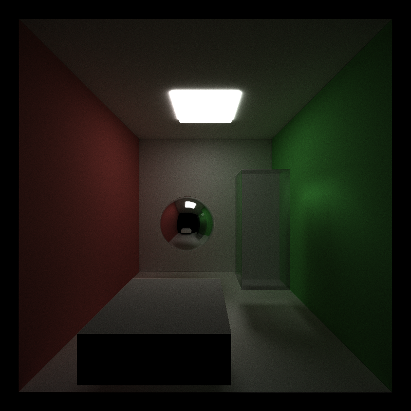
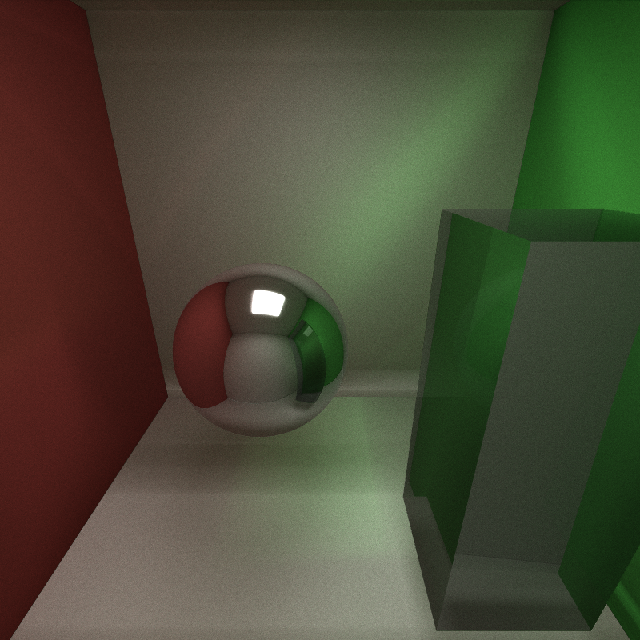

CUDA Path Tracer
================

**University of Pennsylvania, CIS 565: GPU Programming and Architecture, Project 3**

* Tianhong Zhou
  * [LinkedIn](https://www.linkedin.com/in/tianhong-zhou-b559aa159/)
* Tested on: Windows 11, i9-13950HX @ 2.20GHz, 32GB RAM, NVIDIA GeForce RTX 4060 Laptop GPU 8GB (Personal Laptop)

## Base Part

This is the rendered picture of the base part, including:
- Diffuse BRDF
- Stream Compaction
- Sort Material
- Stochastic Sampled Antialiasing

## Visual Improvements

### Refraction

I implemented physically-based specular transmission for dielectrics following [PBRT](https://pbr-book.org/4ed/Reflection_Models/Specular_Reflection_and_Transmission#fragment-FresnelInlineFunctions-1), uses Snell's law to get the transmitted direction and detects TIR and uses Schlick's approximation to stochastically choose reflection vs transmission.

This feature costs more than specular material since it needs to do one reflect, one refract, on Schlick each hit. However, it's still a delta BSDF, so it doesn't integrate over a hemisphere.

The work benefits from GPU since it is mostly arithmetic on a single direction (delta BSDF): a few dot products, a powf (Schlick), and either reflect or refract. This maps well to massively parallel rays/bounces on the GPU, so throughput scales with sample count.

This feature can be optimized in the future by: 1. Add Beer-Lambert absorption for transmitted segments; it improves realism and naturally shortens low-contribution paths; 2. Extend to rough glass, use visible NDF sampling and proper MIS between specular lobes to cut variance.

### Physically-based depth-of-field

I implemented DOF following [PBRT](https://pbr-book.org/4ed/Cameras_and_Film/Projective_Camera_Models#TheThinLensModelandDepthofField) with the thin-lens model: for each primary ray, I first compute the pinhole direction for the pixel, intersect it with the focus plane at focalDistance to get pFocus, then jitter the ray origin on a circular aperture of radius apertureRadius (concentric disk sampling) and aim the ray from that lens point to pFocus. When apertureRadius == 0, it degrades to a pinhole camera (no DOF).

This feature costs more than pinhole camera since it requires 2 more RNG draws (pixel & lens), one concentric-disk map, one extra normalize, a few dot/scale ops. Out-of-focus regions have higher noise, so typically it needs more spp to reach the same perceptual quality than pinhole.

Primary rays are embarrassingly parallel; the work is simple ALU math with minimal branching. At real image sizes and spp, the GPU is decisively faster. The main cost comes from needing more samples in bokeh-heavy shots, which the GPU handles well.

This feature can be optimized in the future by: 1. Use low-discrepancy sequences (Sobol/CMJ/N-Rooks) over (pixel, lens[, time]) dimensions; decorrelate pixel jitter from lens jitter; 2. Support polygonal apertures (N-gon/iris blades) and cat-eye vignetting for realistic bokeh shapes toward the frame edges.

Without Depth of Field | With Depth of Field
--- | ---
 | 

## Performance Improvements

### Russian Roulette

I added Russian roulette (RR) to probabilistically terminate low-contribution paths while keeping the estimator unbiased. After a few bounces (I start at depth >= 3), each path survives with probability
p = clamp(luminance(throughput), p_min, p_max);
if the path survives, I divide its throughput by p (weight compensation); otherwise it terminates. In expectation this equals the non-RR integrator, but it stops long, dark tails early.

In enclosed setups (e.g., Cornell-box-style scenes) rays tend to bounce many times with quickly shrinking throughput. RR trims these long tails. With RR off, it goes about 20 FPS on average, while with RR on, it becomes around 28 FPS, which is a 40% increase. With RR it goes faster mainly because there are fewer deep bounces.

To accelerate it, I start RR only when a ray has 3 bounces remaining, reduces variance spikes. RR is applied before scatterRay each bounce-uses the current throughput and avoids work on rays we'll kill.

It benefits the same in either GPU or CPU implementation because it cutting long tails reduces queue sizes and keeps warps from dragging on a few deep rays. On massive parallel workloads, the speedup is pronounced. However, the CPU also benefits (fewer deep recursions and intersections), but the percentage gain is typically smaller because CPUs don't suffer warp under-utilization.

To optimize this feature, I can: 1. Trigger RR once throughput < threshold or after k bounces (not just fixed k). This tightens termination when rays go dim early; 2. Use a higher p_min when entering caustic-prone chains (e.g., specular paths) to preserve rare but important contributions.

Without RR (Avg. 20 FPS) | With RR (Avg. 28 FPS)
--- | ---
 | 