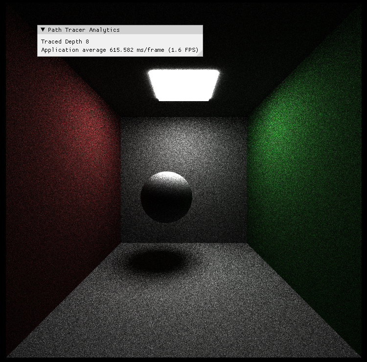
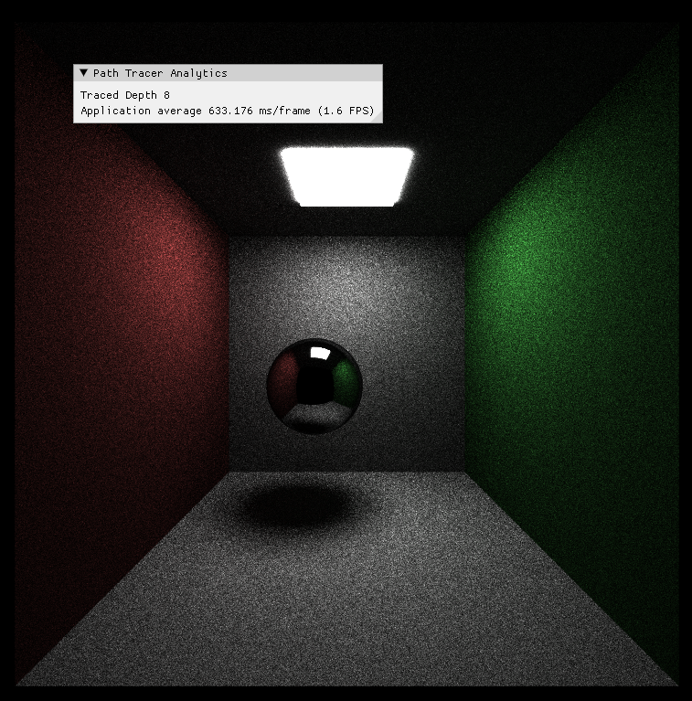
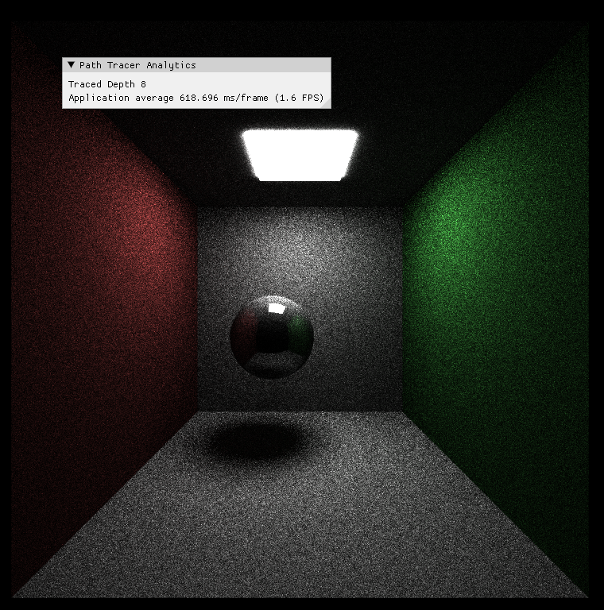
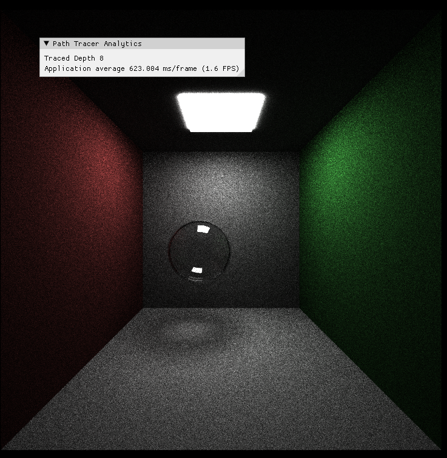
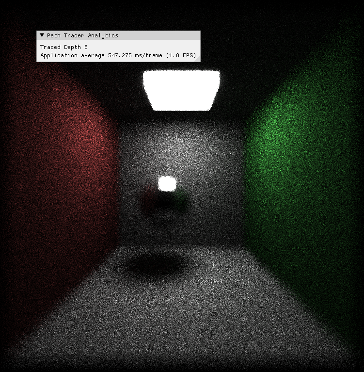
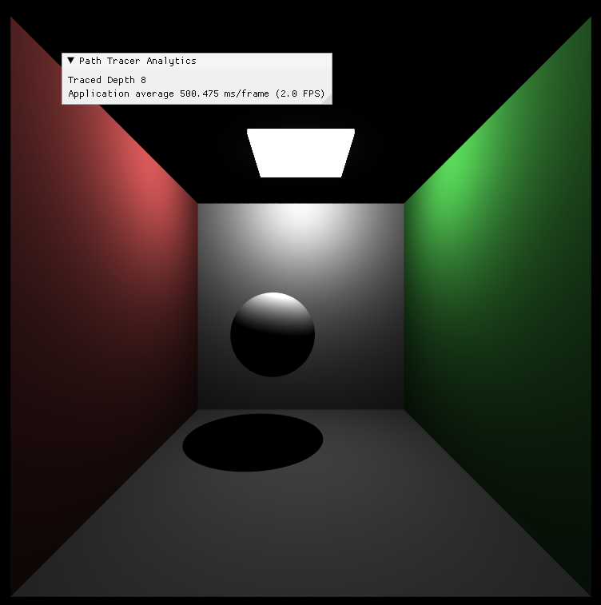
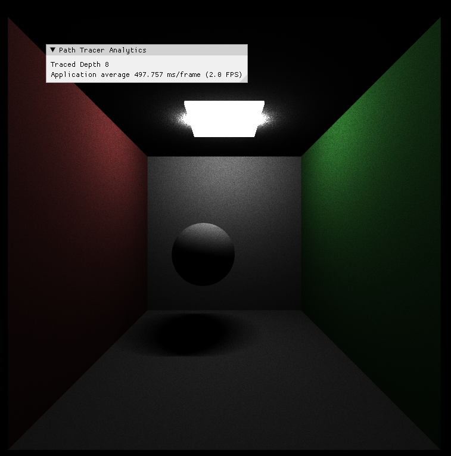

CUDA Path Tracer
================

**University of Pennsylvania, CIS 5650: GPU Programming and Architecture, Project 0**

* Manvi Agarwal
  * [linkedIn](https://www.linkedin.com/in/manviagarwal27/)
* Tested on: Windows 11, AMD Ryzen 5 7640HS @ 4.30GHz 16GB, GeForce RTX 4060 8GB(personal)

**Features Implemented**

### Shading kernel with BSDF evaluation for ideal specular and diffuse surfaces
1. Complete Diffuse surface
   

2. Proper Specular surface
   

3. Imperfect Specular

### Refraction surface using frensel effects using Schlick approximation

### Depth of field by jittering camera position given defocus angle and focal length

### Direct point and direct area lighting along with simple path integrator
1. Direct Point lighting
   

2. Direct Area lighting

