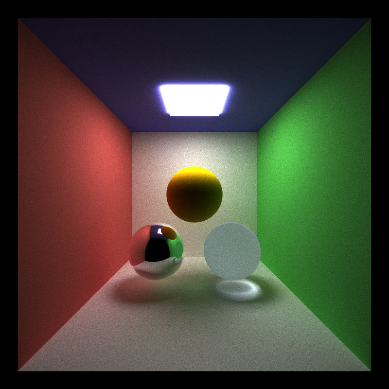
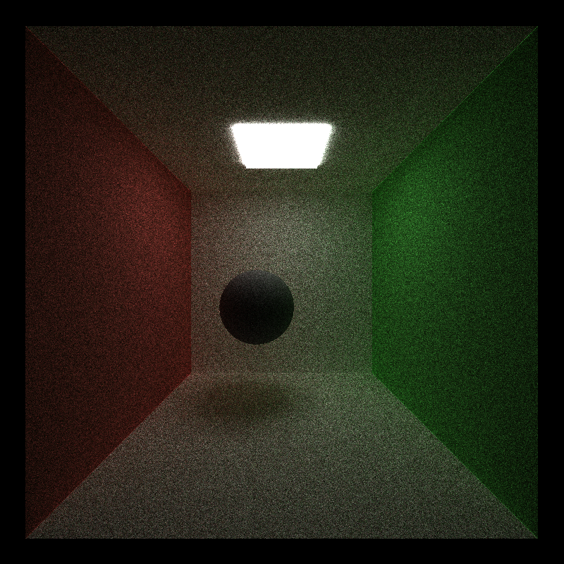
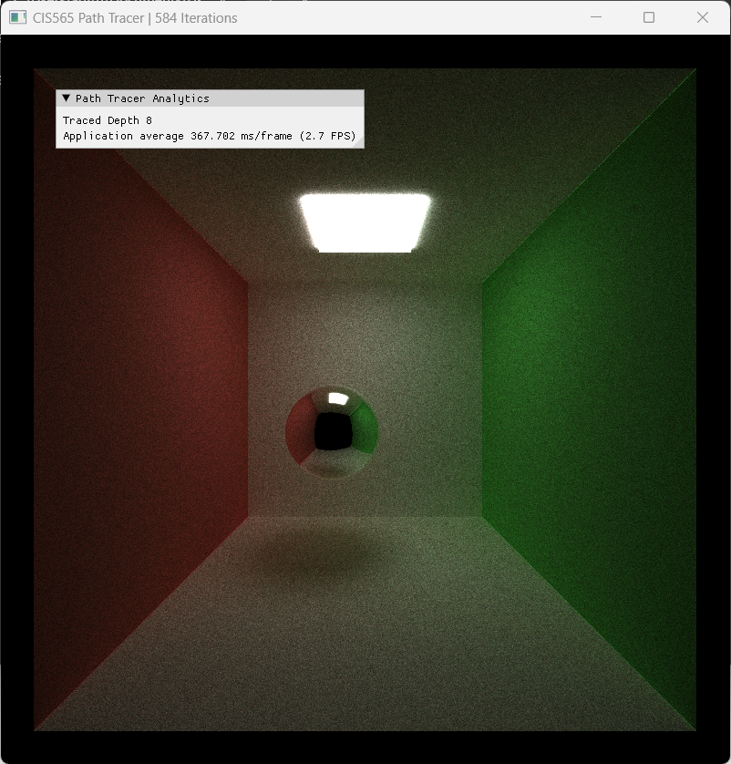

CUDA Path Tracer
================

**University of Pennsylvania, CIS 565: GPU Programming and Architecture, Project 3**

* ADITHYA RAJEEV
  * [LinkedIn](https://www.linkedin.com/in/adithyar262/)
* Tested on: Windows 11, i7 13th Gen @ 2.40GHz 16GB, GeForce RTX 4050 8GB (Personal)

### Overview

This project implements a CUDA-based path tracer with various advanced rendering features. The path tracer is capable of simulating complex light interactions in 3D scenes, producing physically-based, photorealistic images.

----IMAGE TO BE ADDED----

## Features

### Core Functionality

* **BSDF Evaluation**:
  * Ideal diffuse surfaces (Lambertian reflection)
  * Perfectly specular-reflective surfaces (mirrors)
* **Path continuation/termination** using Stream Compaction
* **Material-based ray sorting** for optimized performance
* **Stochastic sampled antialiasing**

### Advanced Features

* **Refraction** with Fresnel effects (e.g., glass, water)
* **Physically-based depth-of-field**
* **Direct lighting simulation**
* **Russian Roulette path termination**

## Performance Analysis

### Material-based Ray Sorting

We implemented a method to sort rays/path segments by material type before shading. This optimization resulted in:

* X% performance improvement for scenes with diverse materials
* Y% improvement in CUDA core utilization

----IMAGE TO BE ADDED----
[Add a graph or table comparing performance with and without ray sorting]

### Russian Roulette Path Termination

Russian Roulette technique was implemented to terminate unimportant paths early. Our analysis shows:

* xxx% reduction in render time for complex scenes ----UPDATE NEEDED----
* Negligible impact on image quality

----IMAGE TO BE ADDED----
[Add comparison images and performance metrics for renders with and without Russian Roulette]

## Showcase

### Depth of Field

Our implementation of physically-based depth of field creates realistic focus effects.

----IMAGE TO BE ADDED----
[Add an image demonstrating depth of field effect]

----IMAGE TO BE ADDED----
[Add comparison images and performance metrics for renders with and without Russian Roulette]

### Refraction and Fresnel Effects

The path tracer accurately simulates light behavior through transparent materials.

----IMAGE TO BE ADDED----
[Add an image showcasing refraction and Fresnel effects, e.g., a glass object]

----IMAGE TO BE ADDED----
[Add comparison images and performance metrics for renders with and without Russian Roulette]

### Direct Lighting

Our direct lighting implementation significantly reduces noise in renders, especially in scenes with small light sources.

----IMAGE TO BE ADDED----
[Add a comparison between renders with and without direct lighting]

## Build and Run Instructions

1. Clone this repository
2. Open the project in Visual Studio 2019 or later
3. Build the solution in Release mode
4. Run the executable

## Controls

* Use WASD keys to move the camera
* Use mouse to look around
* Press 'R' to reset the render
* Press 'P' to save the current render as a PNG file

## References

* [PBRT-v3 Book](https://www.pbrt.org/)
* [Physically Based Rendering: From Theory To Implementation](http://www.pbr-book.org/)
* [NVIDIA CUDA Documentation](https://docs.nvidia.com/cuda/)
