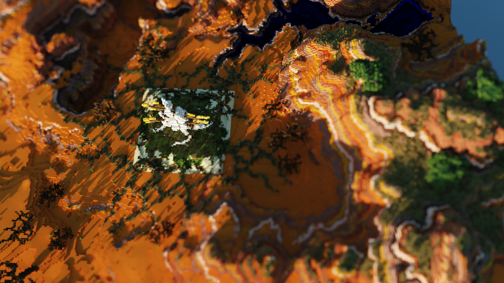

CUDA Path Tracer
================

**University of Pennsylvania, CIS 565: GPU Programming and Architecture, Project 3**

* Zhen Ren
  * https://www.linkedin.com/in/zhen-ren-837089208/
* Tested on: Windows 11, i9-13900H @ 2.60 GHz 16GB, RTX 4070 Laptop 8GB (Self laptop)

### Gallery
| Mesa - shot using thin lens camera (1920*1080 100spp aperture0.5)|
| :------------------------------------: |
||

| Mesa - shot using tilt shift camera (1920*1080 100spp aperture0.5)|
| :------------------------------------: |
||

Using the same aperture size, tilt shift camera can generate more focused image.

| SpongeBob - shot using tilt shift camera (1920*1080 100spp)|
| :------------------------------------: |
||

We can also focus on arbitary plane, like a set of building on one side of the street.

| Dewmire Castle (1920*1080 100spp)|
| :------------------------------------: |
||

| Mando Helmet (1000*1000 76spp)|
| :------------------------------------: |
||

| White Girl Robot (1080*1080 500spp)|
| :------------------------------------: |
||
