**University of Pennsylvania, CIS 5650: GPU Programming and Architecture, Project 3**

- Wang Ruipeng
    - [LinkedIn](https://www.linkedin.com/in/ruipeng-wang-681b89287/)
    - [Personal Website](https://wang-ruipeng.github.io/)
- Tested on: Windows 10, i7-10750H CPU @ 2.60GHz 16GB, RTX 2070 Max-Q 8GB

# CART: CUDA Accelerated Ray Tracer

This is my CUDA-accelerated path tracer project. To compile, use CMake to generate Visual Studio 2022 files. Since this project uses precompiled outside dlls, this project currently only supports Windows platform with CUDA 12.6 or later installed.

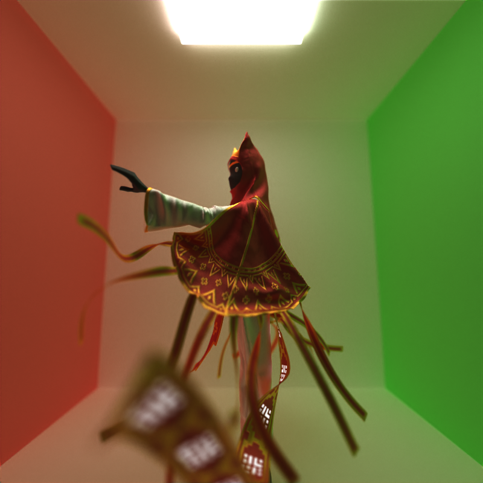

Source: [https://sketchfab.com/3d-models/journey-character-clothing-concept-147b14b62268478da7e59fa36c949bae](https://sketchfab.com/3d-models/journey-character-clothing-concept-147b14b62268478da7e59fa36c949bae)

## Visual Features

### Refractions

Refraction in path tracing refers to the bending of light as it passes from one medium to another, such as from air to water or glass. In path tracing, refraction is simulated to accurately model the way light behaves as it enters and exits transparent or semi-transparent materials, like glass or water. 

Reference: [https://pbr-book.org/4ed/Reflection_Models/Specular_Reflection_and_Transmission](https://pbr-book.org/4ed/Reflection_Models/Specular_Reflection_and_Transmission)

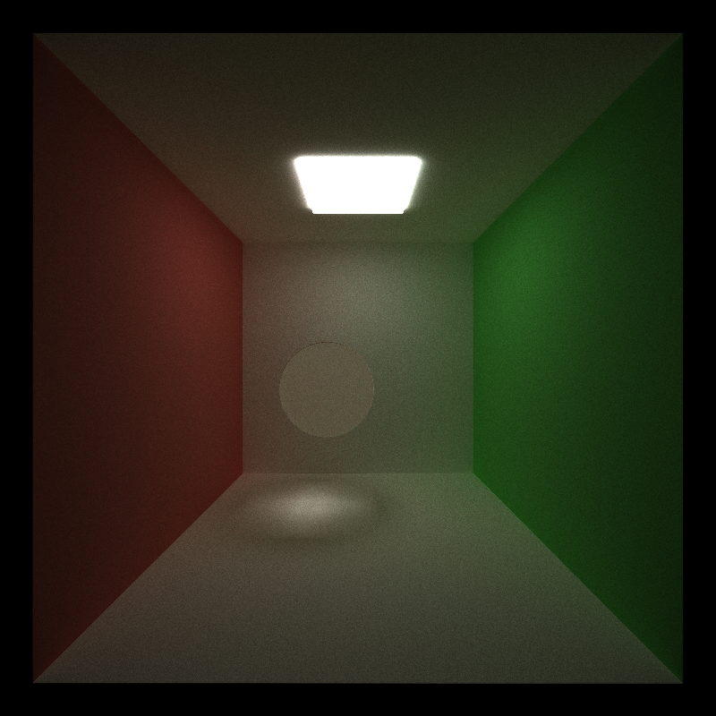

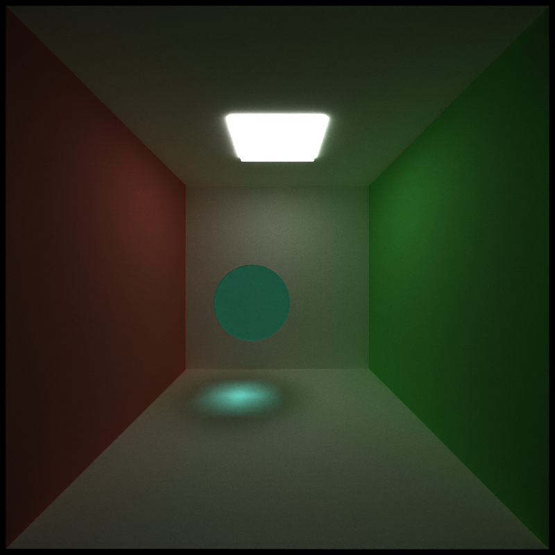

### Physically-based Depth-of-field

Physically-based depth-of-field simulates camera focus by jittering rays within an aperture, creating sharp focus on the focal plane and blur for objects outside it. A larger aperture increases the blur, mimicking real-world optics.

Reference: [https://pbr-book.org/4ed/Cameras_and_Film/Projective_Camera_Models#TheThinLensModelandDepthofField](https://pbr-book.org/4ed/Cameras_and_Film/Projective_Camera_Models#TheThinLensModelandDepthofField)

Without Depth-of-field

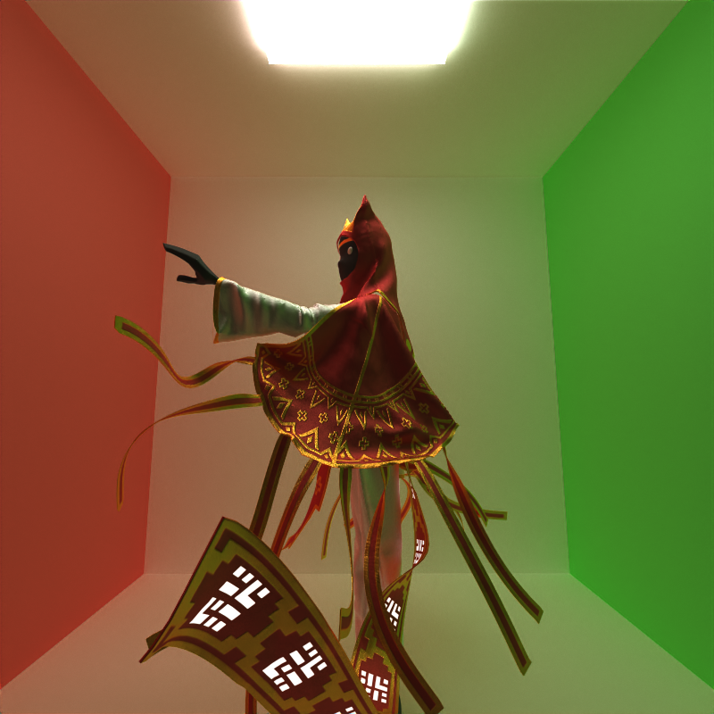

With Depth-of-field

### Procedural Textures

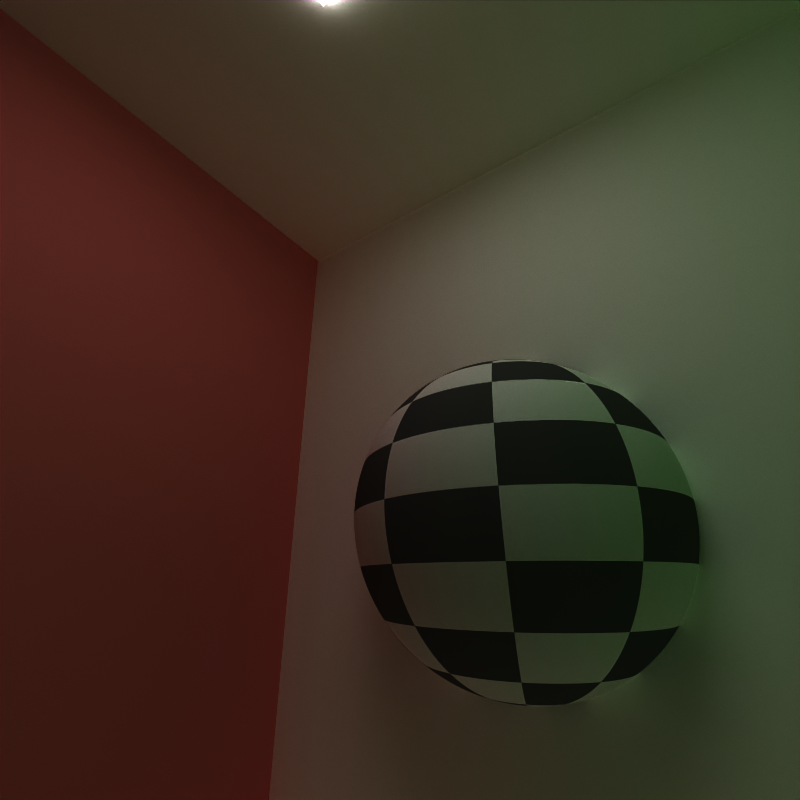

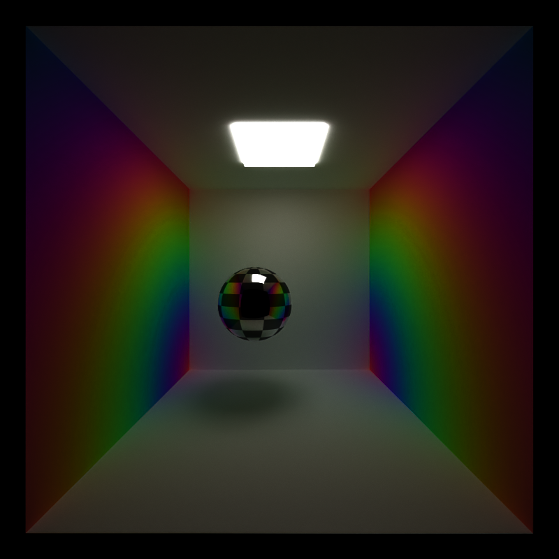

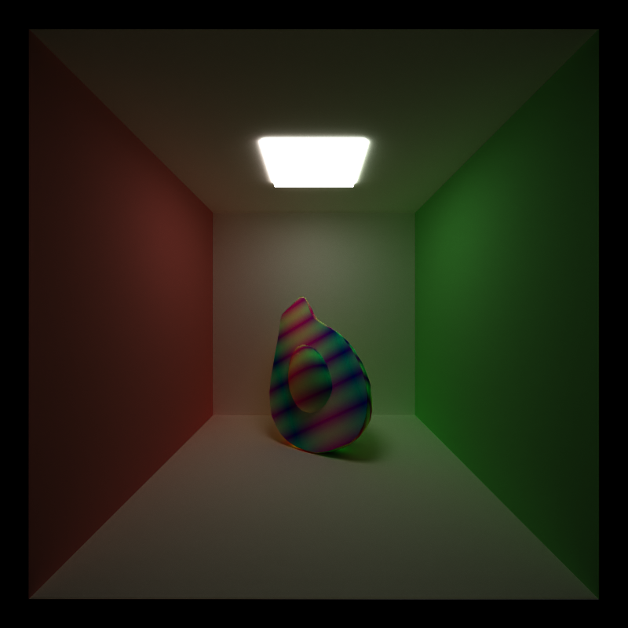

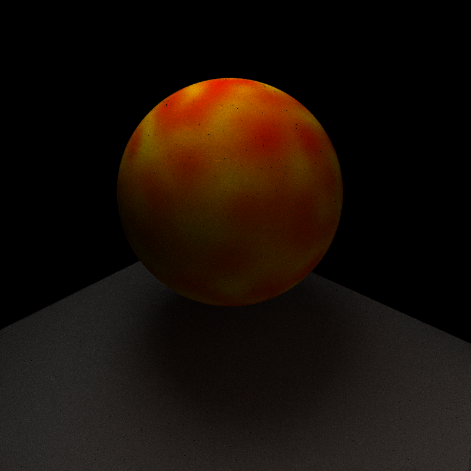

### Texture and Normal Mapping

**Texture mapping** is a technique where a 2D image texture is applied to a 3D model’s surface to add details like color or patterns, making the model appear more detailed without increasing its geometric complexity.

**Normal mapping** enhances surface detail by using a texture to simulate small-scale bumps and dents on the surface. It alters the surface normals used for lighting calculations, making the model appear more complex and textured without actually changing the geometry.

Even though I implemented both **OBJ** and **gltf** model import, texture mapping is **only supported for gltf files**.

Reference: [https://pbr-book.org/4ed/Textures_and_Materials/Image_Texture](https://pbr-book.org/4ed/Textures_and_Materials/Image_Texture)

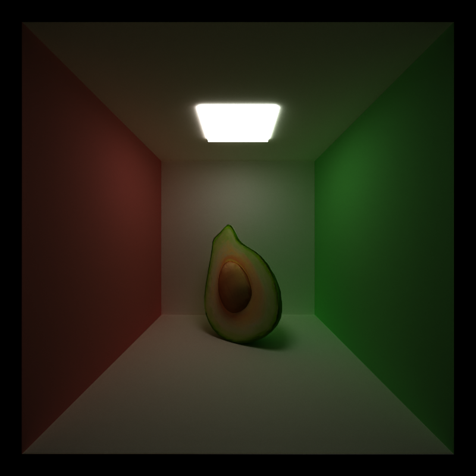

### Subsurface scattering

**Subsurface scattering** (SSS) is the process by which light penetrates a translucent material, scatters beneath the surface, and exits at a different point. This creates a soft, glowing effect, as light diffuses through the material instead of reflecting directly off its surface. Since we are doing rat tracing here, the simulation process is natural.

With subsurface scattering

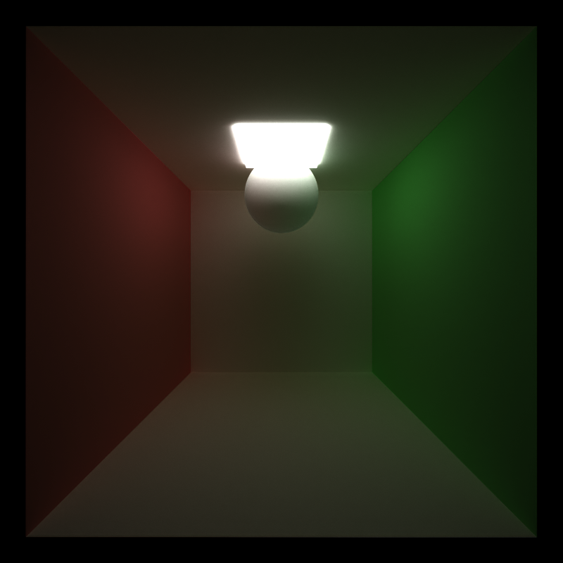

Without subsurface scattering

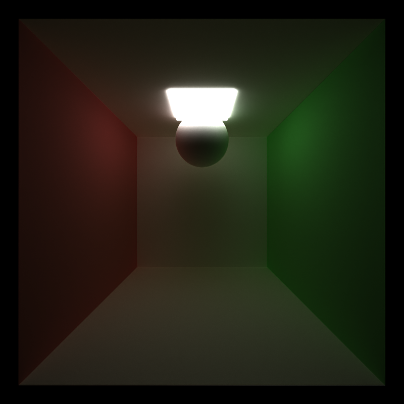

### Stratified Sampling vs. Cosine Weighed Sampling

**Stratified sampling on a semi-sphere** divides the surface into equal regions and samples within each region, ensuring more even coverage of the hemisphere. This reduces variance in the light sampling process, improving the accuracy of the final render.

**Cosine-weighted sampling on a semi-sphere** generates samples that are more concentrated around the normal of the surface, based on the cosine of the angle to the surface. This technique prioritizes sampling directions where light is more likely to contribute.

Reference: [https://pbr-book.org/3ed-2018/Monte_Carlo_Integration/2D_Sampling_with_Multidimensional_Transformations](https://pbr-book.org/3ed-2018/Monte_Carlo_Integration/2D_Sampling_with_Multidimensional_Transformations)

With stratified sampling

Without stratified sampling

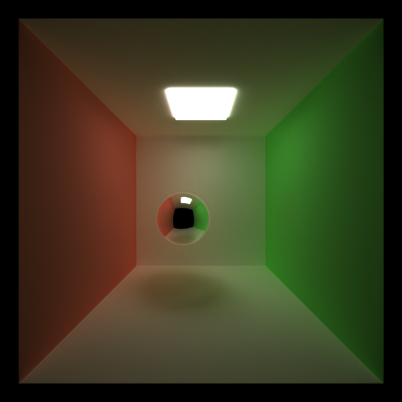

You can really see that the stratified sampling makes the shadow larger.

### Motion Blur

In my ray tracing, **motion blur** simulates the effect of fast-moving objects appearing blurred due to their motion during the exposure time. My approach is to move different positions for each sample to mimics how light captures an object’s movement over time. And it looks pretty good.

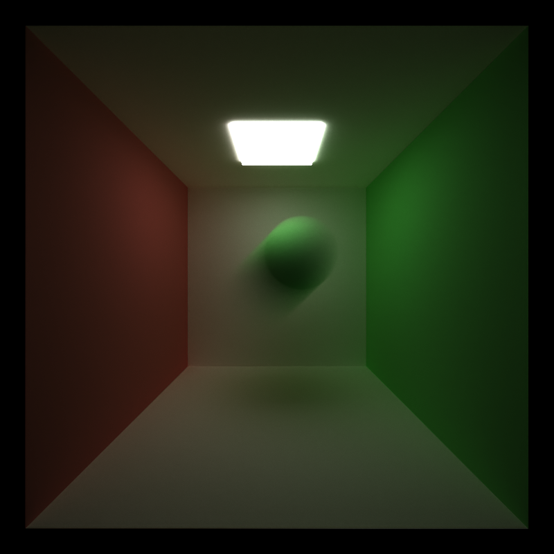

### Open Image AI Denoiser

[https://github.com/RenderKit/oidn](https://github.com/RenderKit/oidn)

I use this open denoiser and the results looks stunning. It is an image denoiser which works by applying a filter on Monte-Carlo-based pathtracer output. 

Without Denoiser

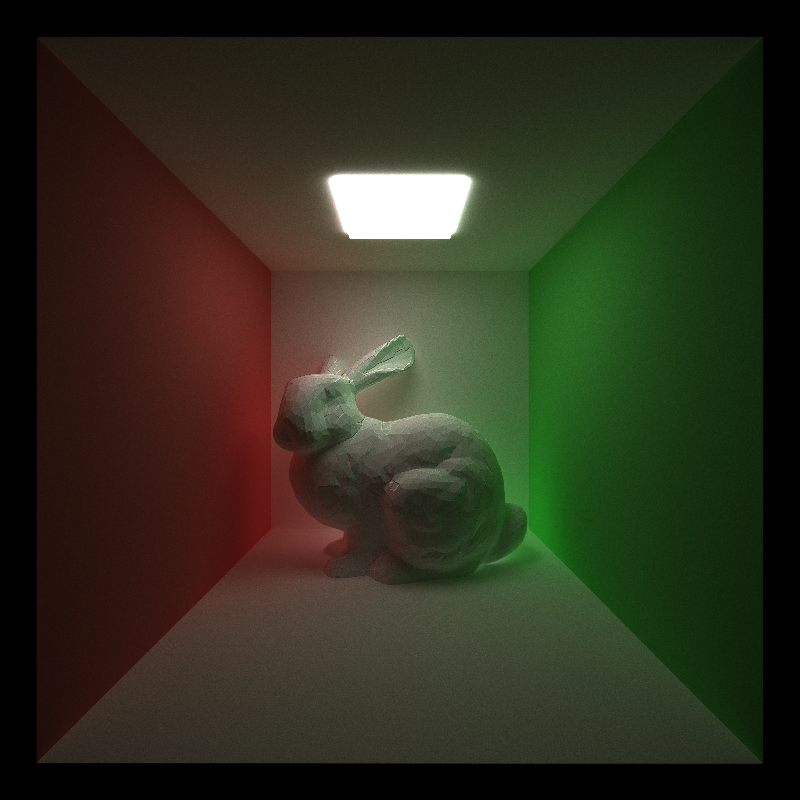

With Denoiser

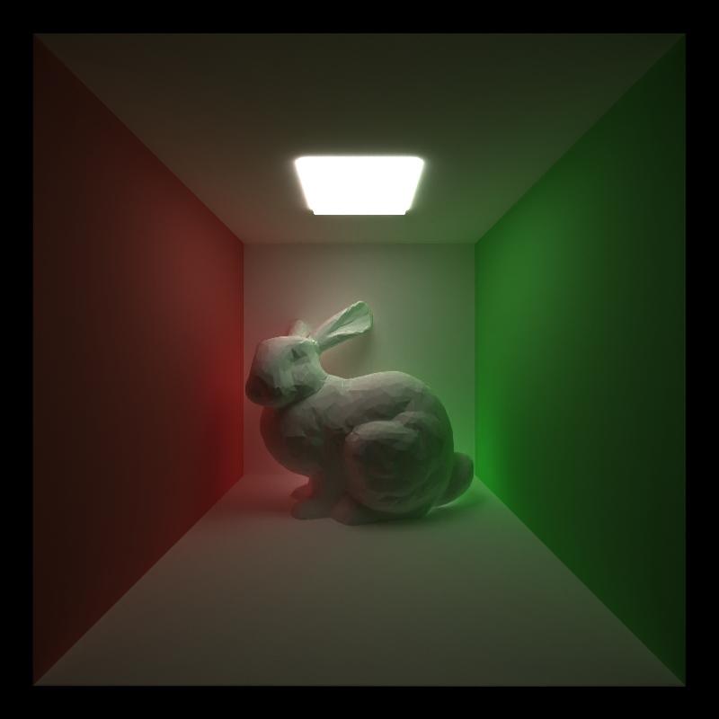

## Performance Optimizations

### Russian Roulette Path Termination

**Russian Roulette path termination** is a probabilistic technique used in path tracing to decide when to stop tracing light paths. Paths that contribute less are more likely to be terminated. This technique balances performance and image quality by reducing unnecessary calculations without introducing significant bias.

Reference: [https://pbr-book.org/3ed-2018/Monte_Carlo_Integration/Russian_Roulette_and_Splitting](https://pbr-book.org/3ed-2018/Monte_Carlo_Integration/Russian_Roulette_and_Splitting)

The Russian Roulette Path Termination does have subtle impact on the rendering result, but the benefit it brings is also obvious:

Without Russian Roulette:

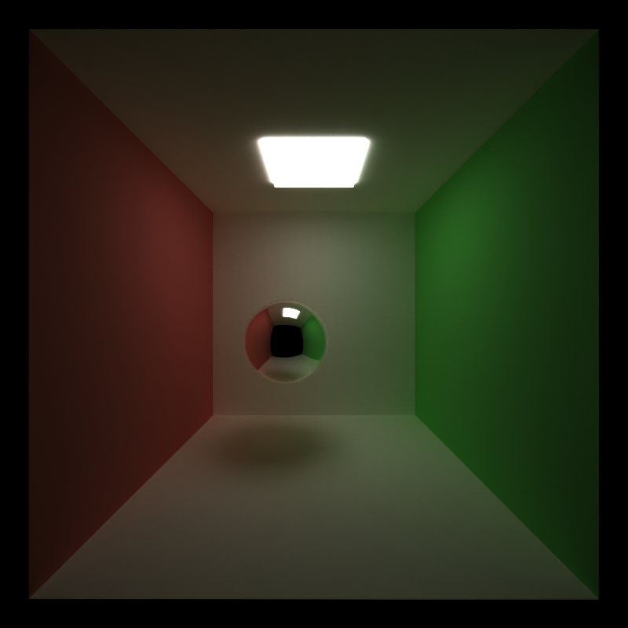

With Russian Roulette:

For closed scene, I observed a notable increase in time, for the scene rendered above:

|  | With RR | Without RR |
| --- | --- | --- |
| Avg. FPS | 36 | 21 |

As for open scene, the increase is less obvious:

|  | With RR | Without RR |
| --- | --- | --- |
| Avg. FPS | 65 | 57 |

### BVH

**Bounding Volume Hierarchy (BVH)** is a spatial acceleration structure used in ray tracing to speed up the process of finding ray-object intersections. In BVH, objects are grouped into hierarchical bounding volumes that enclose one or more objects. The hierarchy is built as a tree, where each node contains a bounding volume and its child nodes represent smaller volumes or objects.

The performance increase is stunning, for a scene with 70k triangles, the FPS is attached below:

|  | With BVH | Without BVH |
| --- | --- | --- |
| Avg. FPS | 65 | 57 |

### Some broken (but artistically interesting) rendering result

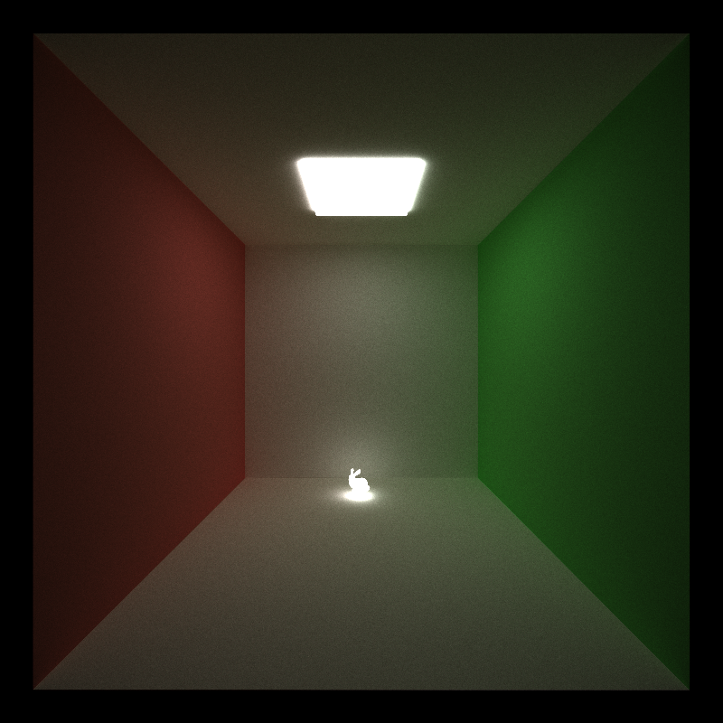

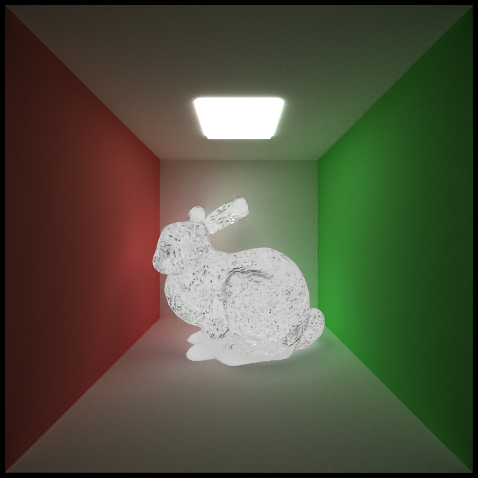

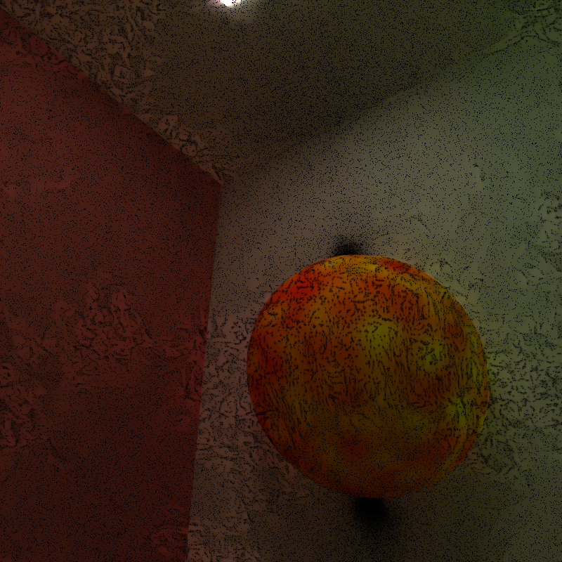