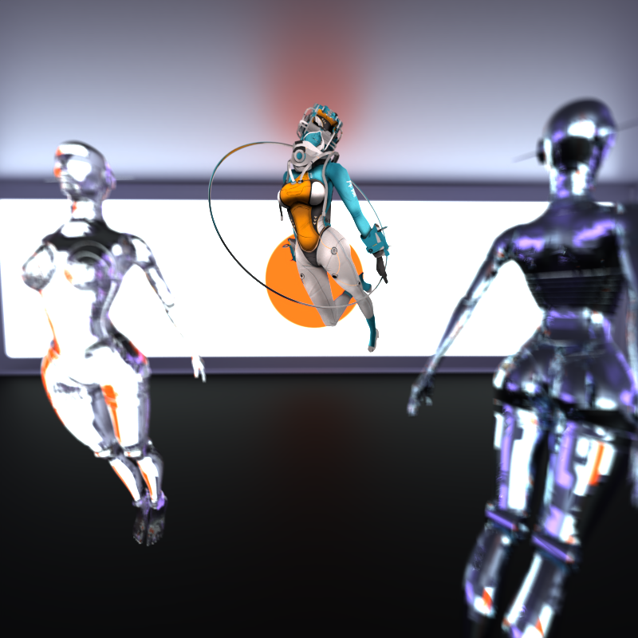

CUDA Path Tracer
================

**University of Pennsylvania, CIS 565: GPU Programming and Architecture, Project 3**

* Zixiao Wang
  * [LinkedIn](https://www.linkedin.com/in/zixiao-wang-826a5a255/)
* Tested and rendered on: Windows 11, i7-12800H @ 2.40 GHz 32GB, GTX 3070TI (Laptop)

### Showcase Image

### Introduction

In this project, I implement a CUDA-based path tracer capable of rendering globally illuminated images quickly. The core renderer includes a shading kernel with BSDF evaluation for Ideal diffuse, perfectly specular-reflective, combination of refraction and reflection, and imperfect specular surface incorporated with roughness parameters. Further, it also explores the features of OBJ and Texture loading, Depth of Field, Environment Mapping/Lighting, BVH structure, and Denoising. The Sections below each specify the output and implementation of each feature, including performance analysis of optimization and further development direction.

### BRDF Shading (Bidirectional Reflectance Distribution Function shading)

#### Ideal diffuse shading: The image shows basic Lambertian shading in the Cornell box scene

 

#### Ideal Specular Shading： The image shows perfect specular surface shading in the Cornell box scene

#### Imperfect reflection: below are 4 images incorporated with different roughness. The edge of the reflection image becomes more and more blur while roughness increases
* Top left is roughness 0.0 (the light is dim because the light parameter is about 0.3 less, but it does not affect the roughness effect)
* Top right is roughness 0.3
* Low left is roughness 0.6
* Low right is roughness 0.9

   

#### Refraction and Reflection: Refraction with Fresnel effects using [Schlick's approximation](https://en.wikipedia.org/wiki/Schlick's_approximation). Implementation Reference [PBRTv4 9.3](https://pbr-book.org/4ed/Reflection_Models/Specular_Reflection_and_Transmission)
* In the real world, reflection and refraction might happen at the same time in one spot. But here, we sample one pixel with 600 samples. Then, for each sample, Monte Carlo was utilized to decide on either refraction or reflection. Once averaged out, it is real.

### OBJ Mesh Loading and Texture Mapping

   

#### Environment Map Lighting

#### BVH accelerated spatial structure

 

#### DOP (Depth of Field)

 

#### Denoise with intel Open Image Denoise

 

