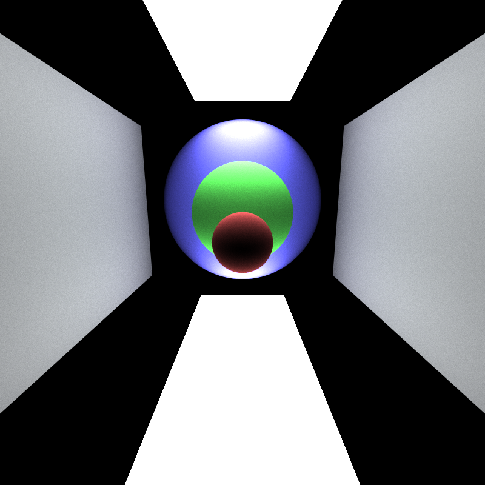
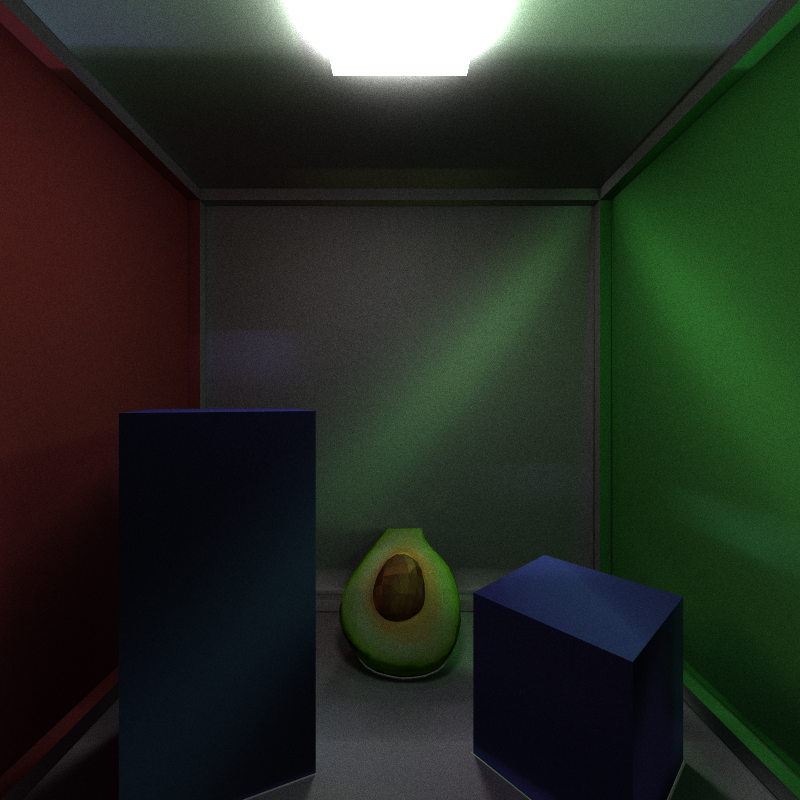
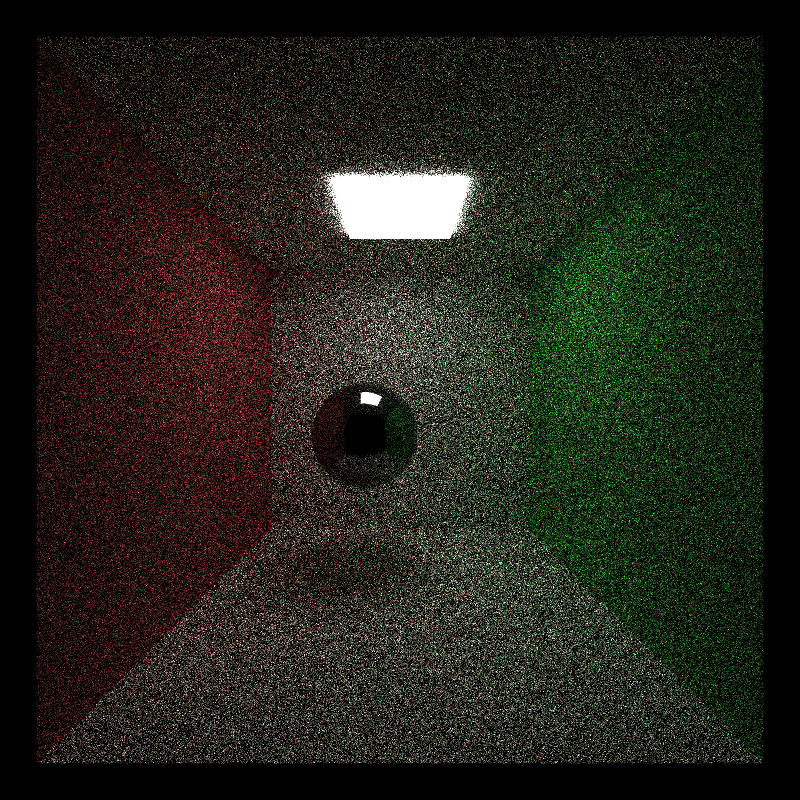
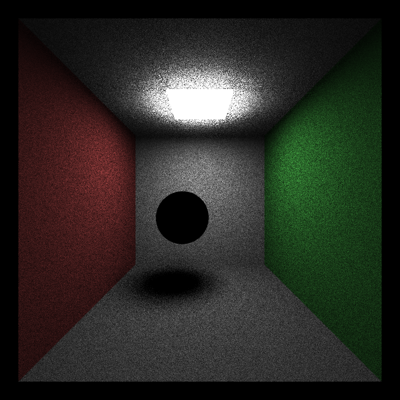

CUDA Path Tracer
================

**University of Pennsylvania, CIS 565: GPU Programming and Architecture, Project 3**

* Nicholas Liu
* Tested on: (TODO) Windows 22, i7-2222 @ 2.22GHz 22GB, GTX 222 222MB (Moore 2222 Lab)

### Features

Refraction (2)

Depth of Field (2)

GLTF loading and texturing (4)

Direct Lighting (2)

