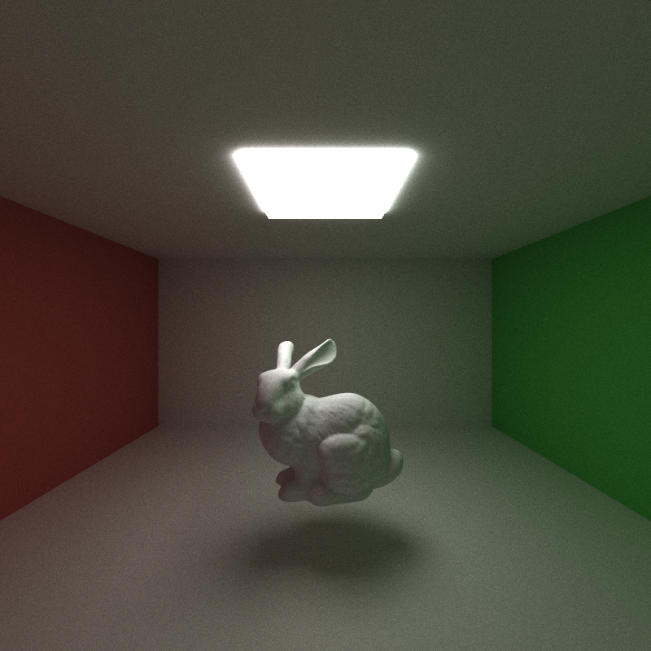
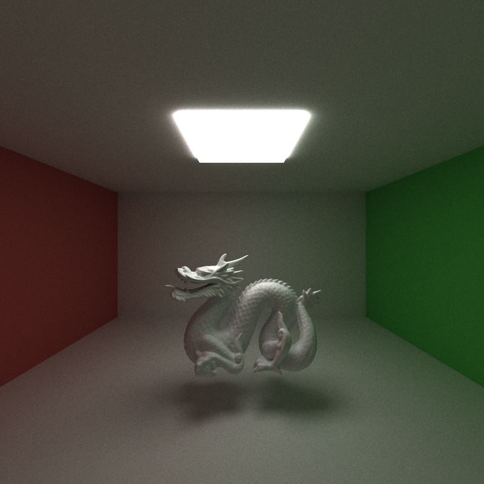
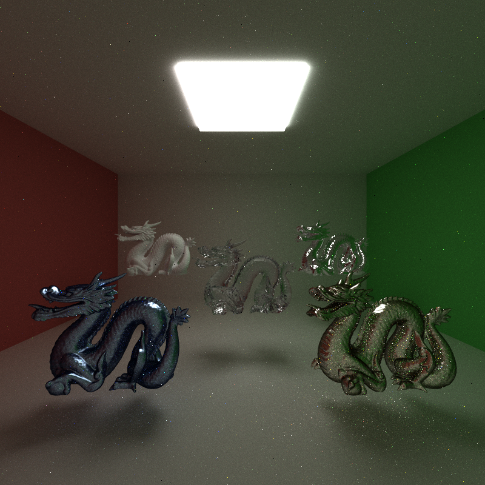
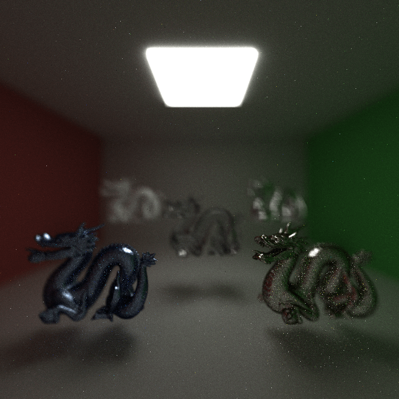
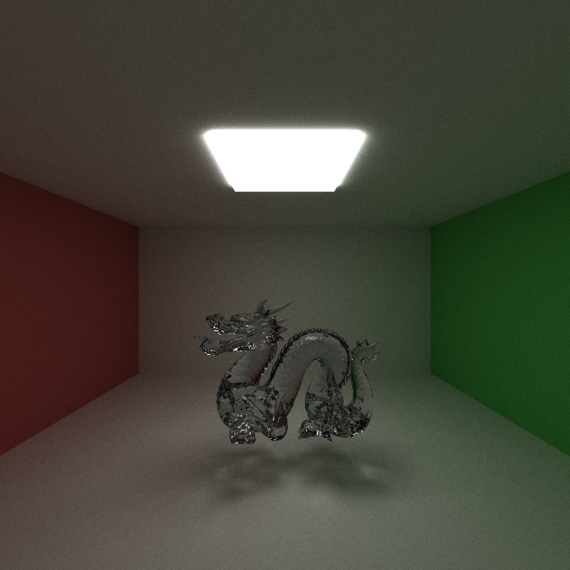

**University of Pennsylvania, CIS 5650: GPU Programming and Architecture,
Project 3 - CUDA Path Tracer**


<div style="text-align: center;">
    <p><em>Stanford Dragons, 4356537 pris, max depth 12, 10000 iter, 4 samp/light</em</p> 
</div>

* Yin Tang
  * [Linkedin](https://www.linkedin.com/in/yin-tang-jackeyty/), [Github](https://github.com/JackeyTY), [Personal Website](https://jackeytang.com/)
* Tested on: Windows 11 Pro, AMD Ryzen 9 7950X @ 5.00GHz 64GB, NVIDIA GeForce RTX 4090 24GB (personal desktop)

### Overview

In this project, I implemented a high-performance CUDA Path Tracer. Leveraging the fast and parallel computing capacity of GPU, we can optimize the process of ray tracing and achieve 10x improvements compared to CPU recursive implementation.

**Core Features**

- Shading kernel with BSDF evaluation, diffuse & perfect specular

  Parallel shading computation using CUDA kernels, supporting BSDF evaluations on diffuse and perfect specular materials. Diffuse surface will scatter ray around cosine-weighted hemisphere, and perfect specular surface will only reflect in a single direction.

- Material sorting

  To reduce the amount of kernel divergence, we will sort the path segments by its intersection surface material in the current bounce, so that the shading kernels in the same warp can enter the same branch as much as possible.

- Stream compaction bounce termination

  To further improve warp retirement and overall utilizations, we will perform stream compaction to filter out terminated paths so that in each bounce we will spawn one kernel for only continuing paths.

- Stochastic antialiasing

  Stochastic antialiasing is adapted to improve jaggies by shooting jittered rays from the camera into the scene and taking average as estimate.

Result after core features:


<div style="text-align: center;">
    <p><em>Cornell box with perfect reflective sphere, max depth 8, 5000 iter</em</p> 
</div>

**Extra features:**

- tinyObj meshing loading

  To load arbitrary meshes into the path tracer, I use [tinyobjloader](https://github.com/tinyobjloader/tinyobjloader), which is a tiny but powerful single file wavefront obj loader out there, and process the vertices and faces into Gemo and Primitive objects, where gemo stores the transformation and matieral information and primitive stores vertices and normals information.

  ```
  Reading scene from ../scenes/cornell.json ...
  
  Finish processing 8 materials in 0.0000 seconds.
  Finish processing 1 lights in 0.0000 seconds.
  Loading ../scenes/mesh/dragon.obj
  Total 871306 faces, 2613918 vertices, 2613918 normals captioned.
  Loading ../scenes/mesh/dragon.obj
  Total 871306 faces, 2613918 vertices, 2613918 normals captioned.
  Loading ../scenes/mesh/dragon.obj
  Total 871306 faces, 2613918 vertices, 2613918 normals captioned.
  Loading ../scenes/mesh/dragon.obj
  Total 871306 faces, 2613918 vertices, 2613918 normals captioned.
  Loading ../scenes/mesh/dragon.obj
  Total 871306 faces, 2613918 vertices, 2613918 normals captioned.
  Finish processing 12 objects, 4356537 primitives in 3.9328 seconds.
  Finishing processing camera in 0.0012 seconds.
  Finish constructing BVH for 4356537 primitives in 3.7845 seconds.
  Opengl Version:4.6.0 NVIDIA 561.09
  Saved cornell.2024-10-09_19-38-01z.10000samp.png.
  
  D:\Projects\Upenn_CIS_5650\Penn-CIS5650-Project3-CUDA-Path-Tracer\build\bin\Release\cis565_path_tracer.exe (process 91332) exited with code 0 (0x0).
  Press any key to close this window . . .
  ```

  

  

  <div style="text-align: center;">
      <p><em>Bunny, prims, max depth 8, 5000 iter</em</p> 
  </div>

  

  <div style="text-align: center;">
      <p><em>Stanford Dragon, 871313 pris, max depth 8, 5000 iter</em</p> 
  </div>

- Stackless BVH GPU traversal

  With the complex mesh, it's highly inefficient to test intersection with every primitive in the scene. Therefore, to speed up the intersection testing, we introduce Bounding Volume Hierarchy which is a hierarchical spatial data structure to improve scene traversal. On the high level, the entire scene has a root BVH node, and we split the primitives in the scene according to their positions along a maximally utilized axis into its left and right children. We proceed with the iterative process until the leaf BVH nodes only contain a certain number of primitives, in this path tracer is 4. This BVH tree data structure is then converted to a stackless BVH nodes array with each node containing an escape index in the case of no intersection with the bounding box, and is then copied to GPU device memory. In the computing intersection kernels, it will compute the intersection of the current ray with the bounding box, which requires much less computation since it's a box, before trying to find the intersections between the actual primitives stored in this node. BVH helps to improve the ray tracing efficiency by an average 10 times compared to without using BVH.

  

  <div style="text-align: center;">
      <p><em>Stanford Dragons, 4356537 pris, max depth 12, 10000 iter</em</p> 
  </div>

- Physically-based Depth of Field

  To simulate the physically-based depth of field , we need to simulate shooting rays from a thin lens camera instead of pinhole. Therefore, I incorporate two additional parameters to the camera, aperture radius and focal length. When shooting a ray from the camera into the scene, we uniformly sample a point on the lens using aperture radius as the new ray origin and find between the intersection of the original ray with the focal plane and the new origin as the new ray direction. This will blur out the objects that are not in focus according to the aperture size.

  

  <div style="text-align: center;">
      <p><em>Aperture radius 0.5, focal length 6.5 / 9.5 / 12.5</em</p> 
  </div>

- Direct lighting with NEE and MIS

  Instead of waiting for the ray to intersect a light source, at each bounce we will shoot shadow rays from the intersection point to a sampled point on the light source to see if there is direct lighting on the current surface. This helps with fast convergence and more realistic shadows, but can add in a bit more noise.

  

  <div style="text-align: center;">
      <p><em>Stanford Dragon without NEE</em</p> 
  </div>

  

  <div style="text-align: center;">
      <p><em>Stanford Dragon with NEE</em</p> 
  </div>

- Russian roulette path termination

  Russian roulette is a method to probabilistically terminate the ray traversing instead of waiting to reach the maximum bounce even if the current ray is insignificant. We use the maximum throughput coordinate as the termination probability and randomly sample a number to determine whether to proceed with the current ray. If no, then terminate the current ray, if yes, we divide the throughput by the probability to unbias the estimate.

- Refraction

  Glass material consists of both specular reflection and specular transmission. We first use the Snell's law to determine whether it's internal total reflection, if yes, then return reflection ray, if not then construct refraction ray. We then sample a number and compare to the Schlick's approximation of the Fernel's Law to determine whether to return reflection ray or refraction ray.

  

  <div style="text-align: center;">
      <p><em>Stanford Dragon Refraction</em</p> 
  </div>


<div style="text-align: center;">
    <p><em>Box Refraction</em</p> 
</div>

**Bloopers**


### Performance Analysis

Here we provide the performance analysis on BVH.


We can see that in scene with very few primitives, BVH construction and traversal can cause overhead, but as the number of primitives increases, BVH becomes much more efficient in finding the intersections and rendering scenes.

### Reference

* CS 184 @ Berkeley, https://cs184.eecs.berkeley.edu/sp19
* PBRT, https://pbr-book.org/4ed/contents

* tinyobjloader, https://github.com/tinyobjloader/tinyobjloader
* McGuire Computer Graphics Mesh Archive, https://casual-effects.com/data/
