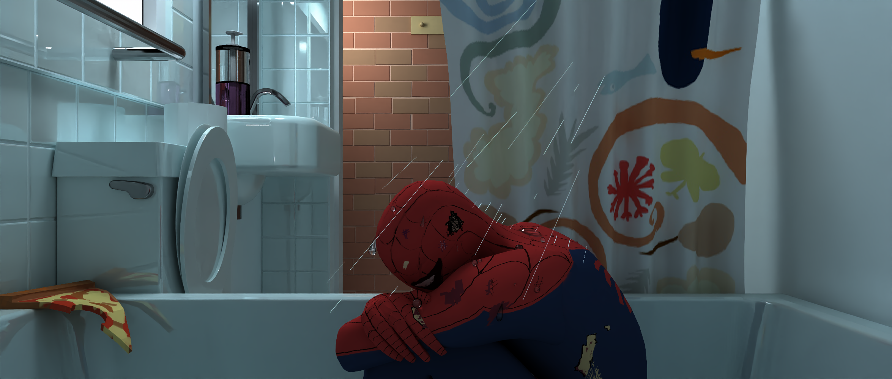
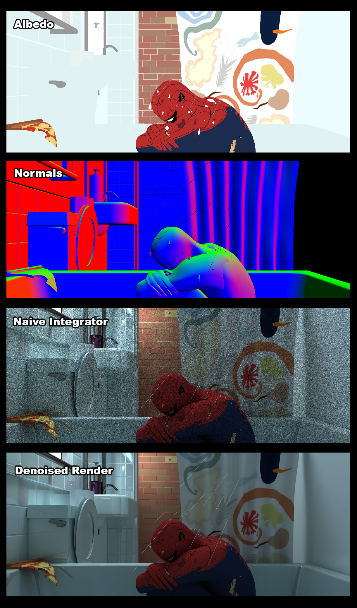

# CUDA Path Tracer
##### Example Render:

  

###### 2350 x 1000 | CUDA Path Tracer with Intel OIDN Denoiser | BVH | 500 SPP | All assets modelled in Maya

  

---

### University of Pennsylvania, CIS 565: GPU Programming and Architecture, Project 3
* Logan Cho
  * [LinkedIn](https://www.linkedin.com/in/logan-cho/)
  * [Art / Coding Portfolio!](https://www.logancho.com/)
* Run on: Windows 11, 13th Gen Intel(R) Core(TM) i7-13700H, 2.40 GHz, RTX 4060 Laptop GPU
-----

## Introduction

This project is a CUDA Path Tracer developed on top of the base code provided by the University of Pennsylvania, CIS 565: GPU Programming and Architecture. Features implemented include: 
* Parallelized Naive Lighting Integrator
* Full Lighting Integrator with MIS
* Performance Optimizations
  * Sorting Path Segments by material type to reduce divergence and increase warp occupancy
  * Stream Compaction of Path Segments to free up cores from rays that have already terminated
* Arbitrary .glTF mesh support with materials and textures (albedo and normals)
* BSDFs (Diffuse, Specular, Microfacet, etc.)
* Intel OIDN Integration (Denoiser)

