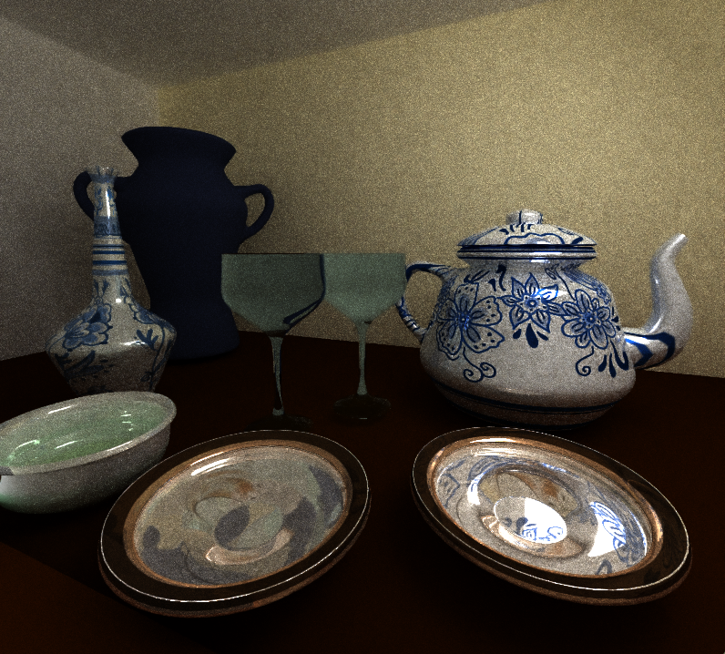
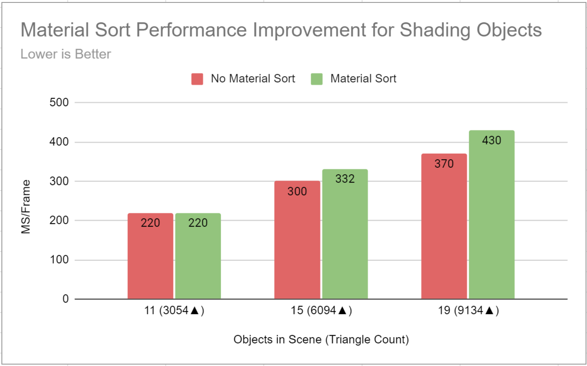
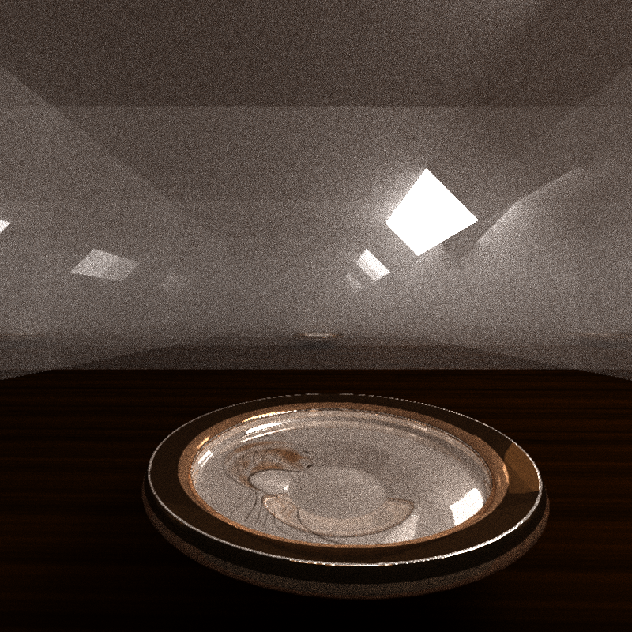
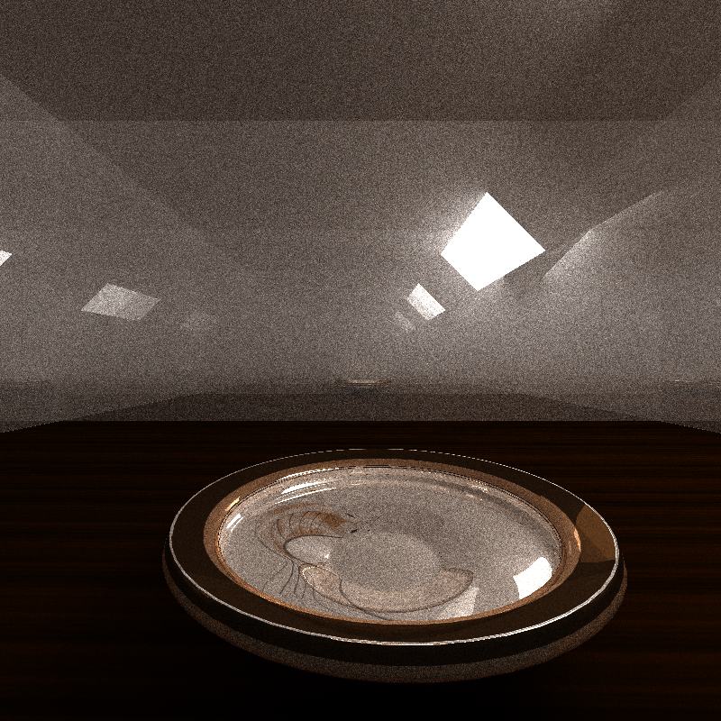
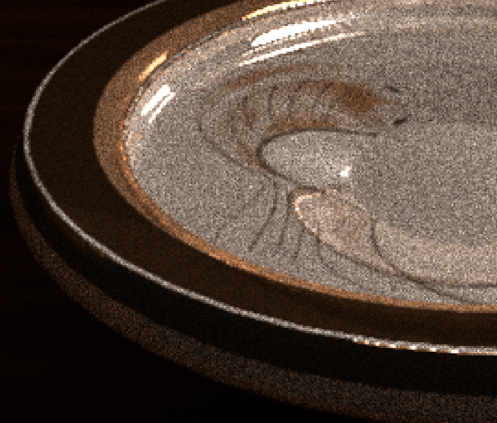
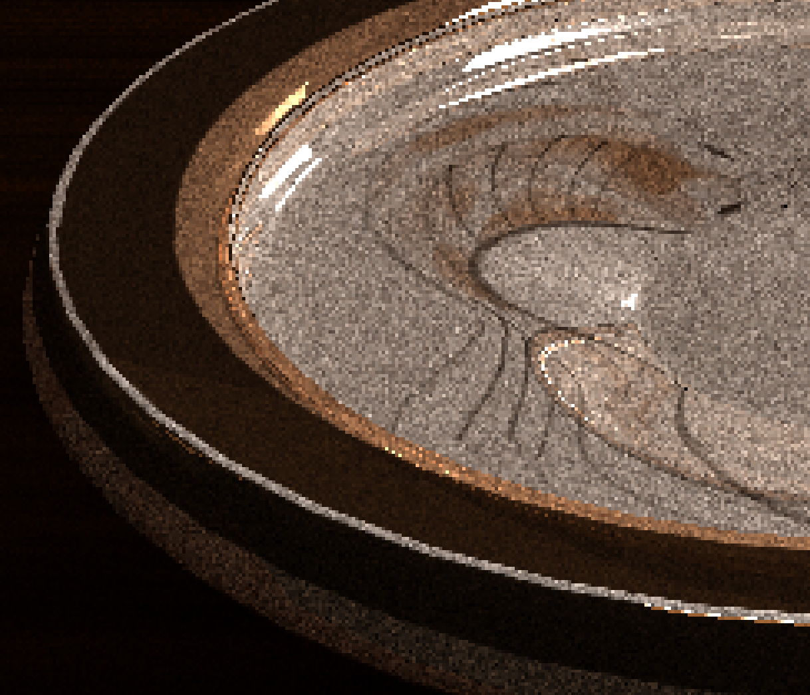
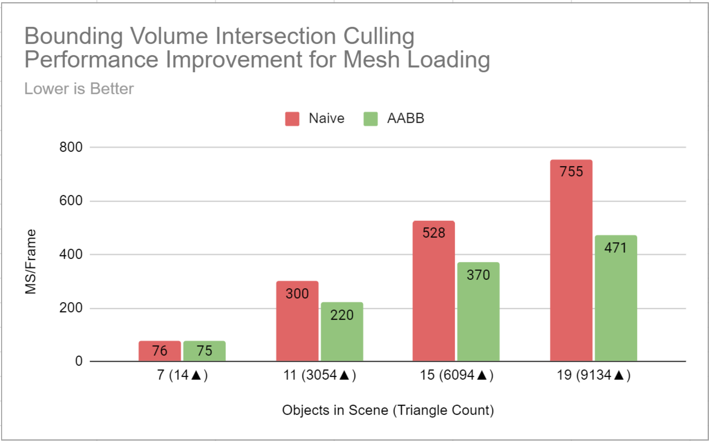
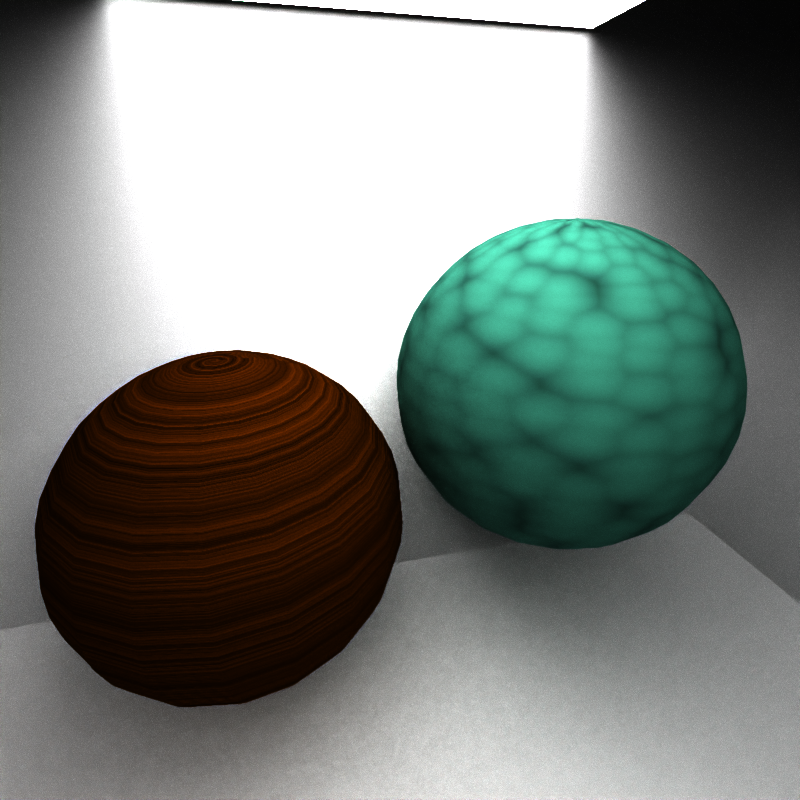
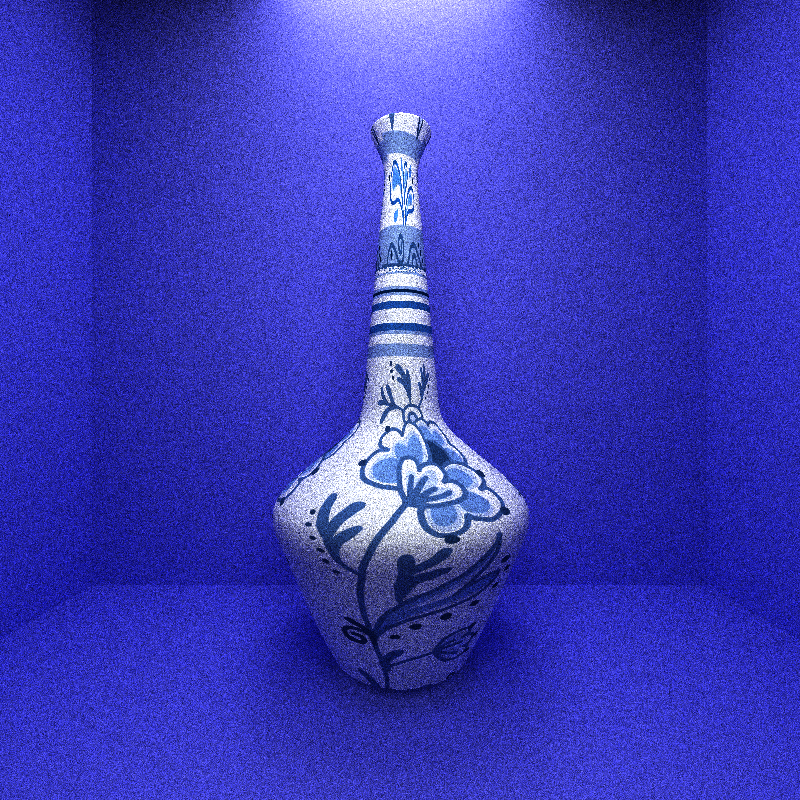
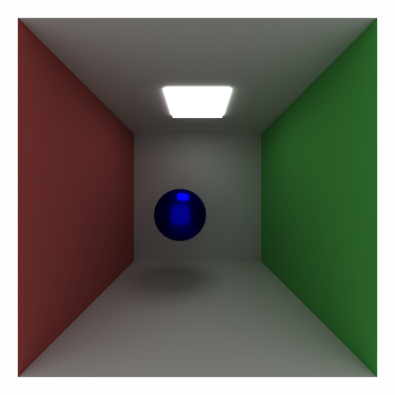

CUDA Path Tracer
================

**University of Pennsylvania, CIS 565: GPU Programming and Architecture, Project 3**

### Yuhan Liu

[LinkedIn](https://www.linkedin.com/in/yuhan-liu-), [Personal Website](https://liuyuhan.me/), [Twitter](https://x.com/yuhanl_?lang=en)

**Tested on: Windows 11 Pro, Ultra 7 155H @ 1.40 GHz 32GB, RTX 4060 8192MB (Personal Laptop)**

 
This takes hours to path trace but I need to update it oops...

## Summary 

CUDA-based path tracer capable of rendering globally-illuminated images very quickly.

### Table of Contents

Core Features
* 🔦 [BSDF Evaluation](https://github.com/yuhanliu-tech/GPU-CUDA-Path-Tracer/tree/main?tab=readme-ov-file#bsdf-evaluation)
* 🚥 [Path Continuation/Termination](https://github.com/yuhanliu-tech/GPU-CUDA-Path-Tracer/tree/main?tab=readme-ov-file#path-continuationtermination)
* 🗃️ [Material Sort](https://github.com/yuhanliu-tech/GPU-CUDA-Path-Tracer/tree/main?tab=readme-ov-file#material-sort)
* 🅰️ [Stochastic-Sampled Antialiasing](https://github.com/yuhanliu-tech/GPU-CUDA-Path-Tracer/tree/main?tab=readme-ov-file#stochastic-sampled-antialiasing)

Additional Elements
* 🔮 [Refraction](https://github.com/yuhanliu-tech/GPU-CUDA-Path-Tracer/tree/main?tab=readme-ov-file#refraction)
* 🫖 [Arbitrary Mesh Loading](https://github.com/yuhanliu-tech/GPU-CUDA-Path-Tracer/tree/main?tab=readme-ov-file#arbitrary-mesh-loading-objs)
* 📦 [AA Bounding Box (& Bounding Volume Hierarchy)](https://github.com/yuhanliu-tech/GPU-CUDA-Path-Tracer/tree/main?tab=readme-ov-file#aa-bounding-box--bvh)
* 🗺️ [Texture Loading & Mapping](https://github.com/yuhanliu-tech/GPU-CUDA-Path-Tracer/tree/main?tab=readme-ov-file#texture-loading--mapping-combined-with-objs)
* 🪵 [Procedural Textures](https://github.com/yuhanliu-tech/GPU-CUDA-Path-Tracer/tree/main?tab=readme-ov-file#texture-loading--mapping-combined-with-objs)
* 📺 [Intel Open Image Denoiser](https://github.com/yuhanliu-tech/GPU-CUDA-Path-Tracer/tree/main?tab=readme-ov-file#intel-open-image-denoiser)

Bloopers Maybe

## Core Path Tracer Features

### 🔦 BSDF Evaluation 

* A shading kernel with BSDF evaluation for:
    * Ideal diffuse surfaces (using provided cosine-weighted scatter function)
    * Perfectly specular-reflective (mirrored) surfaces (using ```glm::reflect```).
    * Handles different roughness values to render imperfect specular material.

### 🚥 Path Continuation/Termination 

* Path continuation/termination using ```thrust::Partition```, based on stream compaction results. 

### 🗃️ Material Sort



* Sorted the rays/path segments so that rays/paths interacting with the same material are contiguous in memory before shading.
* As the chart shows, this improves performance with an increasing number of objects. 

### 🅰️ Stochastic-Sampled Antialiasing 

   
 
   

 * Implemented antialiasing by jittering the ray, results are subtle but noticable. 
 
 * The antialiased (left) has softer edges (blurred fish texture) but is smoother along the room of the plate compared to the original (right). 

## Additional Enhancements

### 🔮 Refraction 

 

 * Refraction with Frensel effects using Schlick's approximation, seen in the glass above. 

### 🫖 Arbitrary Mesh Loading (OBJs)

 

 * Loaded in OBJs using [tinyOBJloader](https://github.com/tinyobjloader/tinyobjloader).

### 📦 AA Bounding Box (& BVH)

 

* Implemented AABB to speed up OBJ mesh intersections.
* Also implemented BVH with SAH and binning, but it's buggy and slower than AABB.
    * I followed this [guide](https://jacco.ompf2.com/2022/04/13/how-to-build-a-bvh-part-1-basics/) for BVH.

### 🗺️ Texture Loading & Mapping (combined with OBJs)

* Used CUDA texture objects to load image files associated with OBJs.
* Referenced the code in the [NVIDIA developer docs](https://docs.nvidia.com/cuda/cuda-c-programming-guide/index.html#texture-object-api). 

### 🪵 Procedural Textures on the GPU

 

 * I created two procedural textures in CUDA kernels.
 * The first (pictured left) is a wood texture, created using FBM.
 * The second (pictured right) is a marble-like texture, created using Worley noise. 
 * Set these textures to OBJs by labeling them in the input JSON. 

### 📺 Intel Open Image Denoiser 

  

 * Integrated [Intel Open Image Denoise](https://www.openimagedenoise.org/downloads.html) by incorporating a precompiled binary package.
 * Image data is loaded into three buffers (denoised, albedo, normal) and pushed through OIDN filter.
 * I've found that excessive use of the denoiser causes the entire image to blur, losing edges of objects. To fix this I: 
     * linearly blended resulting image with the original image as a visual adjustment.
     * set a denoise interval so not all frames have the filter applied. 

## Bloopers

* Check back later!
