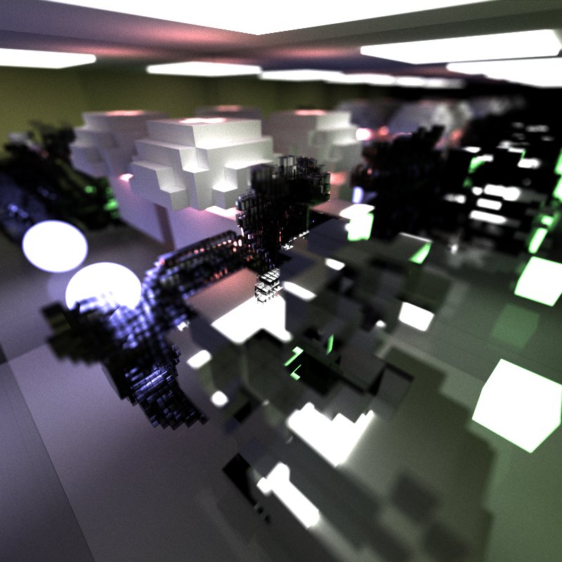
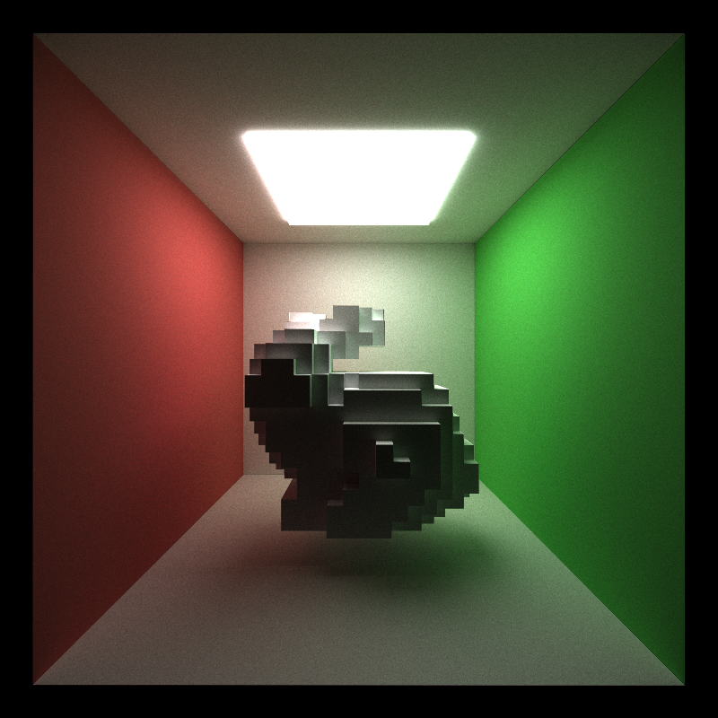
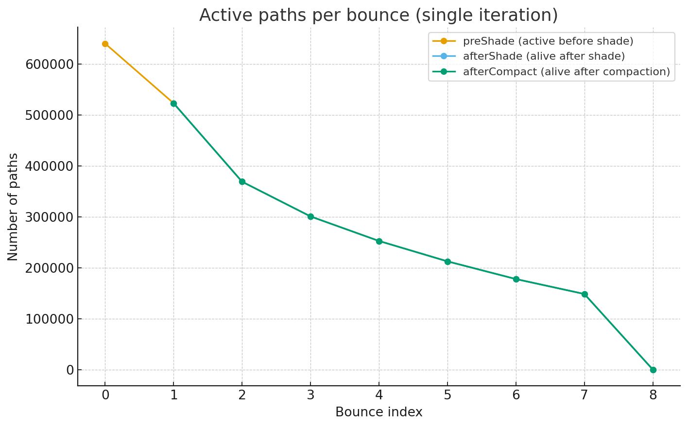
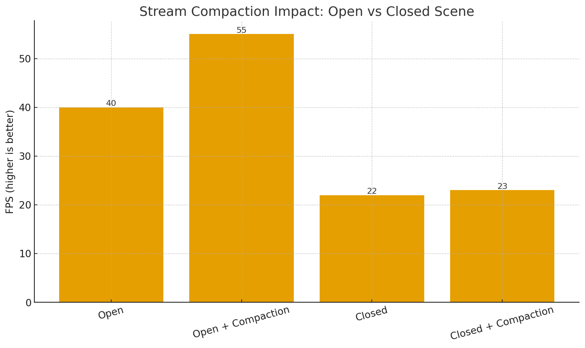

CUDA Path Tracer
================

**University of Pennsylvania, CIS 565: GPU Programming and Architecture, Project 3**

* Tianhong Zhou
  * [LinkedIn](https://www.linkedin.com/in/tianhong-zhou-b559aa159/)
* Tested on: Windows 11, i9-13950HX @ 2.20GHz, 32GB RAM, NVIDIA GeForce RTX 4060 Laptop GPU 8GB (Personal Laptop)

## Base Part

This is the rendered picture of the base part, including:
- Diffuse BRDF
- Stream Compaction
- Sort Material
- Stochastic Sampled Antialiasing

## Visual Improvements

### Refraction

I implemented physically-based specular transmission for dielectrics following [PBRT](https://pbr-book.org/4ed/Reflection_Models/Specular_Reflection_and_Transmission#fragment-FresnelInlineFunctions-1), uses Snell's law to get the transmitted direction and detects TIR and uses Schlick's approximation to stochastically choose reflection vs transmission.

This feature costs more than specular material since it needs to do one reflect, one refract, on Schlick each hit. However, it's still a delta BSDF, so it doesn't integrate over a hemisphere.

The work benefits from GPU since it is mostly arithmetic on a single direction (delta BSDF): a few dot products, a powf (Schlick), and either reflect or refract. This maps well to massively parallel rays/bounces on the GPU, so throughput scales with sample count.

This feature can be optimized in the future by: 1. Add Beer-Lambert absorption for transmitted segments; it improves realism and naturally shortens low-contribution paths; 2. Extend to rough glass, use visible NDF sampling and proper MIS between specular lobes to cut variance.

### Physically-based depth-of-field

I implemented DOF following [PBRT](https://pbr-book.org/4ed/Cameras_and_Film/Projective_Camera_Models#TheThinLensModelandDepthofField) with the thin-lens model: for each primary ray, I first compute the pinhole direction for the pixel, intersect it with the focus plane at focalDistance to get pFocus, then jitter the ray origin on a circular aperture of radius apertureRadius (concentric disk sampling) and aim the ray from that lens point to pFocus. When apertureRadius == 0, it degrades to a pinhole camera (no DOF).

This feature costs more than pinhole camera since it requires 2 more RNG draws (pixel & lens), one concentric-disk map, one extra normalize, a few dot/scale ops. Out-of-focus regions have higher noise, so typically it needs more spp to reach the same perceptual quality than pinhole.

Primary rays are embarrassingly parallel; the work is simple ALU math with minimal branching. At real image sizes and spp, the GPU is decisively faster. The main cost comes from needing more samples in bokeh-heavy shots, which the GPU handles well.

This feature can be optimized in the future by: 1. Use low-discrepancy sequences (Sobol/CMJ/N-Rooks) over (pixel, lens[, time]) dimensions; decorrelate pixel jitter from lens jitter; 2. Support polygonal apertures (N-gon/iris blades) and cat-eye vignetting for realistic bokeh shapes toward the frame edges.

Without Depth of Field | With Depth of Field
--- | ---
 | 

## Performance Improvements

### Russian Roulette

I added Russian roulette (RR) to probabilistically terminate low-contribution paths while keeping the estimator unbiased. After a few bounces (I start at depth >= 3), each path survives with probability
p = clamp(luminance(throughput), p_min, p_max);
if the path survives, I divide its throughput by p (weight compensation); otherwise it terminates. In expectation this equals the non-RR integrator, but it stops long, dark tails early.

In enclosed setups (e.g., Cornell-box-style scenes) rays tend to bounce many times with quickly shrinking throughput. RR trims these long tails. With RR off, it goes about 20 FPS on average, while with RR on, it becomes around 28 FPS, which is a 40% increase. With RR it goes faster mainly because there are fewer deep bounces.

To accelerate it, I start RR only when a ray has 3 bounces remaining, reduces variance spikes. RR is applied before scatterRay each bounce-uses the current throughput and avoids work on rays we'll kill.

It benefits the same in either GPU or CPU implementation because it cutting long tails reduces queue sizes and keeps warps from dragging on a few deep rays. On massive parallel workloads, the speedup is pronounced. However, the CPU also benefits (fewer deep recursions and intersections), but the percentage gain is typically smaller because CPUs don't suffer warp under-utilization.

To optimize this feature, I can: 1. Trigger RR once throughput < threshold or after k bounces (not just fixed k). This tightens termination when rays go dim early; 2. Use a higher p_min when entering caustic-prone chains (e.g., specular paths) to preserve rare but important contributions.

Without RR | With RR 
--- | ---
Avg. 20 FPS | Avg. 28 FPS

Tested enclosed scene

 

### Hierarchical Spatial Data Structures - Octree

I implemented a CPU-built, GPU-traversed octree to cull ray-scene intersection tests. On load, I compute each object's world-space AABB (spheres via scaled center+radius, cubes by transforming 8 corners), then build an octree with tunable params (maxDepth, leafMax, loosen, maxChildHits, gainThresh). The tree is flattened into two GPU arrays:
- OctNode[] (node bounds + firstChild/childCount or firstPrim/primCount)

- uint32_t[] (leaf primitive indices)

Tested on a scene with around 650 cubes. Without Octree, the path tracer was about 3 FPS while with Octree opened, it goes 7.5 FPS on average, which is 2.5x faster. The tree stats printed during load (e.g., Octree nodes: 156, leaf prims: 1486) imply a duplication factor = 2.2x (leaf refs / objects), which is reasonable and matches the speedups above.

I did a lot to accelerate it: 
- Flattened siblings contiguously: enables [firstChild .. firstChild+childCount] sequential access; better cache behavior and simpler indexing on GPU. 
- Front-to-back child ordering by entry t0: maximizes early-out probability after a near hit; reduces both node and primitive tests.
- Tunable build heuristics (loosen slightly above 1, conservative maxChildHits, gainThresh) to reduce cross-child duplication and avoid over-splitting.
- Small fixed stack traversal (no recursion on GPU), keeping register and local memory footprint predictable.

Compare with CPU implementation, GPU benefits a lot because of massive ray parallelism + inexpensive AABB tests = large win when many nodes can be rejected. Front-to-back traversal helps collapse the search early, and GPU excels when there's lots of work to cull. For a CPU with fewer cores but strong caches and branch prediction, a CPU octree/BVH is competitive for small/simple scenes (low build overhead, coherent working set). For complex scenes or high spp, the GPU version clearly wins due to throughput, even with some divergence.

To optimize in the future, I can allow "internal-node prims" (store kept primitives at interior nodes in addition to children) to cut duplication while still subdividing-our current build sometimes forces a leaf when keep is non-empty. Additionally, cache ray.invDir when rays are created/scattered to eliminate 3 divides per AABB test, and sort/cluster rays by space (e.g., Morton code of ray origin/dir bin) per depth to reduce divergence and improve cache hit rates.

Without Octree | With Octree 
--- | ---
Avg. 3 FPS | Avg. 7.5 FPS

Tested scene with around 650 cubes

## Performance Analysis

### Stream Compaction

Why stream compaction helps most after a few bounces:

- Early bounces: Many rays are still alive; compaction would remove relatively few. Even if you compact, the next-bounce kernel size isn't reduced by much, so the wall-time savings are small.

- Mid/late bounces: A large fraction of paths are dead (escaped sky, hit lights, RR-terminated, etc.). This is where compaction shines:

  - Fewer threads launched for intersection + shading at the next bounce.

  - Better memory locality when you actually repack alive paths contiguously (e.g., thrust::stable_partition) - this improves cache/coalescing and reduces divergence.

  - Overall, the time per bounce drops significantly; the cumulative savings across late bounces are substantial.

### Open Scene vs Closed Scene

Stream compaction only reduces work for terminated rays. If a bounce kills many paths (missed the scene, hit light, Russian roulette), then compacting prunes the next bounce's workload and improves memory locality/divergence.

- Open scenes (Cornell-style with escape routes): Many rays miss/exit early. After 1-2 bounces there's a big drop in alive paths -> compaction pays off strongly -> large speedup (+37.5%).

- Closed scenes (fully sealed): Rays keep bouncing; far fewer terminate in early/mid bounces. Compaction has less to remove until late bounces -> small net gain (+4.5%). In some setups it can even be neutral or slightly negative if you compact too early/too often (you pay O(N) shuffle cost without enough pruning).

## References

- Mesh
  - [Stanford bunny](https://graphics.stanford.edu/~mdfisher/Data/Meshes/bunny.obj)
  - [Dragon](https://sketchfab.com/3d-models/stanford-dragon-pbr-5d610f842a4542ccb21613d41bbd7ea1)
