CUDA Path Tracer
================

**University of Pennsylvania, CIS 565: GPU Programming and Architecture, Project 3**

* Rahul Aggarwal
  * [LinkedIn](https://www.linkedin.com/in/rahul-aggarwal-32133a1b3/)
* Tested on: Ubuntu 20.04, i7-12700H @ 2.3GHz, RTX 3050 Ti Laptop 4GB (Personal)

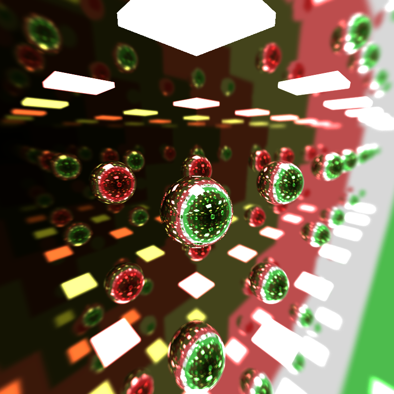
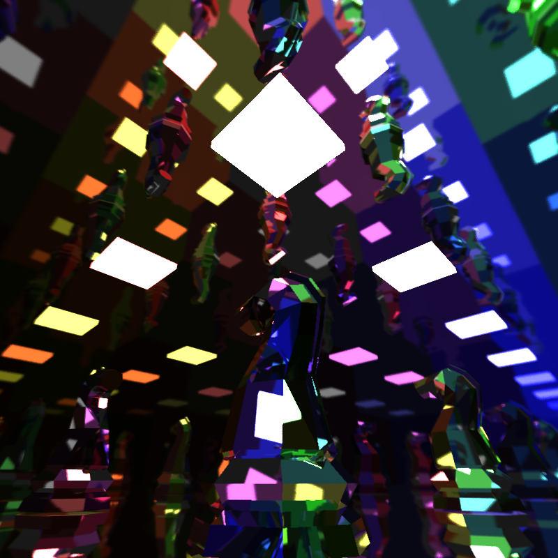
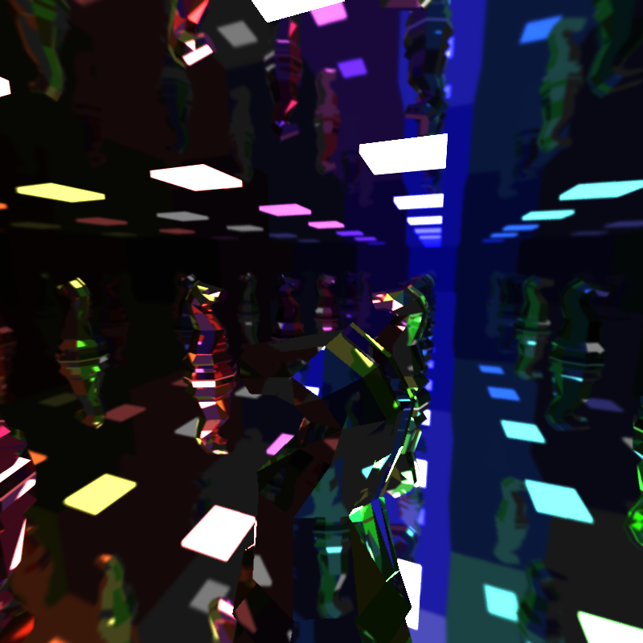

## Overview

This project is a GPU based path tracer that can be used to realistically render images of 3D structures and their interactions with light.

## Core Features

### Diffuse Reflection

Diffuse reflection is where the ray is scattered randomly (weighted by a cosine hemisphere) after it strikes the surface.

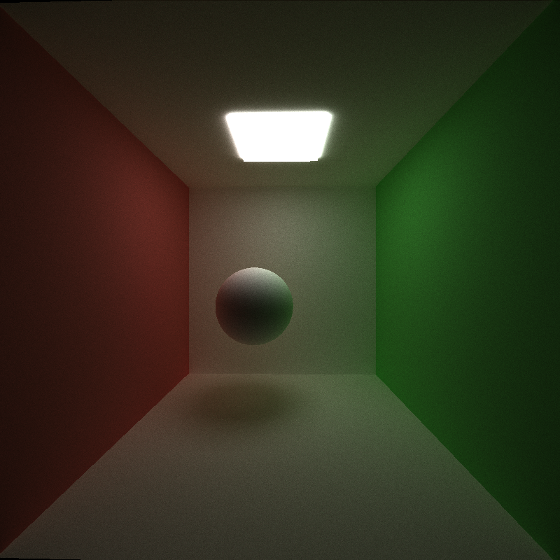

### Specular Reflection

Perfect specular reflection is where the ray is scattered perfectly (mirrored about the normal) when it strikes the material.

### Imperfectly Specular Reflection

We parameterize the imperfectly specular material by a value `roughness`. At full roughness, the imperfectly specular material acts as a diffuse material and at 0 roughness, the material is fully specular. However, in the middle, we interpolate smoothly between a randomly sampled diffuse direction and the specular direction. This allows for partial specularity as can be seen below.

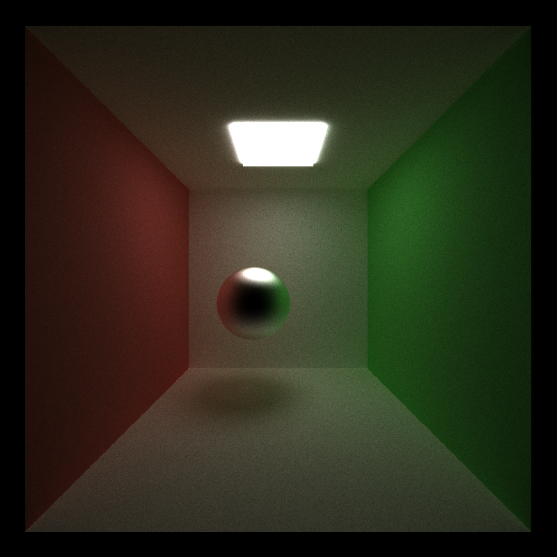

### Path Termination (Perf)

For path termination, I use `thrust::partition` with a custom filtering element that tells me when a ray has hit a light source or reached the maximum bounce limit. With this implementation, invalid rays will be shuffled to the back of the array and the valid (alive) rays will be kept at the front, which should improve memory coalescing and so-forth.

Path termination has differing performance impacts depending on the type of scene as well. For clarity, we try rendering with and without path termination to compare both performance and impact. Below, we show the results.

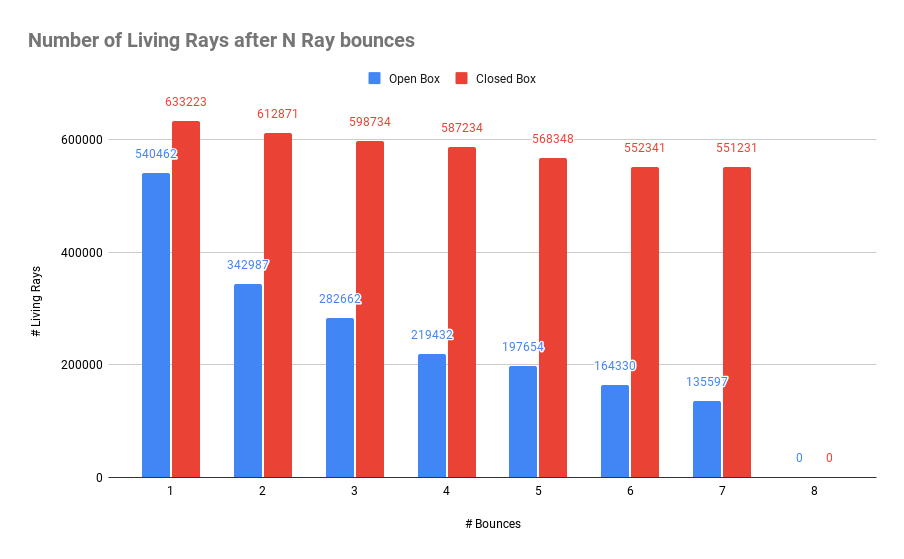

Here, as predicted we see that for scenes where rays can't escape, path termination/stream compaction does not do much. However, for a scene like an open cornell box, it allows many rays to be retired early, meaning that theoreitically more warps can be put through. However, if we actually run the performance comparison on an open cornell box, we see that path termination actually harms our performance.

| No Path Termination | Path Termination |
:--:|:--:
33 ms/frame | 57 ms/frame

This may be because the partitioning actually takes more time than the simple check on whether the ray has been terminated. Additionally, it may be possible that threads spatially local to each other may exhibit similar behaviors in terms of how long they live, meaning that in terms of warp divergemce, we see similar performance.

### Sorting by Material (Perf)

If different materials have very different runtimes, then the performance we might observe during shading is that threads in the same warp might live very different lengths. Therefore, to alleviate this and ideally help with warp removal and throughput, we should ideally sort materials so that all warps shade the same material (ideally).

We implement this by creating a buffer of `materialId`s, and then using `thrust::sort_by_key` to sort both the path segments and intersections based on material. Below, we display the performance impact.

| No Material Sorting | Material Sorting |
:--:|:--:
57 ms/frame | 90 ms/frame

Because material sorting is slower, this suggests that the difference in shading runtimes is not enough to overcome the cost of sorting all the elements in the path segment and intersection arrays.

### Stochastic Anti Aliasing

To implement anti-aliasing, I simply jitter the ray's position within its pixel by a random amount in the range $[-0.25, 0.25]$ every iteration. This has the effect of slightly blurring the scene, which can remove sharp edges, as can be seen below.

|No Anti-Aliasing|Anti-Aliasing|
:---------:|:------------:
 | 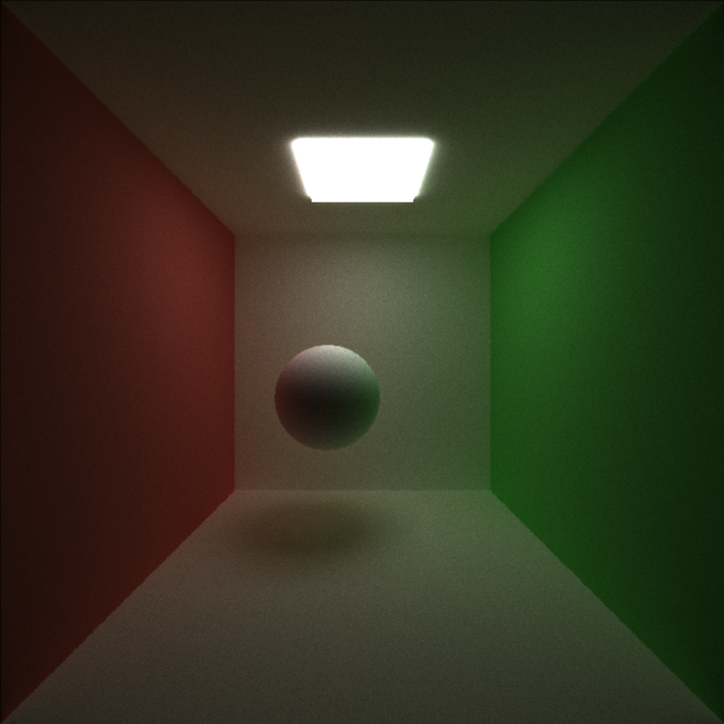

## Extra Features

### Mesh Loading (GLTF) :four:

For mesh loading, we use the [tinygltf](https://github.com/syoyo/tinygltf) library. Specifically, all GLTF parsing is handled by the library, but we write the code to understand and load the parsed meshes into memory. Specifically, we recurse over each node and their children, and if the node is a mesh, we keep track of its vertices and indices in a `Mesh` object. Additionally, we calculate a non-axis-aigned bounding box that we use for boundary volume culling. During rendering, to actually path trace the mesh, we iterate over each triangle in the kernel. While this is slow, we did not have time to implement the more optimized BVH or OCTREE approach. In this sense, the GPU does not benefit each triangle indidually because each ray still has to check all the triangles; however, in the aggreagate the GPU stil helps.

We make boundary volume calling toggleable in order to analyze the performance impacts. Below, we show a visualization of the bounding box as well as the peformance comparison. We note that the numbers are much higher than shown above beucase we are using the [Stanford Bunny](https://graphics.stanford.edu/data/3Dscanrep/) model.

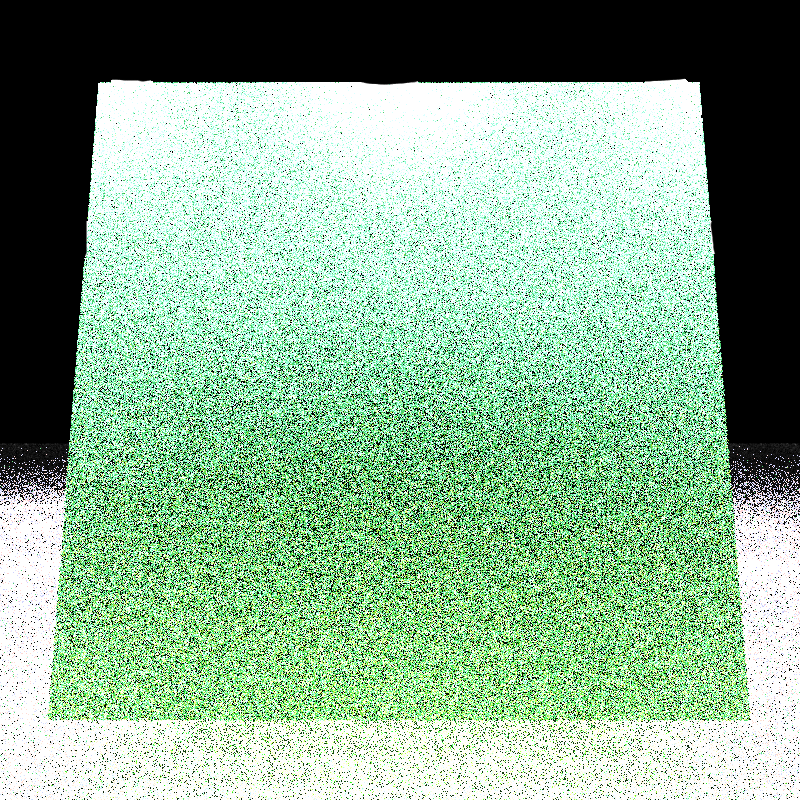

| No Boundary Volume Culling | Boundary Volume Culling |
:--:|:--:
2312 ms/frame | 1857 ms/frame

### Refraction :two:

We model objects with refractive indices by refracting the incoming ray direction into the material on intersection. To make this more realistic, we use [Schlick's approximation](https://en.wikipedia.org/wiki/Schlick%27s_approximation) to account for fresnel effects, which is when refractive materials may induce reflection rather than just pure refraction. In this rendering, we see that the light from above refracts through the sphere to transmit onto the ground and far wall.

|Diffuse|Refraction|
:---------:|:------------:
 | 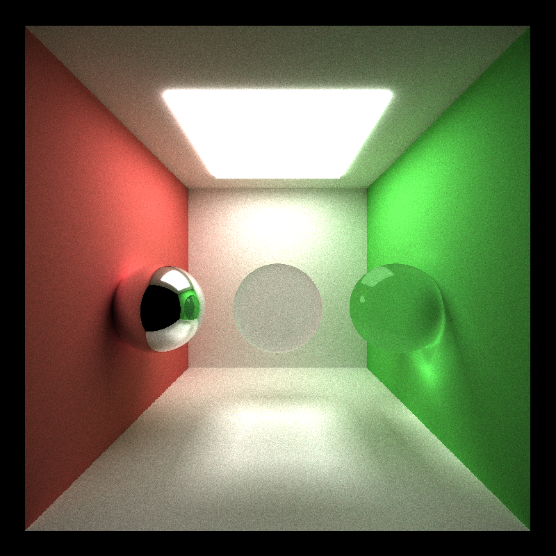

In terms of rendering, implementing refraction on the GPU does not change anything specific from the standard reflection models because there is only a small amount of marginal compute that goes into each interaction calculation. One thing to note is that rays tend to live longer due to being able to go through materials, which we can observe with a small (~2.3 ms) per frame rendering tiem difference.

### Depth of Field :two:

Depth of field is an effect where instead of rays emanating from a single point (the pinhole camera model), they emerge from a thin lens. We introduce two parameters, the `lens_radius` and `focal_distance` of the camera the control how blurry the objects not in focus will be and how far objects will be in focus for, respectively. When implemented on the CPU, if we are still using time averaging, we essentially add a fixed cost to each ray generation, while on the GPU, we are adding a fixed cost to the parallel ray generation. This means that while it will be faster on the GPU, it is not a massive speedup. Below, we compare images with no depth of field and with depth of field.

|No Depth of Field|Depth of Field|
:---------:|:------------:
 | 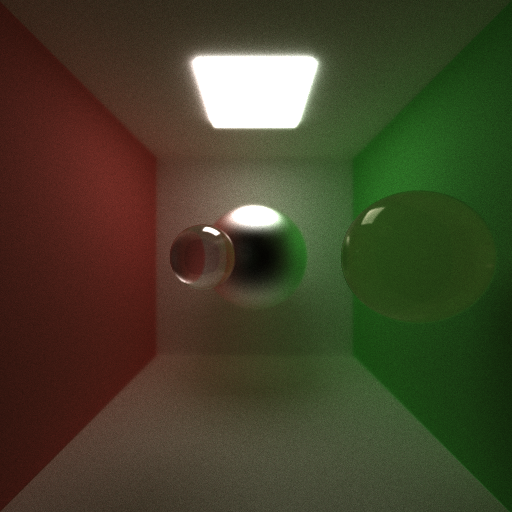

Additionally, we provide an exaggerated lens radius to exemplify the effects of the depth of field

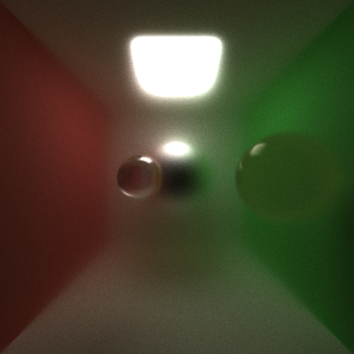

The higher the lens radius, we can think the wider the lens is, which means that the total depth in focus will shrink. Therefore, there is a positive correlation between the lens radius and blurriness of the image.

### Subsurface Scattering :four:

We implement sub-surface scattering using a brute-force random walk approach, incorporating elements of a volumetric path tracer. Essentially, we define three parameters, `translucency`, `thickness`, and `absorption`. If a material is translucent, it has the potential to have subsurface scattering. We randomly choose between the diffuse direction and entering into the material based on the `translucency` of the object. Then, if the ray enters the material, we do a random walk through the surface, where we:

1. Randomly move a distance according to the ray direction inversely proportional to the materials `thickness`.
2. We then randomly choose a new direction for the ray to move in according to a dipole distribution about the current ray direction. While this is not as simple as an isotropic scattering, there are certain papers that encourage this kind of scattering for more realism.
3. Finally, akin to volumetric path tracers, the color is dimmed weighted by the distance travelled and the `absorption` of the material.
4. We repeat this for N steps or until the ray exits the material.

Below, we show a far wall mounted light source, with two thin cubes stacked on top of each other. We see that compared to the diffuse only version of scattering, the light is able to transmit through the surface, especially closer to the center of the object, where the light axis is colocated along the x and y-axes.

In terms of performance, because the random walk is done iteratively on the GPU there is a 3.6 ms increase in rendering time per frame, which is noticeable but not especially a deal breaker. We know that if we increase the global bounce limit, we could simulate each of these scatters independently, but the cost would be massive in terms of time per iteration beacuse more iterations would be needed.

|No Subsurface Scattering|Subsurface Scattering|
:---------:|:------------:
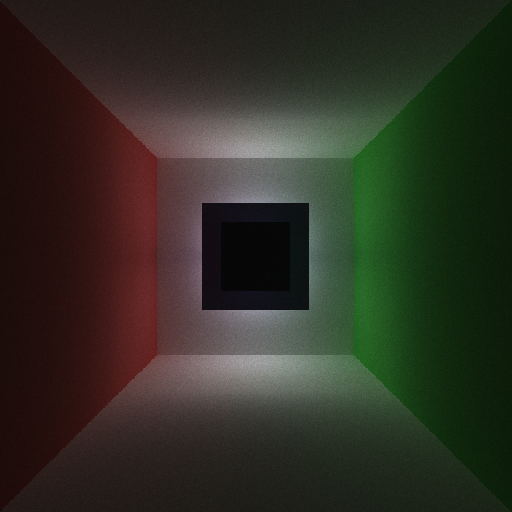 | 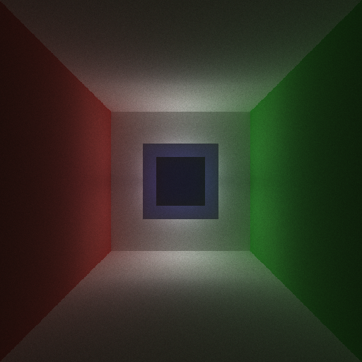

We additonally show a low emissive spherical light and its subsurface scattering effects through a larger sphere. There is clearly an amount of light that transmits through the sphere to the other side and through to the eye.

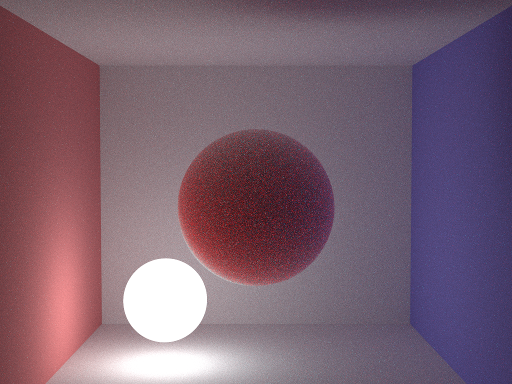