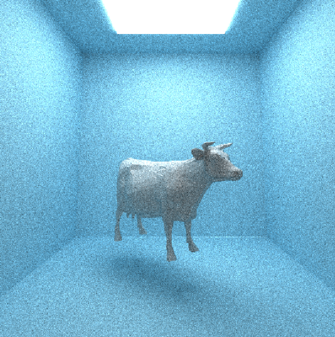

CUDA Path Tracer
================

**University of Pennsylvania, CIS 565: GPU Programming and Architecture, Project 3**

### Yuhan Liu

[LinkedIn](https://www.linkedin.com/in/yuhan-liu-), [Personal Website](https://liuyuhan.me/), [Twitter](https://x.com/yuhanl_?lang=en)

**Tested on: Windows 11 Pro, Ultra 7 155H @ 1.40 GHz 32GB, RTX 4060 8192MB (Personal Laptop)**

  

**Ceramic Still Life Scene (1,000+ iterations, ~175,000 triangles)**

This is the final render composed of all visual features in my GPU path tracer. All models in the render are original, and produced using a [procedural ceramics tool](https://liuyuhan.me/ceramic-tool/) I developed in Houdini. The textures are a combination of hand-painted/image-mapped and procedurally-generated (green vase + wood table). 

## Summary 

This project centers on building a CUDA-accelerated path tracer, which applies a rendering algorithm that simulates the complex interactions of light to produce highly realistic images. That is, a path tracer works by tracing the paths of countless rays of light as they bounce through a virtual scene, accounting for effects like reflection, refraction, and global illumination to accurately capture how light behaves in the real world. Leveraging the parallel processing power of GPUs, this implementation efficiently handles the computational demands of tracing numerous rays simultaneously. 

Read below to learn more about the specific features that were implemented. 

***

### Table of Contents

Shading & Materials
* 🔦 [BSDF Evaluation](https://github.com/yuhanliu-tech/GPU-CUDA-Path-Tracer/tree/main?tab=readme-ov-file#bsdf-evaluation)
* 🔮 [Refraction](https://github.com/yuhanliu-tech/GPU-CUDA-Path-Tracer/tree/main?tab=readme-ov-file#refraction)

Objects & Textures
* 🫖 [Arbitrary Mesh Loading](https://github.com/yuhanliu-tech/GPU-CUDA-Path-Tracer/tree/main?tab=readme-ov-file#arbitrary-mesh-loading-objs)
* 📦 [AA Bounding Box (& Bounding Volume Hierarchy)](https://github.com/yuhanliu-tech/GPU-CUDA-Path-Tracer/tree/main?tab=readme-ov-file#aa-bounding-box--bvh)
* 🗺️ [Texture Loading & Mapping](https://github.com/yuhanliu-tech/GPU-CUDA-Path-Tracer/tree/main?tab=readme-ov-file#texture-loading--mapping-combined-with-objs)
* 🪵 [Procedural Textures](https://github.com/yuhanliu-tech/GPU-CUDA-Path-Tracer/tree/main?tab=readme-ov-file#texture-loading--mapping-combined-with-objs)

Visual Improvements
* 📺 [Intel Open Image Denoiser](https://github.com/yuhanliu-tech/GPU-CUDA-Path-Tracer/tree/main?tab=readme-ov-file#intel-open-image-denoiser)
* 📏 [Stochastic-Sampled Antialiasing](https://github.com/yuhanliu-tech/GPU-CUDA-Path-Tracer/tree/main?tab=readme-ov-file#stochastic-sampled-antialiasing)

GPU-Specific Performance Improvements
* 🚥 [Path Continuation/Termination](https://github.com/yuhanliu-tech/GPU-CUDA-Path-Tracer/tree/main?tab=readme-ov-file#path-continuationtermination)
* 🗃️ [Material Sort](https://github.com/yuhanliu-tech/GPU-CUDA-Path-Tracer/tree/main?tab=readme-ov-file#material-sort)

[Experimental Renders & Progress Images at the End]()

[References]()

***

## Shading & Materials

### 🔦 BSDF Evaluation 

To accurately simulate how light interacts with various materials, I implemented a Bidirectional Scattering Distribution Function (BSDF) evaluation. This implementation handles three primary types of material interactions: diffuse (Lambertian), specular-reflective (mirror-like), and imperfect specular surfaces. The results are rendered below:

  *Spheres in Cornell Box with various materials.*

* Diffuse (Lambertian)
    * Calculated using cosine-weighted random direction generator within the hemisphere defined by the surface normal; this ensures that light scatters uniformly in all directions.
 
* Specular Reflection (Mirror-like)
    * When a reflective material is detected, the incoming ray direction is reflected around the surface normal using the ```glm::reflect``` function. This ensures that the angle of incidence equals the angle of reflection, accurately modeling mirror-like behavior. Imperfect specular surfaces can be achieved by adjusting the ```roughness``` of the material, and the results are shown in the image below.

  *Specular spheres with varying levels of roughness/reflection.*

### 🔮 Refraction 

  *Refraction effect in wine glass.*

To render transparent materials like glass or water with realistic light bending and reflection characteristics, I implemented refraction based on Snell's Law combined with Fresnel effects using [Schlick's approximation](https://en.wikipedia.org/wiki/Schlick%27s_approximation). The code for this section was easily integratable into the parallelized ```scatter ray``` on the GPU which also solves for the aforementioned material interactions.

 *Glass spheres with varying indices of refraction (IOR).*

In the above image, we see that the [index of refraction](https://pixelandpoly.com/ior.html) dictates how a refractive material manipulates light. A material with a low IOR, such as the top left sphere with an IOR of 1 (the same as air) allows light to pass straight through whereas spheres with higher IOR increasingly bend rays that enter it. 

***

## Objects & Textures

### 🫖 Arbitrary Mesh Loading (OBJs)

  *My personal spin on the Utah Teapot.*

To incorporate my own 3D models into the path tracer, I implemented OBJ loading using [Tiny OBJ Loader](https://github.com/tinyobjloader/tinyobjloader). I referenced code from Tiny OBJ Loader’s Object-Oriented API to parse OBJ files, reading vertex positions, normals, and texture coordinates and constructing Triangle structures for each face in the mesh.

### 📦 AA Bounding Box (& BVH)

To optimize ray-geometry intersection tests, I implemented Axis-Aligned Bounding Boxes (AABB) for each loaded mesh in the scene. The AABB is determined for each mesh that is loaded into the scene by a function that finds two of its corners. AABBs provide a simple yet effective means to quickly eliminate rays that do not intersect a geometry’s bounding volume, reducing the number of ray-triangle intersection calculations. 

 

I conducted a performance analysis for the AABB optimization using the Cornell Box with spheres scene from above. Essentially, I duplicated the spheres and recorded the MS/Frame for each scene. The scene with 7 objects contains no spheres (1 light, 6 walls) whereas the scene with 19 objects contains 12 displaced spheres (and the light and walls). The scene has a total of 8 materials. According to the chart, the rendering times of both implementations increase steadily for both, however, the implementation with AABB increases at a much lower rate than the implementation without. 

#### Bounding Volume Hierarchy (BVH)

To further enhance rendering performance, I implemented a Bounding Volume Hierarchy (BVH) as an acceleration structure for efficient ray-triangle intersection tests. BVH organizes triangles into a tree, allowing for rapid traversal and intersection determination. My BVH implementation is currently buggy (unfortunately even after some hours of debugging), but I describe my debugging process below and I hope to fix it soon. 

Implementation Details

* Construction:
    * Recursive subdivision of nodes based on the [Surface Area Heuristic (SAH)](https://jacco.ompf2.com/2022/04/18/how-to-build-a-bvh-part-2-faster-rays/) to determine optimal split position and axes so that the tree is balanced for traversal.
* Node Splitting:
    * The plane on which the node is split is selected by determining the plane that minimizes the SAH cost. Triangles are then partitioned into left and right child nodes based on centroid location, which is aided by the use of discrete [bins](https://jacco.ompf2.com/2022/04/21/how-to-build-a-bvh-part-3-quick-builds/) for triangle allocation.
* Node Management:
    * Each BVH Node maintains its bounding box, triangle range, and pointer to children. 
* Traversal:
    * Traversal is conducted by repeatedly testing the AABB-ray intersection of nodes to determine if further ray-intersection is needed for that sub-tree. This is the same AABB test used for the basic optimization. 

Debugging

* I haven't been able to get the BVH implementation to actually speed up the OBJ loading process. I've taken several debugging steps, first with a simple test scene to determine if the issue was efficiency or construction-related and then to determine if the issue was in the CPU or GPU. I used NVIDIA NSight Graphics (shown below), evluating throughput for any bottlenecks in the CUDA kernels, and concluded that the issue was on the CPU. After more traditional debugging techniques on the CPU, I found the issue to lie in suboptimal BVH construction. As a result, my BVH path tracer has a similar runtime as my naive, but with the added overhead of constructing and explorinng the tree (BVH performance analysis was not included in the above chart, but all scenes ran within 20% of my naive implementation. I will continue to try to fix this issue.  

 

### 🗺️ Texture Loading & Mapping (combined with OBJs)

Implementing image texture mapping enhances the visual realism of rendered scenes by allowing materials to display intricate surface patterns and colors derived from image files. In my renders, these textures were hand-drawn in Procreate and UV-mapped to the OBJ in Autodesk Maya. 

* Used CUDA texture objects to load image files associated with OBJs.
* Referenced the code in the [NVIDIA developer docs](https://docs.nvidia.com/cuda/cuda-c-programming-guide/index.html#texture-object-api). 

### 🪵 Procedural Textures on the GPU

 

 * I created two procedural textures in CUDA kernels.
 * The first (pictured left) is a wood texture, created using FBM.
 * The second (pictured right) is a marble-like texture, created using Worley noise. 
 * Set these textures to OBJs by labeling them in the input JSON.

#### Comparison to Image Textures

| Image Texture |  Procedural Texture  |
| :------------------------------: |:------------------------------: |
|                            |                           |
| xxxxx                            | xxxxxx                          |

***

## Visual Improvements

### 📺 Intel Open Image Denoiser 

  

Integrated [Intel Open Image Denoise](https://www.openimagedenoise.org/downloads.html) by incorporating a precompiled binary package. 
Image data is loaded into three buffers (denoised, albedo, normal) and pushed through OIDN filter.
I've found that excessive use of the denoiser causes the entire image to blur, losing edges of objects. To fix this I: 
     * linearly blended resulting image with the original image as a visual adjustment.
     * set a denoise interval so not all frames have the filter applied. 

### 📏 Stochastic-Sampled Antialiasing 

   
 
   

 * Implemented antialiasing by jittering the ray, results are subtle but noticable. 
 
 * The antialiased (left) has softer edges (blurred fish texture) but is smoother along the room of the plate compared to the original (right). 

***

## GPU-Specific Performance Improvements

### 🚥 Path Continuation/Termination 


* Path continuation/termination using ```thrust::Partition```, based on stream compaction results. 

### 🗃️ Material Sort


* Sorted the rays/path segments so that rays/paths interacting with the same material are contiguous in memory before shading.
* As the chart shows, this improves performance with an increasing number of objects. 

## Experimental Renders & Progress Images

## External References
