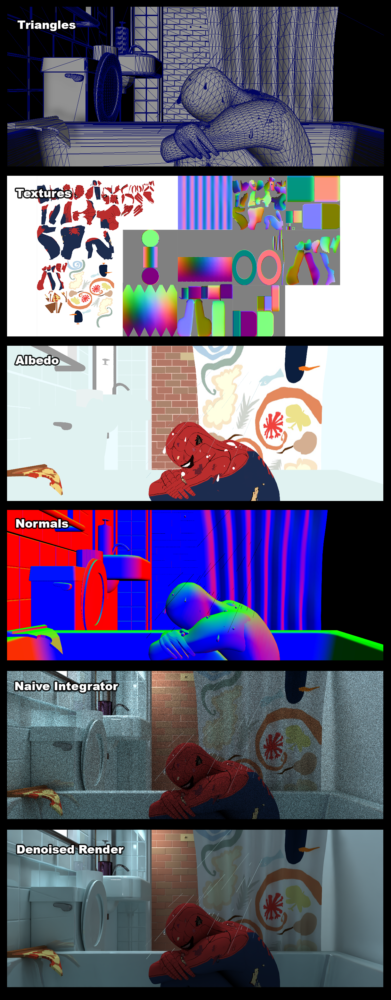
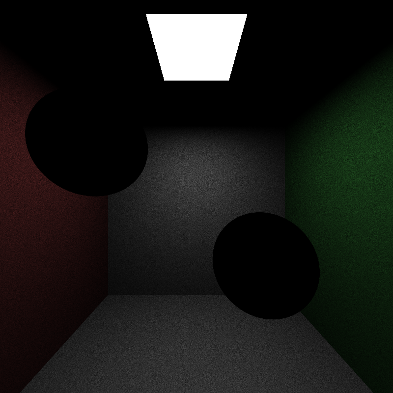

# CUDA Path Tracer

* [Intro](#Introduction)
* [Features](#Features)
* * [BSDFs](#BSDFs)
* * [Integrators](#Integrators)
* * [Mesh and Texture Loading](#Mesh-Loading)
* * [Denoiser](#OIDN)
* [Perf Analysis](#Perf-Analysis)
* [Bloopers](#Bloopers)
* [Credits](#Credits)
-----

##### Example Render:

  

###### 2350 x 1000 | CUDA Path Tracer with Intel OIDN Denoiser | BVH | 500 SPP | All assets modelled in Maya

  

---

### University of Pennsylvania, CIS 565: GPU Programming and Architecture, Project 3
* Logan Cho
  * [LinkedIn](https://www.linkedin.com/in/logan-cho/)
  * [Art / Coding Portfolio!](https://www.logancho.com/)
* Run on: Windows 11, 13th Gen Intel(R) Core(TM) i7-13700H, 2.40 GHz, RTX 4060 Laptop GPU
-----

## Introduction

This project is a CUDA Path Tracer developed on top of the base code provided by the University of Pennsylvania, CIS 565: GPU Programming and Architecture. Features implemented include: 
* Parallelized Naive Lighting Integrator
* Parallelized Full Lighting Integrator with MIS
* Performance Optimizations
  * Sorting Path Segments by material type to reduce divergence and increase warp occupancy
  * Stream Compaction of Path Segments to free up cores from rays that have already terminated
* Arbitrary .glTF mesh support with materials and textures (albedo and normals)
* BSDFs (Diffuse, Specular, Microfacet, etc.)
* Intel OIDN Integration (Denoiser)

## Features

### BSDFs

* #### Diffuse

  

* #### Specular

  
  |  |  |  |
  |:--:|:--:|:--:|
  

* #### Microfacet

  
  |  |  |
  |:--:|:--:|
  

* #### Ceramic / Plastic

  
  |  |  |
  |:--:|:--:|
  

---

### Integrators

I currently support 3 Lighting Integrator models: Naive, Full Lighting with MIS and Direct Lighting. The following renders are after only a few samples (10.) You can see that the direct lighting and full lighting integrator models are far less noisy than the naive integrator. 

|  |  |  |
|:--:|:--:|:--:|
| *Naive Integrator @ 10spp* | *Full Lighting Integrator with MIS @ 10spp* | *Direct Lighting Integrator @ 10spp* |

Currently, there is a bug which doesn't allow my Full Lighting model to correctly render with more than 1 light source. TBC.

---

### Mesh Loading

---

### OIDN

## Perf Analysis

### BVH

### Sort by Material

### Stream Compaction

## Bloopers

## Credits

