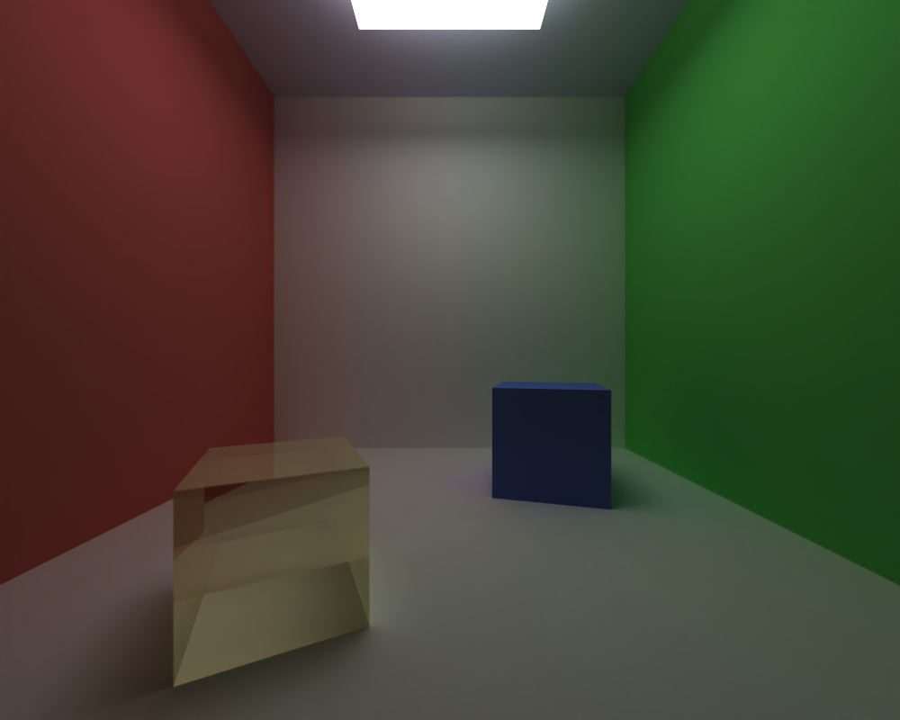

CUDA Path Tracer
================

**University of Pennsylvania, CIS 565: GPU Programming and Architecture, Project 3**

### Yuhan Liu

[LinkedIn](https://www.linkedin.com/in/yuhan-liu-), [Personal Website](https://liuyuhan.me/), [Twitter](https://x.com/yuhanl_?lang=en)

**Tested on: Windows 11 Pro, Ultra 7 155H @ 1.40 GHz 32GB, RTX 4060 8192MB (Personal Laptop)**

  

**Ceramic Still Life Scene (1,000+ iterations, ~175,000 triangles)**

This is the final render composed of all visual features in my GPU path tracer. All models in the render are original, and produced using a [procedural ceramics tool](https://liuyuhan.me/ceramic-tool/) I developed in Houdini. The textures are a combination of hand-painted/image-mapped and procedurally-generated (green vase + wood table). 

## Summary 

This project centers on building a CUDA-accelerated path tracer, which applies a rendering algorithm that simulates the complex interactions of light to produce highly realistic images. That is, a path tracer works by tracing the paths of countless rays of light as they bounce through a virtual scene, accounting for effects like reflection, refraction, and global illumination to accurately capture how light behaves in the real world. Leveraging the parallel processing power of GPUs, this implementation efficiently handles the computational demands of tracing numerous rays simultaneously. 

Read below to learn more about the specific features that were implemented. 

***

### Table of Contents

Shading & Materials
* 🔦 [BSDF Evaluation](https://github.com/yuhanliu-tech/GPU-CUDA-Path-Tracer/tree/main?tab=readme-ov-file#-bsdf-evaluation)
* 🔮 [Refraction](https://github.com/yuhanliu-tech/GPU-CUDA-Path-Tracer/tree/main?tab=readme-ov-file#-refraction)

Objects & Textures
* 🫖 [Arbitrary Mesh Loading](https://github.com/yuhanliu-tech/GPU-CUDA-Path-Tracer/tree/main?tab=readme-ov-file#-arbitrary-mesh-loading-objs)
* 📦 [AA Bounding Box (& Bounding Volume Hierarchy)](https://github.com/yuhanliu-tech/GPU-CUDA-Path-Tracer/tree/main?tab=readme-ov-file#-aa-bounding-box--bvh)
* 🗺️ [Texture Loading & Mapping](https://github.com/yuhanliu-tech/GPU-CUDA-Path-Tracer/tree/main?tab=readme-ov-file#%EF%B8%8F-texture-loading--mapping-combined-with-objs)
* 🪵 [Procedural Textures](https://github.com/yuhanliu-tech/GPU-CUDA-Path-Tracer/tree/main?tab=readme-ov-file#-procedural-textures-on-the-gpu)

Visual Improvements
* 📺 [Intel Open Image Denoiser](https://github.com/yuhanliu-tech/GPU-CUDA-Path-Tracer/tree/main?tab=readme-ov-file#-intel-open-image-denoiser)
* 📏 [Stochastic-Sampled Antialiasing](https://github.com/yuhanliu-tech/GPU-CUDA-Path-Tracer/tree/main?tab=readme-ov-file#-stochastic-sampled-antialiasing)

GPU-Specific Performance Improvements
* 🚥 [Path Continuation/Termination](https://github.com/yuhanliu-tech/GPU-CUDA-Path-Tracer/tree/main?tab=readme-ov-file#-path-continuationtermination)
* 🗃️ [Material Sort](https://github.com/yuhanliu-tech/GPU-CUDA-Path-Tracer/tree/main?tab=readme-ov-file#%EF%B8%8F-material-sort)

[Experimental Renders & Progress Images at the End](https://github.com/yuhanliu-tech/GPU-CUDA-Path-Tracer/tree/main?tab=readme-ov-file#experimental-renders--progress-images)

[References](https://github.com/yuhanliu-tech/GPU-CUDA-Path-Tracer/tree/main?tab=readme-ov-file#external-references)

***

## Shading & Materials

### 🔦 BSDF Evaluation 

To accurately simulate how light interacts with various materials, I implemented a Bidirectional Scattering Distribution Function (BSDF) evaluation. This implementation handles three primary types of material interactions: diffuse (Lambertian), specular-reflective (mirror-like), and imperfect specular surfaces. The results are rendered below:

  *Spheres in Cornell Box with various materials.*

* Diffuse (Lambertian)
    * Calculated using cosine-weighted random direction generator within the hemisphere defined by the surface normal; this ensures that light scatters uniformly in all directions.
 
* Specular Reflection (Mirror-like)
    * When a reflective material is detected, the incoming ray direction is reflected around the surface normal using the ```glm::reflect``` function. This ensures that the angle of incidence equals the angle of reflection, accurately modeling mirror-like behavior. Imperfect specular surfaces can be achieved by adjusting the ```roughness``` of the material, and the results are shown in the image below.

  *Specular spheres with varying levels of roughness/reflection.*

### 🔮 Refraction 

  *Refraction effect in wine glass.*

To render transparent materials like glass or water with realistic light bending and reflection characteristics, I implemented refraction based on Snell's Law combined with Fresnel effects using [Schlick's approximation](https://en.wikipedia.org/wiki/Schlick%27s_approximation). The code for this section was easily integratable into the parallelized ```scatter ray``` on the GPU which also solves for the aforementioned material interactions.

 *Glass spheres with varying indices of refraction (IOR).*

In the above image, we see that the [index of refraction](https://pixelandpoly.com/ior.html) dictates how a refractive material manipulates light. A material with a low IOR, such as the top left sphere with an IOR of 1 (the same as air) allows light to pass straight through whereas spheres with higher IOR increasingly bend rays that enter it. 

***

## Objects & Textures

### 🫖 Arbitrary Mesh Loading (OBJs)

  *My personal spin on the Utah Teapot.*

To incorporate my own 3D models into the path tracer, I implemented OBJ loading using [Tiny OBJ Loader](https://github.com/tinyobjloader/tinyobjloader). I referenced code from Tiny OBJ Loader’s Object-Oriented API to parse OBJ files, reading vertex positions, normals, and texture coordinates and constructing Triangle structures for each face in the mesh.

### 📦 AA Bounding Box (& BVH)

To optimize ray-geometry intersection tests, I implemented Axis-Aligned Bounding Boxes (AABB) for each loaded mesh in the scene. The AABB is determined for each mesh that is loaded into the scene by a function that finds two of its corners. AABBs provide a simple yet effective means to quickly eliminate rays that do not intersect a geometry’s bounding volume, reducing the number of ray-triangle intersection calculations. 

 

I conducted a performance analysis for the AABB optimization using the Cornell Box with spheres scene from above. Essentially, I duplicated the spheres and recorded the MS/Frame for each scene. The scene with 7 objects contains no spheres (1 light, 6 walls) whereas the scene with 19 objects contains 12 displaced spheres (and the light and walls). A version of the scene with 15 objects is shown in the image below. The scene has a total of 8 materials. According to the chart, the rendering times of both implementations increase steadily for both, however, the implementation with AABB increases at a much lower rate than the implementation without. 

 *Test scene with 15 objects (8 spheres, 1 light, 6 walls) and 8 materials.*

#### Bounding Volume Hierarchy (BVH)

To further enhance rendering performance, I implemented a Bounding Volume Hierarchy (BVH) as an acceleration structure for efficient ray-triangle intersection tests. BVH organizes triangles into a tree, allowing for rapid traversal and intersection determination. My BVH implementation is currently buggy (unfortunately even after some hours of debugging), but I describe my debugging process below and I hope to fix it soon. 

Implementation Details

* Construction:
    * Recursive subdivision of nodes based on the [Surface Area Heuristic (SAH)](https://jacco.ompf2.com/2022/04/18/how-to-build-a-bvh-part-2-faster-rays/) to determine optimal split position and axes so that the tree is balanced for traversal.
* Node Splitting:
    * The plane on which the node is split is selected by determining the plane that minimizes the SAH cost. Triangles are then partitioned into left and right child nodes based on centroid location, which is aided by the use of discrete [bins](https://jacco.ompf2.com/2022/04/21/how-to-build-a-bvh-part-3-quick-builds/) for triangle allocation.
* Node Management:
    * Each BVH Node maintains its bounding box, triangle range, and pointer to children. 
* Traversal:
    * Traversal is conducted by repeatedly testing the AABB-ray intersection of nodes to determine if further ray-intersection is needed for that sub-tree. This is the same AABB test used for the basic optimization. 

Debugging

* I haven't been able to get the BVH implementation to actually speed up the OBJ loading process. I've taken several debugging steps, first with a simple test scene to determine if the issue was efficiency or construction-related and then to determine if the issue was in the CPU or GPU. I used NVIDIA NSight Graphics (shown below), evluating throughput for any bottlenecks in the CUDA kernels, and concluded that the issue was on the CPU. After more traditional debugging techniques on the CPU, I found the issue to lie in suboptimal BVH construction. As a result, my BVH path tracer has a similar runtime as my naive, but with the added overhead of constructing and explorinng the tree (BVH performance analysis was not included in the above graph, but all scenes ran within 20% of my naive implementation. I will continue to try to fix this issue.  

  

 Note: Features like this can be toggled in ```utilities.h```. 

### 🗺️ Texture Loading & Mapping (combined with OBJs)

Implementing image texture mapping enhances the visual realism of rendered scenes by allowing materials to display surface patterns and colors derived from image files that are linked to the OBJ. In my renders, these textures were hand-drawn in Procreate and UV-mapped to the OBJ in Autodesk Maya. 

The code I referenced from the Tiny OBJ Loader documentation processes OBJ UVs, so I loaded the image using ```STB_Image``` library and stored it in a ```Texture``` structure. For each loaded texture, a corresponding [CUDA Texture Object](https://docs.nvidia.com/cuda/cuda-c-programming-guide/index.html#texture-object-api) is created. The created CUDA texture objects are then passed to the shading kernels responsible for applying textures to surfaces during rendering. Within these kernels, texture sampling is performed using built-in CUDA functions such as ```tex2D```, which efficiently retrieves texel colors based on UV coordinates. 

In scenes with multiple textured objects, each texture is assigned a unique CUDA Texture Object. These objects are stored in an array, allowing shaders to reference the appropriate texture based on the material properties of each geometry. 

Using CUDA Texture Objects significantly enhanced the efficiency of my texture mapping as, in addition to having optimized pre-written mapping functions, CUDA texture objects leverage the GPU's texture cache for faster texture sampling.

### 🪵 Procedural Textures on the GPU

  *Left: Procedural Wood, Right: Procedural Marble*

Procedural textures allow for the generation of surface patterns algorithmically, eliminating the need for external image files and enabling dynamic and scalable textures. I created two procedural textures in CUDA kernels, which replace the image texture sampling in the intersection logic. The procedural textures can be toggled by replacing the texture image name with ```PROCEDURAL1``` or ```PROCEDURAL2``` in the input JSON. 

Procedural Wood (FBM)

* To simulate the natural lines found in wood, I implemented an fBm-based noise function with high octaves. The FBM lines were heavily stretched out to convey the look of polished wood. (Left texture in above image, table texture in the cover image)

Procedural Marble (Worley)

* For the marble-like texture, I utilized Worley noise, aka cellular noise, which generates organic, vein-like patterns by calculates the distance from each point to the nearest feature point within a defined grid. I aimed for a marble look to texture my ceramic pieces. (Right texture in above image, green vase texture in the left side of the cover image)

Because both textures are generated via a series of arithmetic/hash functions, they are easily parallelizable on the GPU, allowing for more efficient sampling.

#### Comparison to Image Textures

| Image Texture |  Procedural Texture  |
| :------------------------------: |:------------------------------: |
|                            |                           |
| 584 MS/Frame (1.7 FPS)         | 580 MS/Frame (1.7 FPS)                  |

The above comparison uses an original teacup mesh that is split into 4 OBJ files (2 for the cup, 2 for the saucer). The scene has a total of 11644 triangles. On the left, the OBJs use two image textures; on the right, all OBJs use the same procedural texture (I modified the color of the aforementioned Worley texture). As previously mentioned, the use of CUDA Texture Objects enables an extremely fast texture sampling, which makes the runtime of both scenes virtually the same. 

***

## Visual Improvements

### 📺 Intel Open Image Denoiser 

   

In path tracing, especially when rendering with a limited number of samples per pixel, noise artifacts can significantly degrade image quality. To address this, I implemented image denoising using the [Intel Open Image Denoise (OIDN)](https://www.openimagedenoise.org/downloads.html) library, which uses AI to smooth noise. 

I pass in the following buffers: raw "beauty", albedo, and normal. The denoising workflow includes first prefiltering the auxiliary albedo and normal images to ensure they are clean. Subsequently, we run the main OIDN denoising filter on the beauty image using the prefiltered auxiliary data. 

I've found that excessive use of the denoiser causes the entire image to blur, losing the edges of objects. To fix this I: 
* linearly blended resulting image with the original image as a visual adjustment.
* set a denoise interval so not all frames have the filter applied. 

The results are dramatic, and shown in the images above. The vase scene has ~23K triangles. Denoising is applied every 20 iterations, and the results are linearly blended 50-50. Denoising doesn't have much impact on the path tracer runtime: with denoising, the path tracer ran at 1519 MS/Frame (0.7 FPS) and without, the path tracer ran at 1502 MS/Frame (also 0.7 FPS). 

### 📏 Stochastic-Sampled Antialiasing 

 | Antialiased |  No Antialiasing  |
| :------------------------------: |:------------------------------: |
|                            |                           |
|           |                    |

 Antialiasing is a crucial technique in rendering that mitigates visual artifacts like jagged edges. This was implemented by slightly jittering the camera ray. This method leverages random sampling to produce a jitter in the ray, thereby averaging out color discrepancies and reducing aliasing artifacts.
 
The results, shown above, are extremely subtle (mostly as I only let the renders run for about 100 iterations). The antialiased (left) has softer edges (examine fish texture, blurred gills, less defined back curve) but is smoother along the rim of the plate (the very thin, dark lines on the plate where the orange meets the right has been blended in) compared to the original (right). 

***

## GPU-Specific Performance Improvements

### 🚥 Path Continuation/Termination 


As rays traverse the scene, they may undergo multiple interactions (bounces) with surfaces, each potentially generating new rays. However, some rays terminate early (if they do not hit a surface, for example), and efficiently handling these active and inactive rays ensures that the path tracer runs efficiently. To effectively manage active rays, I implemented path continuation and termination using ```thrust::Partition```, based on stream compaction results. 

The above performance analysis of this optimization shows the performance gains. Path continuation/termination was tested 

While the number of remaining paths stays constant without stream compaction, that number decreases after each depth iteration with stream compaction. By eliminating rays that no longer contribute to the final image, the renderer minimizes unnecessary computations, particularly in complex scenes with numerous interactions. Furthermore, this optimization keeps active rays contiguous in memory, improving cache performance and memory access. 

This improvement is more noticable for open scenes than closed scenes. This is because more rays become inactive in open scenes, when they fire into the void. That is, stream compaction is more likely to terminate rays when all rays are guaranteed to hit a surface in a closed scene. This effect gets compounded after each bounce, as the rays that don't hit are terminated and the rays that do hit re-bounce. 

### 🗃️ Material Sort


Material Sorting is an optimization technique that organizes scene geometry based on their material properties. By grouping objects with similar materials together, the renderer accelerate the shading process. I implemented this using ```thrust::sort_by_key```, sorting the path segments so that paths interacting with the same material are contiguous in memory before shading.

As the performance analysis shows, material sorting improves performance with an increasing number of objects, especially with a diverse set of materials in the scene. The runtime of the path tracer with material sorting increases at a lower rate than that of the implementation without it. This is due to reduced warp divergence because threads in the same warp are more likely to handle the same material and carry out the same instructions. I tested this on the same BSDF scene which has 8 materials. 

## Experimental Renders & Progress Images

#### Building the Cover Image

 *Cover image, after first bounce*

With over 175K triangles, the cover image was not an easy feat. Nonetheless, I found some techniques to organize the scene which made its creation process much smoother. For one, I used the first bounce render for composition and object adjustments, as it was fast to load, and showed object information like texture orientation, base color, and position.

 *Cover image, older iteration*

The above image is an older render of the same scene, before I made some lighting adjustments. The plates were very overexposed, causing them to lose the texture as well as the reflections of the other objects. In addition, I adjusted the IOR of the wine glasses and the height of the ceiling. 

#### Glass Flowers Experiment

 *Glass water lilies in mirror room*

I recently build a procedural Houdini Digital Asset tool that generates [water lily ponds](https://liuyuhan.me/water-lily-pond-hda/), and I had the idea to create a mirror room with glass water lilies. I'm still messing with this scene; the first render didn't turn out perfectly because the mesh itself had some issues when exporting. Though they look normal rendered in Houdini and Maya, they aren't as clean in the above render. It is a tricky lighting situation with thin glass objects, but I do like the ethereal effect and plan to continue to work on the scene. 

#### Debugging Fails :(

 *Ominous black hole...*

This was the vase scene from the denoising section... Render created while debugging BVH. 

## External References

* Path Tracer Logic: [Ray Tracing in One Weekend](https://raytracing.github.io/books/RayTracingInOneWeekend.html)
* BVH Construction: [How to Build a BVH](https://jacco.ompf2.com/2022/04/13/how-to-build-a-bvh-part-1-basics/)
* Mapping Image Textures: [CUDA Developer Docs, Texture Object API](https://docs.nvidia.com/cuda/cuda-c-programming-guide/index.html#texture-object-api)
* OBJ Loading: [Tiny OBJ Loader](https://github.com/tinyobjloader/tinyobjloader?tab=readme-ov-file#example-code-new-object-oriented-api)
* Denoising Functions: [Open Image Denoise Documentation](https://www.openimagedenoise.org/documentation.html)
* Polygon Intersection Logic: [Ray Tracing Polygon Mesh](https://www.scratchapixel.com/lessons/3d-basic-rendering/ray-tracing-polygon-mesh/ray-tracing-polygon-mesh-part-1.html)
