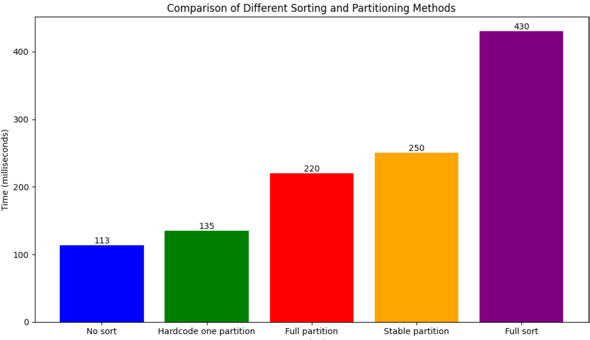

CUDA Path Tracer
================

**University of Pennsylvania, CIS 565: GPU Programming and Architecture, Project 3**

* Jiahang Mao
  * [LinkedIn](https://www.linkedin.com/in/jay-jiahang-m-b05608192/)
* Tested on: Windows 11, i5-13600kf @ 5.0GHz 64GB, RTX 4090 24GB, Personal Computer

## 1. Key feature implemented

Part 1
1. Cuda path tracing with lambertian and specular shading kernel
2. Unhit path termination using Stream Compaction
3. Sort ray-scene intersection by material type
4. Stochastic sampled antialiasing

Part 2
1. Obj mesh import.
2. BVH. Tree construction done on CPU, traversal with GPU. Configurable with either max depth or max leaf size.
3. Refraction. Support transmissive-only and glass-like material.

## 2. Build 

Use C++ 17 or later instead of default C++ 14 with VS2022. Reason is because I added `<filesystem.h>` to support importing files using windows file system.

Change under property -> C/C++ -> Language -> C++ Language Standard


## 3. Navigating UI

I made some updates to the UI, building on top of the imgui.


#### Mesh Options
* `Centralize mesh` When loading loading arbitrary obj mesh, this option automatically compute the center and scale, then apply a transformation to the center of camera's front pov.
* `Mesh transformation` Post-import transformation also customizable.
#### Acceleration Structure
A single choice between three options
* `None` No accleration structure will be applied. For each render pass the intersection checks each ray against all geometry in the scene.
* `Basic Bounding Volume Culling` Conceptually equivalent to a depth-equals-to-one BVH. Construct a single bounding box surrounding the mesh. 
* `Bounding Volume Hierarchy` Construct a tree-like structure to organize the geometry. The tree is built on CPU and traversed on GPU.
  
  * `Bins to Split Per Axis` Controls the number of bins used when determining the best split plane during BVH construction.
  * `BVH Constraint` Choose between using a maximum leaf size or maximum depth as the stopping criterion for BVH construction.
    * `Max Leaf Size` The maximum number of primitives allowed in a leaf node.
    * `Max Depth` The maximum depth allowed for the BVH tree.
#### Render Options
* `Use Path Tracing` Toggle between path tracing and basic shading. Latter suited for quick view of geometry.
* `Sort by Material` Enable/disable sorting of ray-scene intersections by material type.
#### Loading file
* Support either .json or .obj file. When importing an obj file, automatically load a display room scene under ./scenes/display_room.json

    
#### Program output
* Command prompt will have useful info about the mesh and bvh for debugging.
    ```console
    --- Mesh Info ---
    Loaded 5664 vertices, 11272 faces, and 1 face materials.
    Auto-centering object...
    Geometric Center: vec3(0.108734, 0.431662, 0.382079)
    Average Distance to center : 1.03667
    --- BVH Info ---
    Building BVH...
    Validating BVH...
    BVH is valid. Max depth: 50, largest leaf size: 69
    ```
## 4. Performance benchmark

#### 4.1 Stream Compaction, on open and close scene


A sample output of number of rays after stream compaction after each iteration. Tested on scenes/cornell_refraction.json

Results 1:
Tested with cornell_refraction.json there are a total of 7 materials and 9 geometries, all of them are either box or spheres.

  
  ```
  num_paths: 588297 at depth 1 of iter18
  num_paths: 481950 at depth 2 of iter18
  num_paths: 398397 at depth 3 of iter18
  num_paths: 326704 at depth 4 of iter18
  num_paths: 266102 at depth 5 of iter18
  num_paths: 217403 at depth 6 of iter18
  num_paths: 178307 at depth 7 of iter18
  num_paths: 0 at depth 8 of iter18
  num_paths: 588302 at depth 1 of iter19
  num_paths: 482180 at depth 2 of iter19
  num_paths: 397826 at depth 3 of iter19
  num_paths: 326109 at depth 4 of iter19
  num_paths: 265074 at depth 5 of iter19
  num_paths: 216725 at depth 6 of iter19
  num_paths: 177920 at depth 7 of iter19
  num_paths: 0 at depth 8 of iter19
  num_paths: 588302 at depth 1 of iter20
  num_paths: 482791 at depth 2 of iter20
  num_paths: 398975 at depth 3 of iter20
  num_paths: 327015 at depth 4 of iter20
  num_paths: 266191 at depth 5 of iter20
  num_paths: 217700 at depth 6 of iter20
  num_paths: 178610 at depth 7 of iter20
  num_paths: 0 at depth 8 of iter20
  ```

Results 2:
Tested with cornell_refraction_close.json. Comparing to cornell_refraction.json, it has one more cube at back of the camera so light can't escape the room.

  
  ```
  num_paths: 588103 at depth 1 of iter18
  num_paths: 552057 at depth 2 of iter18
  num_paths: 522357 at depth 3 of iter18
  num_paths: 493064 at depth 4 of iter18
  num_paths: 464186 at depth 5 of iter18
  num_paths: 437812 at depth 6 of iter18
  num_paths: 413273 at depth 7 of iter18
  num_paths: 0 at depth 8 of iter18
  num_paths: 588112 at depth 1 of iter19
  num_paths: 551931 at depth 2 of iter19
  num_paths: 522363 at depth 3 of iter19
  num_paths: 492947 at depth 4 of iter19
  num_paths: 464198 at depth 5 of iter19
  num_paths: 437899 at depth 6 of iter19
  num_paths: 413139 at depth 7 of iter19
  num_paths: 0 at depth 8 of iter19
  num_paths: 588110 at depth 1 of iter20
  num_paths: 552150 at depth 2 of iter20
  num_paths: 522766 at depth 3 of iter20
  num_paths: 493317 at depth 4 of iter20
  num_paths: 464677 at depth 5 of iter20
  num_paths: 438364 at depth 6 of iter20
  num_paths: 413396 at depth 7 of iter20
  num_paths: 0 at depth 8 of iter20
  ```

The average render time is higher with close room scene. Since there is a lot less light terminated during rendering, more kernels need to be launched at each render pass, causing higher render time.

### BVH Reults

BVH is constructed on CPU, then ray-scene intersection kernel iteratively looks for closest hit along the BVH Tree. BVH accept three arguments: number of bins to split per axis ( when constructing BVH), max leaf size acceptable, and max depth acceptable.

*Test scene used is cow.obj, contains 2903 vertices, 5804 faces, and 1 diffuse material*

*Config 0 is using a single volume containing the whole mesh.*

#### Using max leaf count as bvh constraint

```
Max leaf count is set, max depth is generated on the fly.
config 0: Single volume
config 1: Bins per axis: 32, Max depth: 33, largest leaf size: 10
config 2: Bins per axis: 32, Max depth: 22, largest leaf size: 27
config 3: Bins per axis: 32, Max depth: 11, largest leaf size: 63
config 4: Bins per axis: 32, Max depth: 10, largest leaf size: 120
config 5: Bins per axis: 32, Max depth: 8, largest leaf size: 229
```
  

#### Using max depth as bvh constraint
```
Max depth is set, max leaf count is generated on the fly.
config 0: Single volume, 2995
config 1: Bins per axis: 32, Max depth: 4, largest leaf size: 1253
config 2: Bins per axis: 32, Max depth: 10, largest leaf size: 102
config 3: Bins per axis: 32, Max depth: 20, largest leaf size: 30
config 4: Bins per axis: 32, Max depth: 38, largest leaf size: 10
config 5: Bins per axis: 32, Max depth: 100, largest leaf size: 162
```
  

#### BVH Conclusion
The BVH performance varies a lot given different tree construction configuration. Overall the 
best BVH result is slight worse than adding a simple bounding volume culling. I think that BVH will show improvement over vanilla bounding volume when we use a much denser mesh with 10k or more vertices in it. 

### Sorting by material type

Another option is to sort by material type during each render pass so that each block will have similar performance. Here is the result. Tested with cornell_refraction scene.
  ```
  No sort: Not soring by material type.
  One partition: Only group one type of material. Used for performance comparison
  Full Partition: All materials are grouped by type. Using thrust::parition
  Stable Partition: All materials are grouped by type. Using thrust::stable_parition
  Full sort:  All materials types are sorted thrust::stable_sort
  ```
  

  Turning on material sort hinders performance. I expect to that scenes with many more material types will see noticeable benefit from using this option.

### 3rd-party code used

* https://github.com/tinyobjloader/tinyobjloader/

