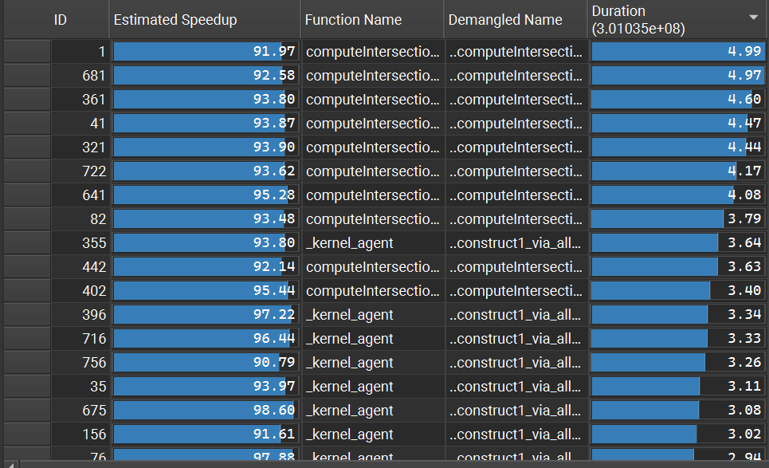

CUDA Path Tracer
================

**University of Pennsylvania, CIS 565: GPU Programming and Architecture, Project 2**

* CARLOS LOPEZ GARCES
  * [LinkedIn](https://www.linkedin.com/in/clopezgarces/)
  * [Personal website](https://carlos-lopez-garces.github.io/)
* Tested on: Windows 11, 13th Gen Intel(R) Core(TM) i9-13900HX @ 2.20 GHz, RAM 32GB, NVIDIA GeForce RTX 4060, personal laptop.

## Features

This CUDA-based ray tracer implements the Lambertian, perfect specular, dielectric, and GGX reflection models. Antialiasing is done by jittering randomly the subpixel coordinate through which each rays passes. The camera can be configured to simulate Depth of Field (using the thin lens model). The final image (to be stored or previewed) goes through a couple of post-processing steps, ACES tone mapping and gamma correction.

| GGX Material, Metallic / Specular            | GGX Material, Glossy            |
|-----------------------------|------------------------------|
|  |  |

| GGX Material, Rough         | Dielectric Material                 |
|------------------------------|------------------------------|
|  |       |

### Materials and Reflection Models

The lower right image shows 3 objects with a GGX material configured differently; roughness increases from left to right (0.1, 0.5, 0.9); different base colors are assigned to each.

| Diffuse Material            | Specular Material            |
|-----------------------------|------------------------------|
|  |  |

| Dielectric Material          | GGX Material                 |
|------------------------------|------------------------------|
|  |       |

### Antialiasing

Camera rays pass through a randomly jittered subpixel coordinate. This antialiasing technique turns high-frequency content into less objectionable noise at geometric edges.

### Thins Lens Model and DoF

The camera configuration includes focus distance and aperture. These parameters are used to place the ray's origin at some point on the lens (as permitted by the aperture size) other than the center, chosen uniformly at random; the ray then passes through a jittered pixel position (see Antialiasing) and points at some point in the scene that is to be imaged in focused (as established by the focus distance). Obtaining a ray this way follows the thin lens model.

The thin lens model allows us to simulate Depth of Field (DoF), an imaging effect where objects at the focus distance are imaged in focus, while objects at other depths become gradually defocused.

The following images illustrate the effects of different aperture and focus distance values. Note how the reflection of the light source on the mirror ball is imaged to a larger set of pixels when the aperture size is larger. Note how objects become blurrier the farther from the focal plane they are.

| | Focus distance 3 | Focus distance 4 | Focus distance 5|
|----------------------------|----------------------------|----------------------------|----------------------------|
| Aperture 1 |  |  |  |
| Aperture 2 |  |  |  |

### Gamma Correction and ACES Tone Mapping

Gamma correction adjusts the brightness of an image by applying a nonlinear transformation to pixel values, compensating for the non-linear response of display devices. The resulting perceived brightness is consistent with human visual perception.

Tone mapping is applied to path-traced images to convert the high dynamic range (HDR) values into a range that can be displayed on standard screens. This process ensures that bright highlights and dark shadows are preserved in a visually appealing way, while preventing the image from looking too washed out or too dark.

These 2 postprocess conversions are performed for both the interactive preview and the stored image.

| No Postprocessing             | Gamma Correction                   | Gamma Corr. and ACES Tone Mapping   |
|-------------------------------|------------------------------------|-------------------------------------|
|  |  |  |

### glTF Mesh Loading and Triangle Mesh Intersections

`gltfLoader` is a thin layer I wrote on top of [Tiny glTF](https://github.com/syoyo/tinygltf) for loading glTF triangle meshes, along with their materials and textures (although the materias and textures are not currently used).

For computing ray-triangle intersections, for each triangle in the mesh, `meshIntersectionTest` calculates whether the given ray intersects the triangle using the Möller-Trumbore intersection algorithm. It checks if the ray hits within the triangle boundaries, and if a valid intersection occurs, it calculates the intersection point, normal, and whether the hit is on the outside of the geometry. The closest valid intersection is returned, if any.

Ray-triangle mesh intersection is not precisely fast. I spent a significant amount of time writing a BVH acceleration structure, but it didn't work well in the end (see details below).

The images at the beginning of this README show the [Damaged Helmet glTF model](https://github.com/KhronosGroup/glTF-Sample-Models/tree/main/2.0/DamagedHelmet) with different GGX material configurations after 200 iterations.

The following image shows the [Flight Helmet glTF model](https://github.com/KhronosGroup/glTF-Sample-Models/tree/main/2.0/FlightHelmet) with diffuse material applied to it.

## Optimizations

### Stream Compaction of Active and Terminated Rays

The renderer implements 2 forms of active/terminated path compaction to optimize the path tracing process. The first method uses `thrust::remove_if` to remove terminated paths from the array. This method, implemented in the specialized template for `PathSegment**`, uses a custom functor (`TerminatedPathChecker`) to check for paths that are no longer active. The result is a compacted array where only active paths remain, and terminated paths are effectively removed from the list. Note that this method operates on a `PathSegment*`, an array of pointers to the `PathSegment`s in device memory, instead of the array of `PathSegment`s: since stream compaction (`thrust::remove_if`) overwrites array elements during its operation, and all paths are needed for the `finalGather` call, stream compaction is done on the `PathSegment*` array, where overwriting entries doesn't matter; paths are updated (and hitpoints shaded) through the pointers as they bounce; at the end, `finalGather` uses the original `PathSegment`s.

Because `PathSegment`s are accessed through pointers and the array of pointers is compacted, access to `PathSegment`s' memory is not coalesced.

The second method, implemented in the specialized template for `PathSegment*`, uses `thrust::stable_partition`, which reorders the paths such that active paths are placed at the beginning of the array, while terminated paths are moved to the end. The `ActivePathChecker` functor is used to identify active paths. Note that this time the reordering takes place on the original array of `PathSegment`s. Since `thrust::stable_partition` keeps the relative order of the elements, blocks of the shading and material sorting kernels are likely to access paths that are contiguous in memory.

Both methods help reduce the number of paths that are shaded and updated: the shading and material sorting kernels execute on fewer and fewer blocks after each bounce and compaction step.

### Path Sorting by Intersection Material Type

The `sortRaysAndIntersectionsByMaterial` function does path sorting by the material type of their primary hit point. It sorts both `PathSegment`s and their corresponding `ShadeableIntersections` using Thrust's `sort_by_key`, which sorts one array (the `PathSegment`s) and reorders a second array (the `ShadeableIntersections`) based on the order of the first; they are both sorted because intersection information needs to be accessed for each `PathSegment` at shading time. By having both in the same order (the order of the paths, which are partitioned by material type), access to contiguous memory is promoted on the 2 arrays.

With `PathSegment`s and `ShadeableIntersections` sorted by material type, the `shadeRaysByMaterial` function loops over the arrays finding the segments of paths of the same material and launching a shading kernel for that material type (`shadeDiffuseRays`, `shadeSpecularRays`, `shadeDielectricRays`, `shadeGGXRays`; and `shadeEmissiveRays` for rays that hit light source and `shadeInvalidRays` for rays that escape out into the environment without hitting an object).

The output rendered images are equivalent after the same number of iterations (100 in the table below). Surprisingly, though, my implementation of material sorting more than doubles frame time; I further investigate this phenomenon below.

| No Material Sorting (100 iters.) | Material Sorting (100 iters.) |
|----------------------------|----------------------------|
| 43 ms/frame (peak) | 90 ms/frame (peak) |
|  |  |

Let's now investigate why this implementation with material sorting leads to higher frame time. In the 2 cases, sorting nsight's summary table by duration, we see that the kernel whose duration dominates is `computeIntersections`, so at least no material-sorting kernel takes longer than this common intersection kernel.

| No Material Sorting (5 iters.) | Material Sorting (5 iters.) |
|----------------------------|----------------------------|
|  |  |

Scrolling down the summary table sorted by kernel duration, a kernel called `DeviceMergeSortBlockSortKernel` begins to appear repeatedly; the demangled name indicates that it's associated with my `RaySorter` functor, which performs material id comparisons for `thrust::sort_by_key`, invoked by my `sortRaysAndIntersectionsByMaterial` function. The details view indicates explicitly that this is a memory-bound kernel: "Memory is more heavily utilized than Compute". In spite of that, the Compute Workload Analysis reports that compute pipelines are underutiled because the kernel is very small or doesn't issue enough warps per scheduler; this is surprising because one doesn't configure the kernel invocations of `thrust` API calls (nsight reports that thrust used a grid size of 2400 and a block size of 256); if you were able to do so, I'd try different block sizes in hopes of improving unit utilization. Occupancy is ok, though, 80.42% achieved occupancy against 83.33% theoretical.

Since the `DeviceMergeSortBlockSortKernel` kernel is memory-bound, let's look at memory-related details. The summary report lists a 77.22% speedup opportunity by improving the global memory access pattern, which is reported to be uncoalesced. However, I would say there's little we can, since this kernel is operating on arrays (`PathSegment`s and their `ShadeableIntersections`) whose order may change drastically from one bounce to another, since paths that intersected an object with the same material may no longer intersect the same material at the very next bounce, leading the sorting kernel to move elements around constantly. It's ironic that a kernel that is meant to promote coalesced memory access for the shading kernel, itself suffers from uncoalesced global memory access, and the problem is so severe that it makes the kernel be the one that drives frame time up the most. 

That's disappointing. However, the goal of promoting coalesced global memory access for the material-specific shading kernels was achieved. Without material sorting, nsight reports the following memory access issues, which includes uncoalesced access to global memory.

It doesn't for the material sorting implementation and the `shadeDiffuseRays`; other issues are reported, though.

### (Incomplete) BVH-based Intersection Acceleration

glTF mesh intersections were (and still are) expensive to compute on moderately large meshes. I spent a very significant amount of time writing a BVH acceleration structure to make this operation more efficient. BVH code is primarily found in scene.cpp (`buildBVH` and `loadGeometryFromGLTF`) and intersections.cu (`intersectBVH`).

Sadly, the effort didn't pay off because I wasn't seeing any speedup (surely because of a wrong implementation) before I felt I needed to move on to other features and optimizations.

## Bloopers

These were some of the renders produced while I was trying to get refraction done properly.

| Dielectric Material Artifacts | | |
|----------------------------|----------------------------|----------------------------|
|  |  |  |

These were the first few renders after my first attempt to implement material sorting. The path segments array and the intersections array were not in sync yet.

| Material Sorting Artifacts |  |
|----------------------------|----------------------------|
|  |  |