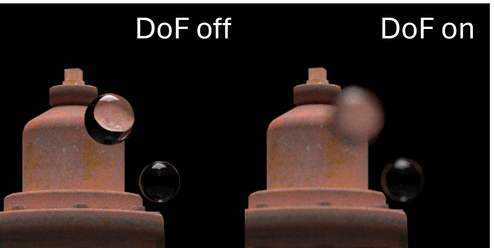

CUDA Path Tracer
================

**University of Pennsylvania, CIS 5650: GPU Programming and Architecture: Project 3**

* Dominik Kau ([LinkedIn](https://www.linkedin.com/in/dominikkau/))
* Tested on: Windows 10, i7-4790k @ 4.4 GHz, 16 GB, RTX 2060 SUPER 8192 MB

# Overview

## Ray Tracing

Ray or path tracing is a rendering technique that simulates the behavior of light to produce realistic images by tracing the paths of individual rays.
Unlike a real camera, which captures incoming light, a path tracer casts rays outward from the camera into the scene. 
These rays interact with surfaces by reflecting or refracting until they either reach a light source or are absorbed by the background.
Thanks to its physical modeling of light, ray tracing naturally produces realistic effects such as soft shadows, reflections, and indirect lighting, where surrounding surfaces are subtly tinted by diffuse color reflections.
These are effects that are not easily achieved with traditional rasterization methods.

This ray tracer was implemented using CUDA, Nvidias general purpose API for GPUs.

## Feature List

* Shading
    * Ideal diffuse material
    * Reflective material with roughness parameter
    * Translucent material with refraction and Fresnel effect
* Stochastic sampled anti-aliasing
* Physically-based depth-of-field effect
* Stratified sampling for initialization of rays 
* Mesh loading of `gltf` files
    * Supports binary and ascii files
    * Simple triangles, triangle strips and triangle fans can be read
    * Loading of base-color texture
    * Loading of precomputed normals
    * Boundary box culling
* Stream compaction on inactive rays
* Internal buffer sorting by material type

# Feature Breakdown

## Visuals

Render of spheres with the three materials that are described below.
For each material, three spheres are shown, each with different settings regarding roughness and transparency where applicable.

### Shading

This ray tracer includes several shading models, each simulating how light interacts with different materials.
Here's a breakdown of the implemented materials:

* **Diffusion:** This material models rough, non-shiny surfaces that scatter light in all directions.
When a ray hits the diffuse material, it reflects randomly within a hemisphere around the surface normal. 
Directions closer to the surface normal are more likely.
* **Reflection:** This material simulates perfect mirror-like surfaces.
A ray is reflected off at the exact same angle it came in, thus creating sharp, clear reflections.
The material also has a roughness parameter that probabilistically combines the diffusive and reflective behaviors.
* **Refraction:**
This shader handles transparent materials like glass or water.
When a ray enters a refractive material, it bends based on the index of refraction (IOR) of the material, according to Snell's Law.
Additionally, the shader uses Schlick's approximation to calculate the balance between reflection and refraction.
This means some light reflects off the surface while some passes through, creating realistic effects for materials like glass, water, or diamonds.
Refraction can also be combined probabilistically with reflection and diffuse shading to create more complex, realistic materials.

### Stratified Sampling

Stratified sampling reduces noise through more uniform ray distribution.
Instead of completely randomly casting rays, the pixel area is divided into a grid, with one ray cast from each cell.
This ensures a more uniform coverage of the image plane, which is especially helpful when enabling features such as depth of field.

### Anti-aliasing

<table>
    <tr>
        <td style="width: 50%; text-align: left; border: none;">
            Anti-aliasing can be achieved for free in a ray tracer by jittering the ray's origin within each pixel on the image plane during multiple iterations.
            This stochastic sampling smooths edges without requiring additional post-processing.
            It can be very well observed in the above picture of the differently shaded spheres.
        </td>
        <td style="width: 50%; text-align: center; border: none;">
            
        </td>
    </tr>
</table>

### Depth of Field

<table>
    <tr>
        <td style="width: 50%; text-align: left; border: none;">
            The ray tracer supports physically-based depth-of field, which is implemented by randomly jittering a ray on the aperture plane.
            Starting from a ray that is cast from the image plane through the lens towards the focus plane, a new ray is calculated based on the target point in the focus plane and a random deviation inside the aperture plane.
            The result accurately simulates the depth of field that is experienced with a real camera.
            Depending on the aperture size that is set in the input file, the effect is more or less pronounced.
            A special function is used to map the stratified samples from a square to a circle which keeps continuity and thus ensures reduces warp divergence.
            This is because rays that are close in the simulation are also close on the GPU.
        </td>
        <td style="width: 50%; text-align: center; border: none;">
            
        </td>
    </tr>
</table>

### Mesh Loading

The ray tracer supports loading `gltf` files in both binary and ASCII formats, making it easy to import custom 3D models.
It can handle various primitive types such as triangles, triangle strips, and triangle fans.
Precomputed normals and UV coordinates are extracted directly from the file, allowing the ray tracer to accurately render surface details.

As shown in the image, the right section displays a simple imported mesh, while the middle section highlights shading using the precomputed normals.
In the left section, a base-color texture is applied to the model using UV mapping.
The ray tracer currently supports 8-bit and 16-bit textures, and the code base can be easily extended to include additional texture types such as roughness, metallic, and normal maps.

## Performance

These performance numbers are taken from a rendering of the image at the top of this README.
The image was rendered at a resolution of 1500 x 1000 with a trace depth of 8.
That is, rays that have not hit an emissive surface or gone into the background after 8 bounces are discarded.

These performance were obtained by rendering the infamous [Cornell box](https://en.wikipedia.org/wiki/Cornell_box) in a similar scene as for the above scene.
Therefore, the resolution and trace depth were kept the same.
In this enclosed space the rays will on average bounce much more often before being terminated.

### Stream Compaction

Stream compaction is used in the ray tracer by filtering out rays that are no longer active, reducing unnecessary computations.
Inactive rays are those that have hit an emissive surface or have disappeared in the background.
The first performance chart shows that using stream compaction significantly reduces computation time, bringing it down from over 3,700 ms without optimization to around 700 ms, a reduction of over 80 %!
This optimization works particularly well for this scene with many rays going directly into the background.
The performance gains in an indoor scene is much less as seen in the second performance chart.
Still, there are significant gains of nearly 40 %.

### Material Sorting

Material sorting groups rays by the type of material of the surface they hit after the intersections have been calculated.
This means that threads in the same warp and block are much more likely to do similar work which will run more quickly on the GPU.
However, in both charts it is quickly observed that the sorting actually decreases the performance. 
This means the benefits in warp divergence reduction is more than offset by the penalties of having to sort the data buffers on the GPU.

### Boundary Box Culling

When loading custom meshes from a `gltf` file, the bounding box is saved for each primitive.
During ray tracing, an intersection check is first performed on the bounding box of that primitive, and only if a hit is detected, the mesh itself is tested for intersections.
This technique greatly reduces the number of costly mesh intersection tests, resulting in a significant performance improvement.
In the first test an improvement of over 65 % is possible, while in the second case a still respectable 40 % reduction in computation time per frame is achieved.

# References
* TinyGLTF  library: [Github repository](https://github.com/syoyo/tinygltf)
* Fire hydrant model: [CGTrader](https://www.cgtrader.com/free-3d-models/architectural/architectural-street/fire-hydrant-low-poly-3d-model-pbr)
* Code snippets (also referenced in source code):
    * [Continuous sampling from unit disk](https://pbr-book.org/4ed/Sampling_Algorithms/Sampling_Multidimensional_Functions#sec:unit-disk-sample)
    * [Branchless intersection check with axis aligned box](https://tavianator.com/cgit/dimension.git/tree/libdimension/bvh/bvh.c#n196)
    * [Optimized triangle intersection check](https://fileadmin.cs.lth.se/cs/Personal/Tomas_Akenine-Moller/raytri/)

# Bloopers

This funky image was the result of a bug in the material sorting feature where the buffers were not correctly handled.

A bug in the distance calculation inside the triangle intersection method lead to this behavior where the mesh is drawn in front of objects that should be covering the mesh.
If the camera gets really close to another object the occlusion works again.

The transformation of random points in a square to random points in a circle had a bug, that led to the double edge effect in the left image.
In the right image this is corrected.