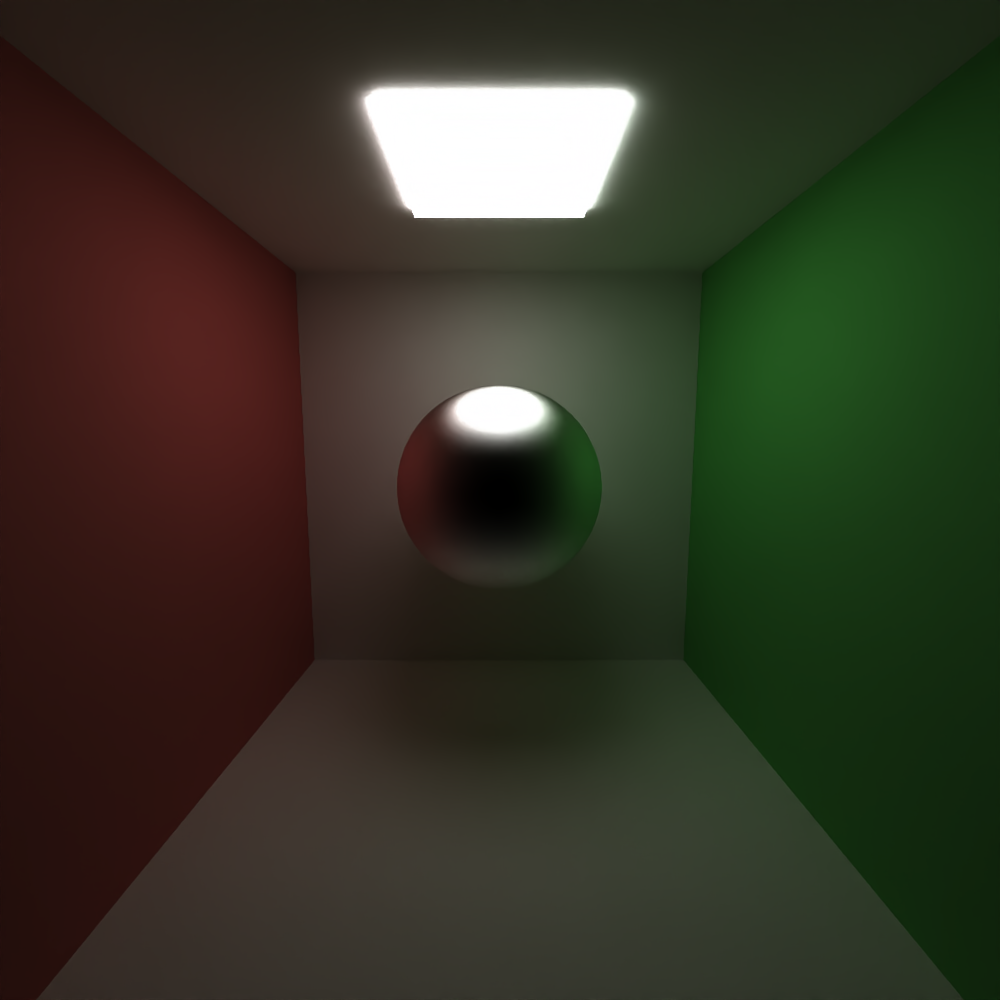

<h1 align="center"> CUDA Path Tracer </h1>

<small><h5 align="center">University of Pennsylvania, CIS 565: GPU Programming and Architecture, Project 3</h5></small>

---

## Summary

In this project, I implemented a CUDA-based path tracer capable of rendering globally-illuminated images at a fast pace thanks to the use of GPU hardware. There are several features, including support for rendering a variety of materials, loading custom scenes written in JSON format, denoising, and more.  
  
This path tracer includes a shading kernel with BSDF evaluation for a variety of materials. **BSDF** stands for "Bidirectional Scattering Distribution Function", which is simply a mathematical function that describes how light scatters from a surface. 

A BSDF is a quantitative representation of how light interacts with a surface, including how it's reflected, transmitted, or absorbed. In this project, I was able to implement support for diffuse, perfectly reflective, partially reflective, refractive, and emissive materials. More detail on each of these material types is included below.

  
||||||
|:--:|:--:|:--:|:--:|:--:|
|*Diffuse*|*Mirror*|*Specular*|*Refractive*|*Emissive*|

## Part 1 - Core Features

### Ideal Diffuse Surfaces
  
An ideal diffuse surface, often referred to as a "Lambertian reflector," is one that reflects light evenly in all directions, scattering it uniformly across a hemisphere.   
  

  
This type of reflection occurs because the surface’s microscopic irregularities or rough texture cause the incoming light rays to be diffused in multiple directions. As a result, the surface appears equally bright from all viewing angles. Common examples of diffuse surfaces include materials like chalk, matte paint, paper, or any surface with enough microtexture to scatter light rays in a non-specular manner! These surfaces lack any visible reflection or shine, making them a perfect representation of diffuse scattering, where the intensity of reflected light follows Lambert's cosine law.  
  

Below is an example diffuse surface rendered with my path tracer:

  

<i>Number of Samples: 505</i>

### Perfectly Reflective Surfaces

In rendering, a "perfectly reflective surface" refers to an idealized surface that reflects all incoming light with flawless clarity, much like a mirror. 

 

This type of surface perfectly mirrors the surrounding environment without any distortion or blurring, producing a specular reflection with a roughness value of 0. The result is an entirely smooth, mirror-like appearance where every detail is sharply reflected, maintaining a high degree of precision and accuracy in the reflection.

Below is an example perfectly reflective surface rendered with my path tracer:

 

<i>Number of Samples: 1107</i>

### Partially Reflective Surfaces
A "partially reflective surface" in rendering refers to a surface that reflects only a fraction of the incoming light while allowing the rest to either pass through or be absorbed. 

 

This is in contrast to a perfectly reflective surface like a mirror (mentioned above), which reflects all light. Partially reflective surfaces simulate materials such as glass, water, or lightly polished metals, where some light is reflected and some is transmitted. The balance between reflection and transmission is typically determined by the material properties, such as its reflectivity and refractive index, resulting in a more complex interaction with light compared to idealized mirrors.

Below is an example partially reflective surface rendered with my path tracer:

 

<i>Number of Samples: 1089</i>

### Stream Compaction
Stream compaction is an optimization technique that groups active rays (or path segments) together in memory, improving performance by reducing the number of unnecessary operations. The results of stream compaction in the context of path tracing show notable improvements in scenes with complex geometry and more active rays (open scenes), but its impact in closed scenes is more nuanced.

#### Expected Results:
In open scenes, stream compaction will likely lead to a significant performance boost due to the higher number of terminated path segments. In contrast, closed scenes may show less improvement, as the number of early terminations is limited. Stream compaction only affects rays that terminate, so its benefits are tied to the frequency of early terminations. In scenes with a larger number of path segments that have more opportunities to terminate, stream compaction will yield the best results, particularly after multiple bounces.

#### Actual Results:
** Note: In the graph below, ***lower*** values indicate ***better*** performance!  

| Scene Types          | Stream Compaction On | Stream Compaction Off |
|----------------------|----------------------|-----------------------|
| Open Scene (light)   | 25                   | 35                    |
| Open Scene (heavy)   | 340                  | 490                   |
| Closed Scene (light) | 60                   | 40                    |
| Closed Scene (heavy) | 610                  | 690                   |

##### Performance Across Scenes:
#### Open Scenes: 
For heavy open scenes, stream compaction led to a significant improvement. Specifically, the framerate increased by around 30% due to the optimization, as the number of terminated path segments was higher, allowing for more efficient memory access and computation. 

#### Closed Scenes: 
Interestingly, even in closed scenes, stream compaction had some effect, though not always beneficial. For example, the heavy closed scene saw roughly an 11% performance decrease. This is unexpected because closed scenes typically have fewer rays that terminate early. However, even in such scenes, some path segments can still terminate early due to factors like having a very small BRDF or a sample yielding NaN or super small values.

#### Evaluation of Stream Compaction:
Stream compaction was most effective in reducing the number of active rays (or path segments) after a few bounces. In the Open Scene, the number of unterminated path segments decreased significantly as each bounce progressed, which was expected given the larger number of rays interacting with materials. The Closed Scene (light), however, didn't show a performance improvement, likely because the overhead of sorting and removing terminated path segments exceeded the benefits in such a small scene with fewer early terminations.

#### Conclusion
This analysis shows that stream compaction is a powerful optimization for path tracing, especially in larger, more complex scenes with significant ray termination. However, its impact diminishes in smaller or closed scenes, where path termination is less frequent, and the overhead of sorting terminated rays might outweigh the gains.

### Memory-Sorted Materials
To improve performance in the path tracer, sorting rays/path segments by material type can significantly optimize memory access patterns during shading. In this project, I use the [Thrust](https://nvidia.github.io/cccl/thrust/) library to achieve material sorting.  

By grouping path segments interacting with the same material together, we ensure that the shading kernel processes similar types of BSDF evaluations in contiguous memory locations. This reduces cache misses and improves memory locality, as the GPU can load large chunks of memory in a single transaction, especially when accessing the same material repeatedly. 

In contrast, coloring every path segment in a buffer and using a single shading kernel for all materials can lead to performance bottlenecks. The BSDF evaluation for different materials can vary in computational cost, meaning that some path segments will be processed faster than others, leading to inefficient execution when they are processed together in a single kernel. 

Sorting path segments by material type allows for more balanced workloads per kernel, reducing execution time and improving overall performance by minimizing idle times on the GPU. This method is easy to toggle using the ImGUI toggle buttons on the UI, which are explained in more detail below.

### Stochastic sampled Anti-Aliasing
Antialiasing is a rendering technique used to reduce jagged edges in images, resulting in smoother and more realistic visuals. This is accomplished by casting multiple rays per pixel, each slightly offset to sample different subpixel locations within the pixel. The resulting color values are then averaged, effectively softening pixelation along object boundaries. By capturing more detailed information about the scene, antialiasing minimizes visual artifacts and enhances the overall image quality.

## Part 2 - Customization
## Russian Roulette
In path tracing, "Russian roulette" is an optimization technique used to efficiently terminate a ray's path. This is done by probabilistically deciding whether to continue tracing the ray based on its "throughput"—a value representing how much light it contributes to the final image. If the ray's contribution is likely to be minimal, the algorithm may stop tracing it to save computational resources. To maintain accuracy, the final result is adjusted to account for the probability of terminating the ray, ensuring the rendered image remains unbiased.

After implementing this, I noticed a slight boost in the time it took for the scene to settle/converge. This makes sense because rays which do not actually hit a light are being terminated/not taking up resources when they are unlikely to contribute much to the final render.

## Refractive Materials
A "refractive material" is a substance that alters the path of light as it enters or exits, bending the light due to a change in its speed between the material and the surrounding medium. This phenomenon, known as refraction, occurs because light travels at different speeds in different materials. The extent of this bending is determined by the material's refractive index, a measure of how much the light slows down when passing through it.

## Depth of Field
In path tracing, "depth of field" is a rendering technique that replicates the effect of a real-world camera lens, where only objects within a certain distance from the camera are sharply focused, while those closer or farther away appear blurred. This effect enhances visual depth perception, adding realism to the rendered image by mimicking the way a camera lens focuses on a specific range of distances in a scene.

## Load OBJ
This feature is partially implemented. The OBJ data is loaded successfully, but I did not have time to debug further and render a scene.

## Dynamic JSON Loading && Toggleable GUI Options
I added this feature mainly for fun, but also for convenience from the user's perspective. The original project base code allows for JSON scene loading via arguments passed to the main function. However, this meant that every time I wanted to load a different scene, I needed to exit the program and modify my Visual Studio project settings to point to the new .json file path every time.  

To make the process easier and to add an interactive element to my path tracer, I added an ImGUIFileDialog to the GUI with an "Open JSON File" button which allows for scene loading dynamically from the project "scenes" folder.  

One challenge with this feature was figuring out how to get the scene to refresh when a new file was loaded! I encountered various issues where the last rendered scene was still present in the background, the program would crash due to memory issues, or the new scene not showing up at all. I think I have a better understanding now of which dependencies needed to be cleared as the load function works seamlessly now :)

I also added a toggle button for each of the toggleable features, including:
* Russian Roulette
* Material Sorting
* Antialiasing
* DOF
* Denoising

In the future, the GUI could be further improved with additional options to customize the scene. It would be very cool to have a scene editor so the user could add objects, change material types, or change colors & sizes on the fly!

## Bloopers! :D

Use the wrong random number generator and suddenly you're in a horror game

Something bad is happening... I don't think this is denoising 

Not sure what happened here while I was debugging

---
## Meet the Dev! :wave:

Nadine Adnane 
<a href="https://www.linkedin.com/in/nadnane/"> LinkedIn </a>

## References & Helpful Resources
* [My pathtracer from CIS-5610 Advanced Rendering](https://github.com/CIS-4610-2023/homework-05-full-lighting-and-environment-maps-nadnane/tree/main) 
* [Thrust Library Documentation](https://nvidia.github.io/cccl/thrust/api/function_group__sorting_1ga667333ee2e067bb7da3fb1b8ab6d348c.html) 
* [OIDN Documentation](https://github.com/RenderKit/oidn)
* [DOF and Antialiasing](https://paulbourke.net/miscellaneous/raytracing/)