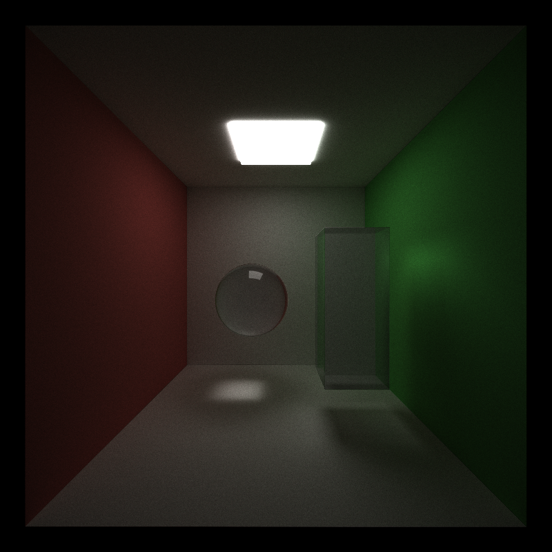

CUDA Path Tracer
================

**University of Pennsylvania, CIS 565: GPU Programming and Architecture, Project 3**

* Matt Schwartz
* Tested on: Windows 10 22H2, Intel(R) Core(TM) i7-10750H CPU @ 2.60GHz, NVIDIA GeForce RTX 2060

  

 

  

# Background

Welcome to my CUDA-based path tracer! What is a path tracer, I hear you asking? In its simplest form, it's a program that follows the paths of light rays as they bounce around a scene - absorbing into materials, scattering off others, refracting in yet others, etc. - and colors the pixels on your screen according to what those rays intersect and how they interact with those materials. If you follow physically-based rules for how those light rays interact with objects, you can get very realistic looking scenes!

One important note about path tracers - it's impractical to follow every light ray in existence! We really only care about the ones that make it to our "eye" / "camera"; those are the ones we see. To find those rays, the ones we see, we actually operate in reverse! We "shoot" rays out in all directions from the camera, and follow their paths until they terminate at a light source (or until we say "enough is enough!"). I like to think of it like echolocation, but with light.

That's enough context, for now - let's take a tour through some path-traced images and the features implemented in this project.

# Features
## Visual Features

### Diffuse, reflective, refractive, and emissive surfaces!

One of the marvelous abilities of path tracers is how easy it is to model a wide variety of different materials. Simply changing the distribution of paths that a light ray scattering off a material can take will change a material from metallic, to plastic, to glassy, and more.

The simplest type of material is a "diffuse" one. In terms of light scattering, a diffuse materially is equally likely to scatter incoming light in any outgoing direction (*simplification). In more common terms, we might call such a material "matte". Here's what it looks like:

  

 
 

On the other hand, if incoming light scatters off a surface at the same angle it came in at, we get a reflective surface:

  
  
<em>(The black in the center is reflecting the void that our "camera" is sitting in</em>

 
 

Light isn't limited to absorbing and scattering, however. It can also *refract* - or bend through materials that *transmit* light through their volumes. For example - glass, plastic, crystals, etc. The physical quantity that determines how much light bends in these media is called the index of refraction; by changing this value, we can easily render a variety of transmissive media!

  

 
 

### Depth of field

In the real world, whether viewed through a camera or the human eye, there is a certain range of distance in which objects are sharply in focus. This range is called depth of field. Objects outside of this range - either too close or too far away from the viewer - are blurry. You can try this by holding a finger in front of your own eye and looking past it; it should appear blurry. The source of the blur comes from the fact that light rays must focus through a lens (of your eye or a camera). Physics tells us that a lens of a given aperture size and radius of curvature has a given distance of focus. Light rays outside that distance do not come to a neat focus point after traveling through the lens.

In the path tracer, this effect can be physically simulated. Remember that we trace rays in reverse - starting from the view point. For depth of field, we imagine a lens of a given aperture size, and jitter our ray origins around in that lens, adjusting their directions such that they point towards the plane of focus. 

  

### Stochastic antialising

One important point about path tracing that I haven't touched on yet, is that to get a nice result, we actually have to trace multiple light rays *per* pixel. Why? Well, your screen only has a finite number of pixels, and each one may span an area of a material or multiple materials. If we only trace one path in the direction of that pixel, we're essentially saying "take the color at the middle of the pixel and use it to color the *whole* pixel". It's not a bad first approach, but it can create artifacts in the render known as aliasing. To resolve these artifacts, we can take multiple samples in each pixel and average them. Not unexpectedly, that's called *anti*aliasing (or, in this case, "stochastic sampled antialiasing," since there's more than one way to achieve this).

### Denoising

One of the cons of antialiasing in this way, is that it makes the image "noisier" - or more static-filled - and requires us to take more samples to converge on the true colors of each pixel. To help mitigate this, I integrated Intel's Open Image Denoiser (OIDN) to help clean up and speed up the render results. OIDN includes a pretrained ML model that is specially adapted to clean up noise in stochastic path tracers such as this one. You give it some key information about the scene: for each pixel, the path-traced pixel color, the albedo (material base color), and surface normal (direction). It gives you back some very slick denoised results (which I've secretly been showing this whole time in each render).

### Arbitrary mesh loading and intersection

Now that we can represent materials, visual effects, and get clean, noise-free renders, the real fun begins. At this stage, the path tracer can only render spheres and cubes. That's because, for each different shape, I have to write code that mathematically tests if a light ray intersects the shape. For spheres and cubes, that's easy. But what about for a spaceship? For more complex shapes, we need to be able to break down a mesh into a triangles and test each triangle individually for intersections. Not so difficult in theory, but if we want to render an arbitrary mesh, we'll need a way to represent it and load it into the program. There are many file types commonly used to represent 3D models - `.obj`, `.fbx`, my choice for this project, `.gltf` (Graphics Language Transmission Format), and others. `glTF` is a rich file type that includes information about the scene's 3D models, cameras, lights, textures, and more. For that richness, you must pay the price - it's a little more complex to load and parse than, say, a `.obj` file.  But, if you follow this nifty [Khronos group glTF reference cheat sheet](https://www.khronos.org/files/gltf20-reference-guide.pdf), you get arbitrary meshes:

  

### Texture mapping and normal mapping

As I'm sure you'll agree, that space ship looks a little bare. Sure, we could use our previous work to make it metallic, glassy, etc., but few real objects are so uniform. What we need, is texture! If we can map points on our 3D spaceship model to the right points on a colorful 2D image, we can "paint" the spaceship with that image. Simple in concept, very difficult in implementation. Without going into too much detail, I'll enumerate some of the challenges that I encountered:
1. Loading the texture from glTF (turns out, if your 3D model has a certain number of triangles, glTF changes the data type it uses to represent them!)
1. Getting the texture from CPU to GPU memory.
1. Getting the right 2D UV coordinates to sample the texture.
1. Debugging! (See appendix for bloopers here...) Boy is it difficult to diagnose the issue when the problem is on the GPU-side!

But after many painful hours... voila!

  

Similar to texture-mapping, we can also enhance our models by performing a technique known as "bump" or "normal" mapping. All of our 3D models have normals at each vertex that dictate the direction of the surface at that point. These normals are used by the path tracer to calculate the direction of scattered light when it hits a given point on the model. However, with only so many vertices on a model, it can be difficult to get smooth and realistic results. We could increase the vertex count of our model, but that means more intersections to compute and other costly calculations. Instead, we can once again use 2D textures to enhance our model. We encode the direction of normals (x,y,z) as the red-green-blue components of the image, and again "paint" them onto to each point on the model's surface. The model's geometry stays as coarse as before, but its response to light becomes much more granular.

### Environment mapping

Lastly, one final visual cherry-on-top. All of our scenes so far have been indoors - that's because, until now, outdoors has been a big black void. When our rays don't intersect anything, we simply color those pixels black. What if, instead, we use a high definition image - one that is specifically captured to map onto a sphere - and we color those empty pixels according to the image. This is environment mapping. The key is, that any lights that bounce off our objects in our scene and into the environment map void will also reflect the color of that environment map. This helps breathe some depth and life into our scene. 

Putting it all together:

  

## Performance features 

With all these visual features, the frame rate on this path tracer sure has become abysmal. I believe at my low point, I was taking ~3 samples per pixel, per second, for a relatively low-poly scene. For the above spaceship scene, a reasonable image would take a couple minutes to render, and I had already done a few optimizations by then. 

Let's discuss some of the ways I improved the performance of the path tracer to be capable of rendering more complex scenes in reasonable times. Along the way, I'll provide some analysis of the performance improvements; unless otherwise specified, tests were done in a simple cornell box scene with the Ironman model featured at the top of the README - about 30K triangles.

### Stream compaction for early ray termination

When a ray bounces and doesn't intersect anything, we stop following it - we set it's `remainingBounces` to 0. Doing so means that any GPU thread following a ray with 0 bounces remaining can retire early. However, we can do better than this; rather than returning from the thread early, what if we simply never launch the thread at all? That would leave fewer threads idle and more GPU resources available to calculate actively bouncing light rays.

To achieve this, after each bounce of all of our rays, we perform *stream compaction*. That is, we (in parallel) take our array of rays, and sort them so that all rays that are still bouncing are at the front. Then, for the next bounce, we only launch threads for those rays, and give the GPU only the data pertaining to those rays. Less data transfer, fewer calculations to do = better performance!

  

### Material sorting

Another, similar but slightly more subtle optimization we can do is to sort rays by the type of material they intersected with, *before* shading them. Why would this help? Wouldn't it just make things slower because now we have to sort all these rays? Yes, and no. 

On the GPU, threads are partitioned into groups called warps. These warps operate in lock-step; each thread in a warp performs the same instruction on different data. This is the nature of the GPU; it's what allows it to operate so quickly, and also what can cause it to operate sluggishly, without the proper care. If the GPU instruction contains a branch, an if-statement for example, and different threads in a warp evaluate that condition differently, they *diverge*. Essentially, group A carries out instructions from branch A, while group B waits, then vice-versa. Our beautiful parallelism has been serialized! In the context of our path tracer, our shading code will certainly contain different behavior for different material interactions. Thus, to reduce divergence, we sort our rays by material intersection type *before* shading. The hope is that the increase in speed due to GPU coherence outweighs the cost of the sorting!

  

Well, that *was* the hope - it seems the path tracer performs better without the sort! Granted, the data above comes from a scene with few materials, so the benefit of a sorting pass isn't too great. I tried some more complex scenes, with more materials as well, but the performance improvements were not statistically significant. If there was an improvement, it was shadowed by other, more significant factors.

### Russian roulette termination

Not all rays are equal - darker rays (those that have interacted with dark materials / haven't hit a light) don't contribute as much to the final render result as lighter rays. We can save ourselves some compute time, with little affect on the final result, by terminating these rays early. The trick is determining which rays are worth terminating, and doing so in a way that doesn't bias the image. 

An easy heuristic we can use is to evaluate the *luminance* of a ray. The luminance is a particular combination of the red, green, and blue color channels of the ray; a combination that mimics the sensitivity of human eyes (which are more receptive to green light). Higher luminance effectively means brighter rays. We normalize that luminance to the range [0, 1], and choose a random number in that same range for each ray we shoot. Comparing the two, we decide whether or not to keep the ray. 

A couple caveats:
- In order to not "lose" energy from the scene and bias the image, russian roulette also involves "redistributing" that energy to unterminated rays by bumping up their colors by a factor proportional to the luminance.
- In my experimentation, I found this effect to be a little too strong. It seemed to wash out shadows as well. I decided to limit its effect by only applying it to rays after a given number of bounces (say, depth > 2).

  

Not bad for such an easy change to implement! Obviously, results will vary depending on how well lit a scene is, how many bounces you want each ray to perform, and more.

### Bounding Volume Hierarchy (BVH)

Last, but definitely not least, of the performance optimizations is Bounding Volume Hierarchies, or BVH. As discussed in the arbitrary mesh loading section, each object is composed of triangles, and every ray needs to test for intersection against every one of those triangles, every sample. You can see how this gets very expensive, very quickly. The low-poly model of the spaceship shown earlier has around ~4k triangles. In an 800x800 image, that's around 2.5 *billion* intersection tests for that object alone, per sample. The GPU is fast, but not that fast. And imagine if we want to render higher-poly models or higher resolution images!

In comes BVH to the rescue; a spatial-partitioning scheme. That sounds intimidating, but the concept is actually quite straightforward. We take our model and divide it into two boxes, or bounding volumes. Then, we doing intersection testing, we test these boxes. Let's say our ray misses one of those boxes - we get to eliminate *half* of the triangles in the model as possible intersectors. We can take this approach further and divide each of the two boxes into two more, and so on. Each time we test a box, we can potentially get rid of half our remaining triangles. The time complexity of this approach is thus `O(log(n))`, where n is the number of triangles in the model. Compare this to our original `O(n)` and it's clear how major this improvement is. Here's a cool visualazation of BVH sourced from a [fantastic video](https://www.youtube.com/watch?v=C1H4zIiCOaI) on ray tracing by Sebastian Lague:

  

And for the FPS comparison:

  

Now, this is for our 30K triangle Ironman scene. The impact of BVH can vary drastically depending on the triangle count of the scene, the partitioning scheme used, and even the viewing angle (imagine viewing a train head on, versus from the side. Many more intersection tests to do head on). In a more complex scene (the interior home scene shown earlier), which had ~250K triangles among 60 meshes, BVH is the only reason I could get a render at all! A measly 0.8 FPS, but better than nothing!

Also worth noting, my BVH partitions meshes by longest axis (so on each iteration, whichever cardinal axis is longest is the one chosen to split the mesh up further). This is an OK heuristic, but some meshes don't play nicely. For example - imagine a picture frame. On the first iteration, we split it in half; no problems yet. On the second iteration, however, when we split each half in half again, it's likely that 2 of the new bounding boxes contain 0 triangles. For this shape, BVH converges very slowly, and we actually create *more* work for ourselves. To improve upon this basic partitioning scheme, I could implement a [surface area heuristic](https://pbr-book.org/3ed-2018/Primitives_and_Intersection_Acceleration/Bounding_Volume_Hierarchies).

# Bloopers
No project is complete without a few bloopers, so please enjoy these grainy, terrible renders at my expense!

  
  
<em> Texture mapping was, perhaps surprisingly, the most difficult part of this project for me. Mismatched euler angle orders between GLM and our utility functions, neglecting to transform normals appropriately, and so much more. Here's my sad, mis-textured spaceship: </em>

 
 

  
  
<em> The sphere was actually behind the Ironman model in 3D space! When doing intersection tests, I had neglected to transform the intersection distance back into world space, and so objects with non-uniform scale were behaving quite oddly! </em>

# References / Credits

"Bedroom Interior Design" (https://skfb.ly/oGPYN) by gozdemrl is licensed under Creative Commons Attribution (http://creativecommons.org/licenses/by/4.0/).

"IRONMAN - TONY STARK MARVEL" (https://skfb.ly/o9Pxq) by Felipe.Sanches.Alves is licensed under Creative Commons Attribution (http://creativecommons.org/licenses/by/4.0/).

"Low-poly Spaceship" (https://skfb.ly/YU9x) by Shophorn is licensed under Creative Commons Attribution (http://creativecommons.org/licenses/by/4.0/).

[Meadow HDRI from Polyhaven](https://polyhaven.com/a/meadow_2)

[Workshop HDRI from Polyhaven](https://polyhaven.com/a/industrial_pipe_and_valve_01)