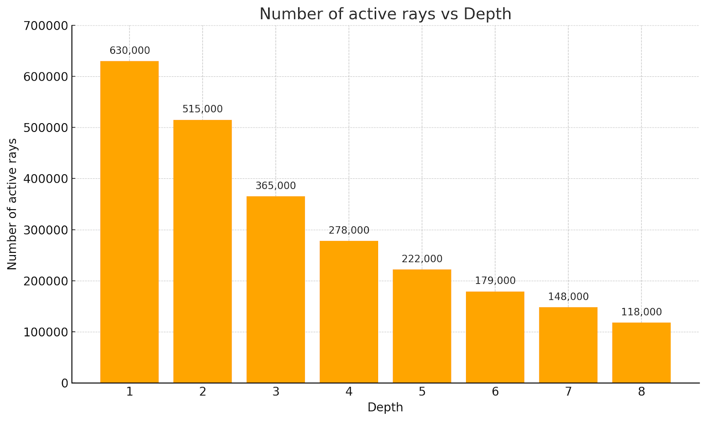

CUDA Path Tracer
================

**University of Pennsylvania, CIS 5650: GPU Programming and Architecture, Project 3**

* Shreyas Singh
    * [LinkedIn](https://linkedin.com/in/shreyassinghiitr)
* Tested on: Windows 10, i7-12700 @ 2.1GHz 32GB, T1000 (CETS Lab)

## Overview
  

This project implements a high-performance path tracer using CUDA, enabling the realistic simulation of light transport in complex 3D scenes. By tracing the paths of rays as they interact with various materials—including diffuse, reflective, and refractive surfaces—the path tracer renders realistic scenes. The renderer is optimized for speed and efficiency through advanced techniques such as path segment sorting and stream compaction, which reduce computational overhead and improve parallel execution on the GPU. Additional features include anti-aliasing for smoother images, support for physically accurate refraction with Fresnel effects. Together, these enhancements generate photorealistic visuals with rapid render times.

## Features
### Shading with BSDF evaluation

The shading kernel in the path tracer determines how light interacts with surfaces at each ray-surface intersection, using **Bidirectional Scattering Distribution Functions (BSDFs)** to model different types of material behavior. This process simulates the way light is reflected, absorbed, or transmitted, producing realistic lighting effects for various materials.

#### Ideal Diffuse Surfaces

For ideal diffuse materials, also known as Lambertian surfaces, light is scattered uniformly in all directions from the surface point. The amount of scattered light follows a **cosine-weighted distribution**, meaning it is strongest when the outgoing direction is close to the surface normal.

#### Reflective Surfaces

Reflective surfaces are handled in two ways:

* **Imperfect (Glossy) Reflection:** Here, the BSDF simulates materials that reflect light predominantly in the mirror direction but with some blur or spread, mimicking real-world surfaces such as polished metals or plastics. The sharpness of the reflection can be controlled with material parameters, creating anything from subtle gloss to near-perfect mirror effects.

* **Perfectly Specular Reflection:** For perfectly smooth, mirror-like surfaces, the BSDF calculates the outgoing reflection direction using the law of reflection. The reflected ray leaves the surface at the same angle as the incoming ray, relative to the surface normal. This creates crisp, accurate reflections, as seen with ideal mirrors or still water.

#### Refractive Surfaces with Fresnel Effects

Refractive materials (e.g. glass) are modeled by bending rays as they enter or exit the material, according to **Snell’s Law** and the material’s **Index of Refraction (IOR)**. The shading kernel handles the refraction, and also evaluates the **Fresnel effect**—the phenomenon where the proportion of reflected versus refracted light changes depending on the angle of incidence.

Using **Schlick’s approximation**, the shader computes the probability that light will reflect or transmit at the surface, resulting in realistic blends of reflection and refraction. For instance, at shallow angles, more light is reflected, while at direct angles, more is transmitted.

#### Antialiasing with Stochastic Sampling
Anti-aliasing in a ray tracer is accomplished by randomly offsetting the starting position of each ray within its corresponding pixel on the image plane. This stochastic sampling method ensures that each pixel gathers color information from slightly different locations, effectively blending the edges between objects and smoothing out jagged lines. As a result, the rendered image displays smoother transitions and more natural-looking boundaries without the need for any post-processing filters.

#### Physically-based Depth-of-Field
Depth of field (DoF) simulates the optical behavior of a real camera lens, allowing some parts of a scene to appear sharply in focus while others become blurred, depending on their distance from the focal plane. Rays are sampled from different points across the lens aperture and directed toward the focus point. As a result, objects within the focus distance remain crisp and clear, while objects outside this range—either closer or farther from the camera—gradually become more blurred. The image below demonstrates the depth-of-field effect rendered by the tracer.

#### Arbitrary Loading and Rendering of OBJ Mesh with Bounding Box Culling
This path tracer supports the import of complex 3D models from OBJ files, allowing users to add detailed meshes to their scenes via the JSON config. For each loaded mesh, a bounding box is computed and stored for every primitive. First the intersection tests are performed against these bounding boxes. Only if a ray intersects a bounding box does the tracer proceed to test the actual mesh geometry. This bounding box culling method dramatically reduces the number of expensive mesh intersection checks, significantly boosting performance.

#### Denoising with OpenImage AI Denoiser
This path tracer integrates Intel Open Image Denoise (OIDN), an advanced AI-driven denoiser, to improve the visual quality of rendered images. OIDN leverages deep learning techniques to analyze and eliminate noise from path-traced images, producing smoother and more refined results at quicker rendering times.

## Performance Analysis

### Path Continuation / Termination with Stream Compaction

During path tracing, rays are terminated when they intersect an emissive material (such as a light source), miss all scene geometry, or reach a predefined maximum bounce depth. Consequently, some rays complete their paths earlier than others, leading to idle threads and inefficient GPU usage. To address this, this project employs **stream compaction** at each iteration: it filters out terminated rays, compacting the active paths together and ensuring that only live rays continue to be processed. The performance enhancement can be observed from the chart below: 

The number of active rays decreases continuously as the rays that do not have any bounces remaining are terminated.

### Sorting of Rays Based on Material Type
Sorting rays by material type groups similar shading tasks together, reducing memory divergence and improving efficiency in the shading kernel—especially in scenes with many different materials. While sorting can introduce overhead in simple scenes and may not always improve performance, its benefits become significant in complex scenes with more materials, leading to faster rendering.
