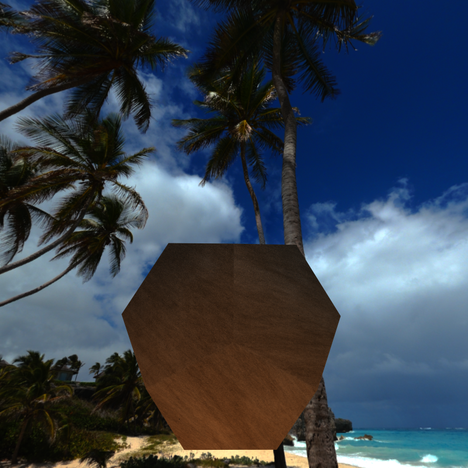
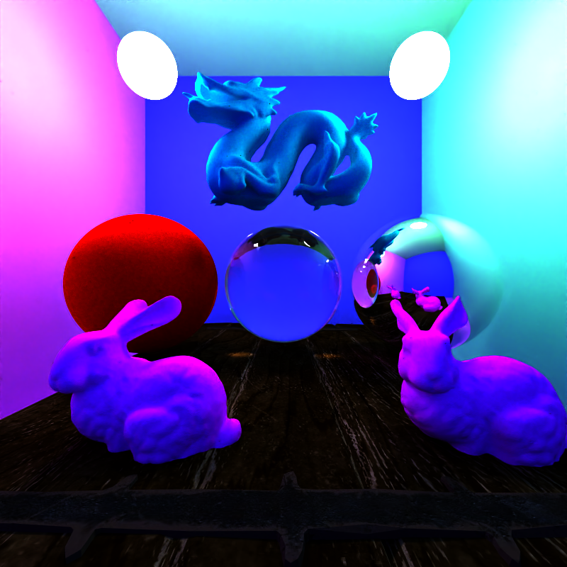
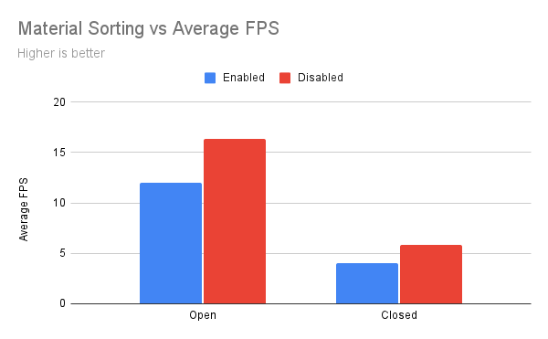

CUDA Path Tracer
================

**University of Pennsylvania, CIS 565: GPU Programming and Architecture, Project 3**

* Daniel Gerhardt
  * https://www.linkedin.com/in/daniel-gerhardt-bb012722b/
* Tested on: Windows 23H2, AMD Ryzen 9 7940HS @ 4GHz 32GB, RTX 4070 8 GB (Personal Laptop)


### CUDA Path Tracer

## Table of Contents:
* [Description](#Description)
  * [Controls](#Controls)
  * [Toggling Features](#Toggling-Features)
  * [Detailed Feature Overview](#Detailed-Feature-Overview)
  * [Scene File Format](#Scene-File-Format)
* [Performance Analysis](#Performance-Analysis)
	* [Stream Compcation](#Stream-Compaction)
	* [Material Sorting](#Material-Sorting)
	* [Textures and Bump Maps](#Textures-And-Bump-Maps)
	* [Image Denoising](#Image-Denoising)
	* [Environment Map](#Environment-Map)
* [Issues](#Issues)
  * [Challenging Bugs](#Challenging-Bugs)
  * [Bloopers](#Bloopers)
  * [TODO](#TODO)
* [Acknowledgements and Resources](#Acknowledgements-and-Resources)

## Description

Path tracing is the process of shooting a ray out of each pixel of the screen from the "camera", and collecting color by bouncing the ray around throughout the 3D scene. This project was done using CUDA to run the compute-heavy processes in parallel on the GPU. The path tracer was completed with the following features(* = core feature):
1. Ideal diffuse and specular surfaces*
2. Dielectric materials like glass with refraction
3. Stream compaction for terminating non-contributing paths*
4. Sorting intersections by material type*
5. Stochastic sampled antialising by jittering rays within each pixel*
6. Mesh loading with OBJ files
7. Bounding Volume Hierarchy(BVH)
8. Environment mapping
9. Texture and bump mapping with optional procedural texture
10. Real time and final render denoising with Intel Open Image Denoise
See the detailed feature overview below to read more about these features.

### Controls
* Left mouse button - rotates the camera.
* Right mouse button on the vertical axis - zooms in or out.
* Middle mouse button - moves camera on the global X/Z plane.
* Space - re-centers the camera.
* S - saves an image to the build folder.
* Esc - saves an image and closes the program.

### Toggling Features
The following features are toggleable and can be enabled or disabled for different image and performance effects. Locate the following defines to change the status of the feature.
1. Stream compaction: USE_STREAM_COMPACTION - 1 = enabled, 0 = disabled. Disabling this will decrease performance since more paths have to be analyzed.
2. Intersection sorting by material:  USE_MATERIAL_SORTING - 1 = enabled, 0 = disabled. Disabling this will descrease performance since neighboring threads will be utilizing less contiguous memory.
3. Anti aliasing: USE_ANTIALISING - 1 = enabled, 0 = disabled. Disabling this will cause edges to appear more jagged.
4. Bounding volume hierarchy: USE_BVH - 1 = enabled, 0 = disabled. Disabling this will decrease performance when rendering OBJ files, since rays will be tested against every triangle rather than the bounding volume hierarchy.
5. Bump map: USE_BUMP_MAP - 1 = enabled, 0 = disabled. Disabling this will not use bump map textures for meshes that specify a bump map.
7. Textures: USE_TEXTURE - 1 = enabled, 0 = disabled. Disabling this will not texture any meshes, by reading from file or procedurally.
8. Texture from file: USE_PROCEDURAL_TEXTURE - 1 = use texture from file, 0 = use procedural texture. Enabling this will set all meshes that have a specified texture to use the procedural texture.
9. Environment map: USE_ENVIRONMENT_MAP - 1 = enabled, 0 = disabled. Disabling this shows a black background rather than the 360 degree environment view.
10. Use image denoising for real time render view: USE_OIDN_FOR_RENDER - 1 = enabled, 0 = disabled. Disabling this will increase performance but the rendered image will be more noisy.
11. Use image denoising for final image saving: USE_OIDN_FINAL_IMAGE - 1 = enabled, 0 = disabled. Disabling this will save the raw but more noisy final render.

### Detailed Feature Overview
1. Ideal diffuse and specular surfaces. These are surface types that are the most basic in path tracing. Ideal diffuse surfaces will reflect light with an equal probability in every direction. Ideal specular surfaces always reflect light in one direction, reflected about the surface normal, like a mirror. Neither of these surfaces exist perfectly in real life but they are convenient to implement in a path tracer.

On the left is a perfectly diffuse red sphere, and on the right a perfectly specular chrome sphere.


2. Dielectric materials. Some materials, like glass, both reflect light outwards and refract light inwards. This phenomenon causes caustics, which is focused light through a transmissive material.

Glass sphere with reflection and refraction:


3. Stream compaction for terminating non-contributing paths. Stream compaction is the process of removing elements from an array that do not meet a certain criteria. In a path tracer, this can be used to remove rays that have finished bouncing or have bounced into the outer reaches of the scene from consideration of future computation. See [the performance analysis below](#Stream-Compaction) for a detailed analysis of how this speeds up the path tracer.

4. Sorting intersections by material type. In a parallel environment, multiple threads that are continguous will be slowed down by working on memory that is spread out in a random manner. Each thread will be assigned to an intersection. Within the shading stage, different memory is accessed based upon the material type, and different code is executed based on the material as well. So, sorting the intersections by material will increase the coherency of the memory and decrease the diveregence between neighboring threads. See [the performance analysis below](#Material-Sorting) for a detailed analysis of how this speeds up the path tracer.

5. Stochastic sampled antialising by jittering rays within each pixel. Antialising is smoothing out rough edges. This can be done "for free" within a path tracer without extra computation by slightly moving the ray position, which will cause the pixel to draw color from slightly different positions in the scene, effectively blurring the pixel color and smoothing out the rough edges.

Image with no antialiasing: 

Image with antialiasing: 

6. Mesh loading with OBJ files. The OBJ format is a standardized and common way of representing complex objects. There is support for loading arbitrary OBJ files, along with their textures and bump maps. I chose to use TinyOBJ to read in the data, and then passing it to the GPU as an array of triangles.

Here is a nice bunny made of 70,000 triangles: 

7. Bounding Volume Hierarchy. A naive approach to rendering in a path tracer is to test if a ray intersects with any object in the scene by doing an intersect test with each primitive object(triangles, planes, spheres). This can be extremely slow if there are complex objects made up of many primitive objects, which is common of OBJ files that are made of triangles. A bounding volume hierarchy reduces the number of primitives that are checked against. To do this, a volume is created to enclose the triangles in the scene(in my case, the volumes are cubes). Then the volume is divided over and over, until each of the smallest volume divisions encloses one or two primitives. The ray can be checked against the larger volumes to rule out many primitives, and only has to be compared against log2(n) primitives rather than n primitives. See the performance analysis below for a detailed analysis of how this speeds up the path tracer(hint: A LOT).

8. Environment mapping. If a ray does not hit anything in the scene, the basic technique is to make the color at that point black. This gives the viewer a sense of dread, which is generally not the goal in computer graphics. To alleviate this fear inducing void, the rays that are sent in to the void can instead have their direction mapped to a cubemap texture coordinate, and a nice environment can be created around the scene.

Scary table in scary void: 

Nice beach table in fun environment: 

9. Texture and bump mapping with optional procedural texture. Object files are often colored with textures. Additionally, a technique called bump mapping can be used to give artificial small details by varying the normals based on a texture called a bump map. To achieve this in the path tracer, the primary challenge is getting the data and indexing correctly on the GPU. To do this, I am passing a large array of colors to the GPU, along with an array of start indices and directions. The triangle primitives that are intersected with carry a texture index, and this can be used to sample the start index and dimension arrays to get a final index to sample the color array.

Object with no texture: 

Textured object:  

Procedural texture on object:  

Bumpy object: 

Textured bumpy object: 

10. Real time and final render denoising with Intel Open Image Denoise. A big problem with path tracing is it can take a long time for the speckles in the image to be smoothed out. These specks are caused by the time it takes for a ray to be cast at each point in the scene, and it can take multiple rays at the points to provide an accurate and visually pleasing color. These speckles, called noise, can be dealt with by using a denoiser. Intel provides a deep learning based denoiser that is rather easily integrated into the path tracer. It can be used every frame to denoise the render view, or used with prefiltering on the final saved image. Prefiltering is not used for every frame because it is slow.

No denoising: 

With denoising: 

### Scene file format
The scenes are stored in JSON files for easy parsing. There are 3 main sections.

1. Materials. Materials have unique names and a series of parameters. The first is type. Materials have the following supported types: `"Diffuse"`, `"Specular"`, `"Emitting"`, `"SpecularTransmissive"`, `"Texture"`, `"BumpMap"`, and `"EnvironmentMap"`. The other parameters depend on the type. `"Diffuse"` and `"Specular"` materials require `"RGB"`. `"Emitting"` in addition to `"RGB"` requires `"Emittance"`. `"SpecularTransmissive"` in addition to `"RGB"` also requires `"ETA"`. `"Texture"`, `"BumpMap"`, and `"EnvironmentMap"` require the `"FILE"`, as well as `"WIDTH"` and `"HEIGHT"`.

Examples:
```
"Materials":
{
	"light":{
	    "TYPE":"Emitting",
	    "RGB":[1.0, 1.0, 1.0],
	    "EMITTANCE":5.0
	},
	"diffuse_white":
	{
	    "TYPE":"Diffuse",
	    "RGB":[0.98, 0.98, 0.98]
	},
	"specular_white":
	{
	    "TYPE":"Specular",
	    "RGB":[0.98, 0.98, 0.98],
	    "ROUGHNESS":0.0
	},
	"specular_transmissive_white":
	{
	    "TYPE":"SpecularTransmissive",
	    "RGB":[0.98, 0.98, 0.98],
	    "ETA":[1.0, 1.55]
	},
	"dog_tex":
	{
	    "TYPE":"Texture",
	    "FILE":"C:/Users/danie/Desktop/School/CIS 5650/Project3/scenes/textures/wolftexture.png",
	    "WIDTH":64,
	    "HEIGHT":64
	},"dodecahedron_bump":
	{
	    "TYPE":"BumpMap",
	    "FILE":"C:/Users/danie/Desktop/School/CIS 5650/Project3/scenes/textures/154_norm.JPG",
	    "WIDTH":1024,
	    "HEIGHT":1024
	},
	"env_map":
	{
	    "TYPE":"EnvironmentMap",
	    "FILE":"C:/Users/danie/Desktop/School/CIS 5650/Project3/scenes/environmentmaps/Frozen_Waterfall_Ref.hdr",
	    "WIDTH":1600,
	    "HEIGHT":800
	}
}
```

2. Camera. The camera requires the following fields seen in this example:
```
"Camera":
{
    "RES":[800,800],
    "FOVY":45.0,
    "ITERATIONS":5000,
    "DEPTH":8,
    "FILE":"cornell",
    "EYE":[0.0,5.0,10.5],
    "LOOKAT":[0.0,5.0,0.0],
    "UP":[0.0,1.0,0.0]
}
```

3. Objects. Each object contains:
- `"TYPE"`: The type of object, such as `"cube"` or `"sphere"`.
- `"MATERIAL"`: The material assigned to the object, referencing one of the materials defined earlier.
- `"TRANS"`: An array for the translation (position) of the object.
- `"ROTAT"`: An array for the rotation of the object in degrees.
- `"SCALE"`: An array for the scale of the object.

There are additional required parameters if the `"TYPE"` is `"mesh"`.
- `"BUMPMAP"`: The bumpmap material, or `""` if there is no bumpmap.
- `"FILE"`: The OBJ file for the mesh.
- `"FILE_FOLDER"`: The folder with the OBJ file for the mesh.

Examples:
```
"Objects":
{
	{
        "TYPE":"cube",
        "MATERIAL":"diffuse_green",
        "TRANS":[5.0,5.0,0.0],
        "ROTAT":[0.0,0.0,0.0],
        "SCALE":[0.01,10.0,10.0]
    },
    {
        "TYPE":"mesh",
        "MATERIAL":"ninja_tex",
        "BUMPMAP": "ninja_bumpmap",
        "TRANS":[0.0,0.0,0.0],
        "ROTAT":[0.0,0.0,0.0],
        "SCALE":[1.0,1.0,1.0],
        "FILE":"C:/Users/danie/Desktop/School/CIS 5650/Project3/scenes/objs/ninja.obj",
        "FILE_FOLDER":"C:/Users/danie/Desktop/School/CIS 5650/Project3/scenes/objs/"
    },
    {
        "TYPE":"mesh",
        "MATERIAL":"dog_tex",
        "BUMPMAP": "",
        "TRANS":[2.0,4.0,-3.4],
        "ROTAT":[0.0,0.0,0.0],
        "SCALE":[0.2,0.2,0.2],
        "FILE":"C:/Users/danie/Desktop/School/CIS 5650/Project3/scenes/objs/wolf.obj",
        "FILE_FOLDER":"C:/Users/danie/Desktop/School/CIS 5650/Project3/scenes/objs/"
    }
}
```

## Performance Analysis

The following features were tested in an open scene and closed scene with depth 8. Unless otherwise stated:

USE_ENVIRONMENT_MAP = 1
USE_MATERIAL_SORTING = 1
USE_STREAM_COMPACTION = 1
USE_OIDN_FOR_RENDER = 0
USE_OIDN_FINAL_IMAGE = 1
USE_ANTIALIASING = 1
USE_BVH = 1
USE_BUMP_MAP = 1
USE_TEXTURE = 1
USE_PROCEDURAL_TEXTURE = 0
Block size for ray gen = (8, 8, 1)
Block size for path tracing = (128, 1, 1)

The scene has 160,585 triangles, 7 materials, 1 bump map, 1 texture, and 1 environment map.

Open scene: 

Closed scene: 

### Stream Compaction


Stream compaction unsurprisingly increases performance when used. This is extremely apparent in open scenes, where it is very likely for a ray to bounce into the environment and away from any objects. Removing these rays from computation is a huge speedup. The difference in performance in closed scenes is not apparent and within the margin of error, because rays do not ever get removed from consideration as they are always bouncing within the scene. It could be that the increased work of partitioning the rays causes a slight decrease in performance, but as the FPS difference is negligible it is not easy to say one way or the other.


The performance numbers are supported by the above chart that displays a much greater ray drop over time in the open scene, and a very slight drop in rays in the closed scene.

### Material Sorting



The goal with material sorting is to increase memory coherency. However, the performance does not support the usage of this feature. The reshuffling of the memory, even using a fast library like thrust, is taking more time than the incoherent memory reads adds. This is apparent in the data, where in both closed and open scenes the material sorting caused a performance dip. There are 7 materials in the test scene. With more it is possible material sorting would cause a performance increase, but with the scenes I have been creating, it is not beneficial.

### Bounding Volume Hierarchy


The BVH is one of the most important performance boosts possible in a path tracer. From the numbers alone, it demonstrates its prowess. The construction of the BVH is done on the CPU, as GPU construction is not within the scope of the project and is very complex. It took 105 ms to create a BVH for 160,585 triangles. For that cost, there is over 10 times the performance. The BVH stops building nodes when they have 2 or less triangles. Assuming the worst that there is 1 triangle for every node, then there are 160,585 nodes, which creates a binary tree of height 18. That means there are 18 intersection tests for each ray at most, much less than the 160,585 alternative. The cost of not having the BVH with this number of triangles is prohibitive and makes the scene nearly unresponsive in both open and closed scenes. There are ways to optimize this further. My bounding boxes are axis aligned. This allows for easy intersection and computation of the size of the boxes. However, having tighter boxes limits the number of misses that are still within the box. 

### Textures and Bump Maps


Textures and bump maps don't appear to have any impact on performance. This is not what I expected, as I thought the memory reads for each bounce would cause a slow down. However, as there is only 2 or 3 added per bounce, it isn't enough to tip the FPS in a noticeable way. The procedural texture is also not any different, which is not surprising, as the computation is very fast in CUDA and procedural textures are compute based. Using CUDA's built in texture objects would likely be a more optimized version but I wanted to get more practice with indexing and setting up buffers with CUDA. 

### Image Denoising


Image denoising had less of a performance impact than I was expecting. It added about 20% to the FPS, but the image results are usually worth the slow down. Saving images is 83 ms with denoising and 1 ms without. The prefiltering step adds a lot of time to the image saving. But, the real time rendering without prefiltering is impressively quick with albedo, normal, and beauty filters are enabled. To reduce the real time performance impact one could decrease the number of filters used or not use it on every frame. It is not necessary to only produce the denoised image for the render, as it can be used to clarify the scene every few frames.

### Environment Map


The environment map did not affect performance. All it adds is at most one texture read per bounce, which is not enough to cause a frame rate dip. It is hard to optimize this further, although as with textures the CUDA texture object may have some under the hood speed ups in its look up usage.

## Issues

### Challenging Bugs
My most challenging issue was with textures. I had the infrastructure for one texture working well, but as I added more textures, the objects were all using the texture assigned to the last object. I eventually found this was due to my mesh intersection, as any time a mesh was checked against for intersection the texture assigned to the intersection was updated even if there was no better intersection. To fix this I added a texture index for each triangle and sent this back only if the intersection found was the best intersection so far. Luckily I could use this technique for bump maps as well.

It turns out that glm::rayIntersectTriangle and glm::refract are not so reliable outside of their native environment. I could not figure out what was causing my artifacts until I found new references to reimplement these glm functions, and my mesh intersection and object transmission were both fixed after replacing these functions.

The BVH iterative traversal on the GPU also gave me some issues. I had some trouble getting the stack pointer to not get stuck indefinitely, and spent hours puzzling over why my nodes were being pushed on the stack and not being removed in a sensible manner. Luckily, TA Aditya came to the rescue and it turned out my + that I thought was a ++ was missing its neighbor. This caused my stack pointer to properly add the node but not move up, causing an infinite loop. Sometimes all you need is an extra set of eyes(and some great TAs)!

### Bloopers

Tried to anti alias and my project got upset and attempted to run away:


Minecraft dog pre assembly:


Double reflection:


Hol(e)y meshes:


Invisisphere:


Demon dodecahedron:


### TODO
I would like to add roughness to specular materials and depth of field. These are small but nice additions which add nice variety and realism to scenes. Additionally, adding ImGUI toggles for the defines would provide a better user experience. At some point I hope to come back to this and add support for mediums, phosphoresence, and chromatic abberation.

## Acknowledgements and Resources
A big thank you to the professor, Shehzan Mohammed, and the TAs Han, Crystal, and Aditya for their designing of the project and great assistance with issues and clarification.

Resource attribution:
- Table model - https://sketchfab.com/3d-models/wooden-table-31ab9f9ad2fa425aa75e8bb76cad8fc1
- Dark Room Environment Map - https://hdri-haven.com/hdri/dark-empty-room-2
- Lantern model - https://free3d.com/3d-model/old-lantern-pbr-98203.html

Code assistance:
- Measuring CPU Time - https://www.geeksforgeeks.org/how-to-get-time-in-milliseconds-in-cpp/
- Incredible blog on building BVHs that I drew heavily from - https://jacco.ompf2.com/2022/04/13/how-to-build-a-bvh-part-1-basics/
- Intel Open Image Denoise - https://www.openimagedenoise.org/
- tinyOBJ - https://github.com/tinyobjloader/tinyobjloader
- Procedural texture - Author @kyndinfo. https://thebookofshaders.com/edit.php?log=161127201157
- Refraction - https://www.pbr-book.org/3ed-2018/Reflection_Models/Specular_Reflection_and_Transmission, https://en.wikipedia.org/wiki/Fresnel_equations

