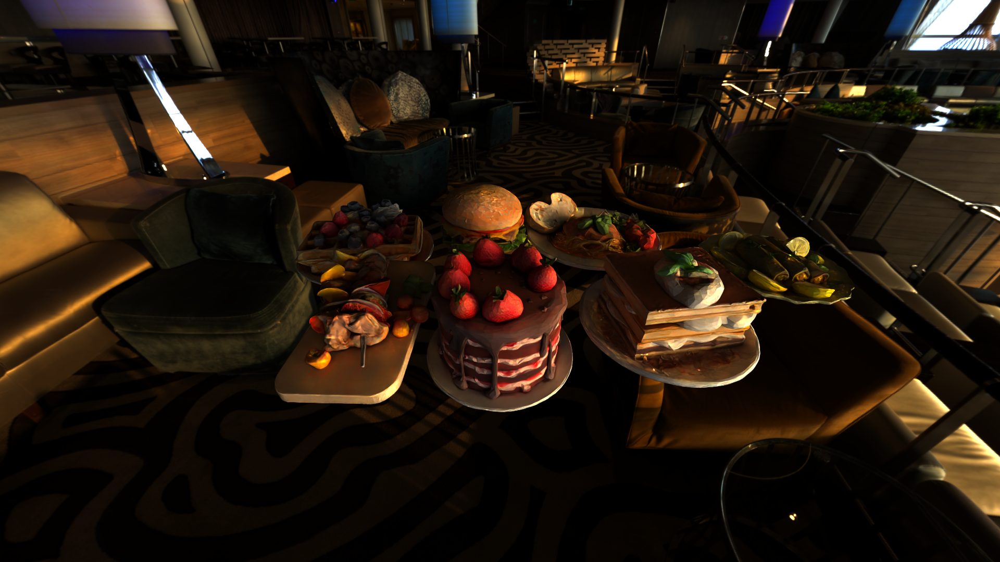

# CUDA Path Tracer

**University of Pennsylvania, CIS 565: GPU Programming and Architecture, Project 3**  
**Author:** Yi Liu

## Tested On
- **OS:** Windows 11 Home Version 24H2 (OS Build 26100.4061)  
- **CPU:** Intel(R) Core(TM) i9-14900K @ 3.20GHz, 24 cores / 32 threads  
- **RAM:** 64 GB  
- **GPU:** NVIDIA GeForce RTX 4090, 24 GB VRAM  
- **Environment:** Visual Studio 2022, CUDA 12.6, CMake 3.27

---
## Rendered Results

All the models featured in this path tracer were AI-generated using Meshy, which leverages advanced Image-to-3D and Text-to-3D generation with PBR texture support.

---

## Introduction

This CUDA-based path tracer implements a physically-based rendering system capable of rendering photorealistic images using global illumination. It supports BRDF shading models (diffuse, metallic, dielectric materials), OBJ mesh and texture loading, BVH acceleration, depth of field (DOF), environment lighting, and Intel's Open Image Denoise (OIDN).

---

## BRDF Shading

### Rough Specular Reflection (Glossy)

This render demonstrates rough specular reflection using a microfacet BRDF. Different surface roughness levels cause varying degrees of reflection blur.

### Refraction + Reflection (Glass)

This image demonstrates dielectric material behavior with Fresnel reflection and refraction simulated using Schlick's approximation.

---

## Visual Features

### Mesh Loading, Texture Mapping, and Environment Map Lighting

OBJ meshes are parsed using TinyObjLoader, with support for albedo and normal maps via CUDA texture memory. Lighting is provided by an HDR environment map.

  

### Denoising with Intel OIDN

The final image is denoised using Intel Open Image Denoise with support for auxiliary normal and albedo buffers. HDR output is enabled for improved fidelity.

| Raw | Denoised |
|-----|----------|
|  |  |

---

## Performance Analysis

### Material Sorting

Sorting path segments by material can reduce warp divergence, improving coherence during shading. However, it also introduces sorting overhead.

### BVH Acceleration (Bounding Volume Hierarchy)

BVH traversal significantly reduces ray-scene intersection cost. This implementation supports two BVH construction modes:
- **Midpoint Split**: A fast, balanced partitioning approach.
- **Surface Area Heuristic (SAH)**: A cost-optimized method that improves performance in complex geometry by minimizing expected intersection tests.

This flexibility allows users to choose between construction speed and traversal performance based on scene complexity.

