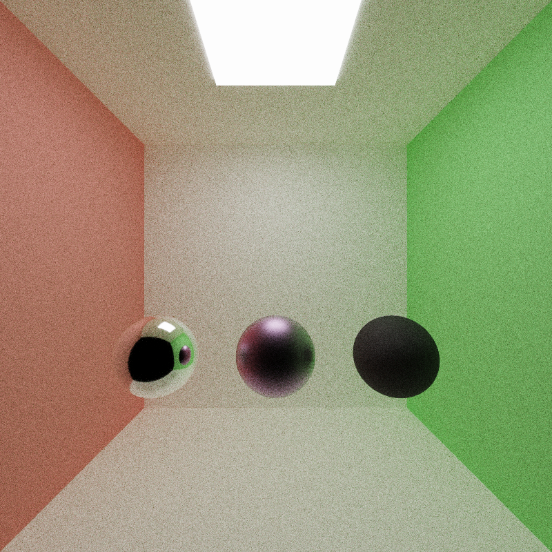

CUDA Path Tracer
================

**University of Pennsylvania, CIS 565: GPU Programming and Architecture, Project 2**

* CARLOS LOPEZ GARCES
  * [LinkedIn](https://www.linkedin.com/in/clopezgarces/)
  * [Personal website](https://carlos-lopez-garces.github.io/)
* Tested on: Windows 11, 13th Gen Intel(R) Core(TM) i9-13900HX @ 2.20 GHz, RAM 32GB, NVIDIA GeForce RTX 4060, personal laptop.

## Features

This CUDA-based ray tracer implements the Lambertian, perfect specular, dielectric, and GGX reflection models. Antialiasing is done by jittering randomly the subpixel coordinate through which each rays passes. The camera can be configured to simulate Depth of Field (using the thin lens model). The final image (to be stored or previewed) goes through a couple of post-processing steps, ACES tone mapping and gamma correction.

### Materials and Reflection Models

The lower right image shows 3 objects with a GGX material configured differently; roughness increases from left to right (0.1, 0.5, 0.9); different base colors are assigned to each.

| Diffuse Material            | Specular Material            |
|-----------------------------|------------------------------|
|  |  |

| Dielectric Material          | GGX Material                 |
|------------------------------|------------------------------|
|  |       |

### Antialiasing

### Thins Lens Model and DoF

The camera configuration includes focus distance and aperture. These parameters are used to place the ray's origin at some point on the lens (as permitted by the aperture size) other than the center, chosen uniformly at random; the ray then passes through a jittered pixel position (see Antialiasing) and points at some point in the scene that is to be imaged in focused (as established by the focus distance). Obtaining a ray this way follows the thin lens model.

The thin lens model allows us to simulate Depth of Field (DoF), an imaging effect where objects at the focus distance are imaged in focus, while objects at other depths become gradually defocused.

The following images illustrate the effects of different aperture and focus distance values. Note how the reflection of the light source on the mirror ball is imaged to a larger set of pixels when the aperture size is larger. Note how objects become blurrier the farther from the focal plane they are.

| | Focus distance 3 | Focus distance 4 | Focus distance 5|
|----------------------------|----------------------------|----------------------------|----------------------------|
| Aperture 1 |  |  |  |
| Aperture 2 |  |  |  |

### Gamma Correction and ACES Tone Mapping

Gamma correction adjusts the brightness of an image by applying a nonlinear transformation to pixel values, compensating for the non-linear response of display devices. The resulting perceived brightness is consistent with human visual perception.

Tone mapping is applied to path-traced images to convert the high dynamic range (HDR) values into a range that can be displayed on standard screens. This process ensures that bright highlights and dark shadows are preserved in a visually appealing way, while preventing the image from looking too washed out or too dark.

These 2 postprocess conversions are performed for both the interactive preview and the stored image.

| No Postprocessing             | Gamma Correction                   | Gamma Corr. and ACES Tone Mapping   |
|-------------------------------|------------------------------------|-------------------------------------|
|  |  |  |

### glTF Mesh Loading and Triangle Mesh Intersections

`gltfLoader` is a thin layer I wrote on top of [Tiny glTF](https://github.com/syoyo/tinygltf) for loading glTF triangle meshes, along with their materials and textures (although the materias and textures are not currently used).

For computing ray-triangle intersections, for each triangle in the mesh, `meshIntersectionTest` calculates whether the given ray intersects the triangle using the Möller-Trumbore intersection algorithm. It checks if the ray hits within the triangle boundaries, and if a valid intersection occurs, it calculates the intersection point, normal, and whether the hit is on the outside of the geometry. The closest valid intersection is returned, if any.

It takes very long to render one such triangle mesh. I spent a significant amount of time writing a BVH acceleration structure, but it didn't work well in the end.

The following image shows the [Damaged Helmet glTF model](https://github.com/KhronosGroup/glTF-Sample-Models/tree/main/2.0/DamagedHelmet) with a GGX material (roughness 0.5) after about 5 iterations or 25 minutes:

## Optimizations

### Stream Compaction of Active and Terminated Rays

The renderer implements 2 forms of active/terminated path compaction to optimize the path tracing process. The first method uses `thrust::remove_if` to remove terminated paths from the array. This method, implemented in the specialized template for `PathSegment**`, uses a custom functor (`TerminatedPathChecker`) to check for paths that are no longer active. The result is a compacted array where only active paths remain, and terminated paths are effectively removed from the list. Note that this method operates on a `PathSegment*`, an array of pointers to the `PathSegment`s in device memory, instead of the array of `PathSegment`s: since stream compaction (`thrust::remove_if`) overwrites array elements during its operation, and all paths are needed for the `finalGather` call, stream compaction is done on the `PathSegment*` array, where overwriting entries doesn't matter; paths are updated (and hitpoints shaded) through the pointers as they bounce; at the end, `finalGather` uses the original `PathSegment`s.

Because `PathSegment`s are accessed through pointers and the array of pointers is compacted, access to `PathSegment`s' memory is not coalesced.

The second method, implemented in the specialized template for `PathSegment*`, uses `thrust::stable_partition`, which reorders the paths such that active paths are placed at the beginning of the array, while terminated paths are moved to the end. The `ActivePathChecker` functor is used to identify active paths. Note that this time the reordering takes place on the original array of `PathSegment`s. Since `thrust::stable_partition` keeps the relative order of the elements, blocks of the shading and material sorting kernels are likely to access paths that are contiguous in memory.

Both methods help reduce the number of paths that are shaded and updated: the shading and material sorting kernels execute on fewer and fewer blocks after each bounce and compaction step.

### Path Sorting by Intersection Material Type

### (Incomplete) BVH-based Intersection Acceleration