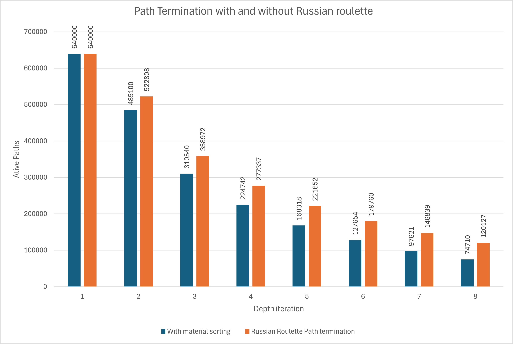

CUDA Path Tracer
================

**University of Pennsylvania, CIS 5650: GPU Programming and Architecture, Project 0**

* Manvi Agarwal
  * [linkedIn](https://www.linkedin.com/in/manviagarwal27/)
* Tested on: Windows 11, AMD Ryzen 5 7640HS @ 4.30GHz 16GB, GeForce RTX 4060 8GB(personal)

These project is my first attempt at path tracing and while the implementation covers some of the basic concepts in path tracing, I learned a bunch of stuff about both using GPU for a highly parallelizable problem and also some basics of graphics. The features implemented in this repository are as following. 

**Features Implemented**

### Shading kernel with BSDF evaluation for ideal specular and diffuse surfaces

1. Perfect and imperfect Specular surface
   
For reflective surfaces, surface takes the color of the path segment. glm function reflect is used to find the direction of reflected ray. 

Light bounced from diffuse or matte looking materials have a randomized direction and so a custom function is used to find a random direction in a hemisphere. Path traced using such function produces a diffused surface as shown below.

2. Complete Diffuse surface

   

### Refraction surface using frensel effects (using Schlick approximation)
Probability of reflection is calculated using frensel parameter

### Depth of field by jittering camera position given defocus angle and focal length
By giving camera a focal length and choosing ray origin radomly from the surface of the lens, depth of field is implemented

### Direct point and direct area lighting along with simple path integrator
Direct point lighting or direct area lighting samples path for depth = 1 and checks all the paths that have uninterrupted path to the light source.

1. Direct Point lighting
Here the shadows are much sharper and the rendering happens fast.
   

2. Direct Area lighting
The shadows are not as sharp and rendering took time

### Performance Analysis

## Effect of anti-aliasing

Anti-aliasing is used jitter the path segment at origin for sampling the pixel. Anti-aliasing helped to remove a lot of fireflies from the image rendered. Below is an image taken with implementing the anti-aliasing.

Compared to this, number of fireflies are significantly lesser with anti-aliasing implemented.

## Stream Compaction and Sorting the materials

For the path integrator problem, lot of path segments tend to terminate early because of either no intersection or having very low color value. Such path segments need not be computed for in the subsequent kernel calls. Hence, we can use /*stream compaction*/ to reduce the subsequent kernel calls to help improve timing. We can /*sort the paths*/ based on the material intersected to reduce the warp divergence. As is illustrated from the chart, the number of paths terminated are slightly lesser by simply sorting the material.

## Path termination using Russian Roulette 

Rusian Roulette randonly terminates the path based on the probability inveresely proportional to throughput. This helps optimize the code without reducing the quality of rendering. Below chart show evident improvement in number of paths terminated because of russian roulette.

### Bloopers

These are some of the images rendered while I was trying to understand how a path tracer works.

I got the below image when I made color equal to hit point suggesting how shading is done based on the hit point.

I got the below image when I made the hit point color equal to angle between hit point and normal. This helped me to understand what this factor was doing in the path tracer shading computation.

